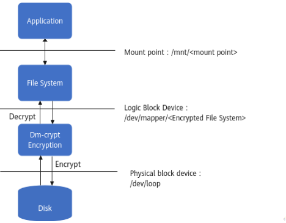
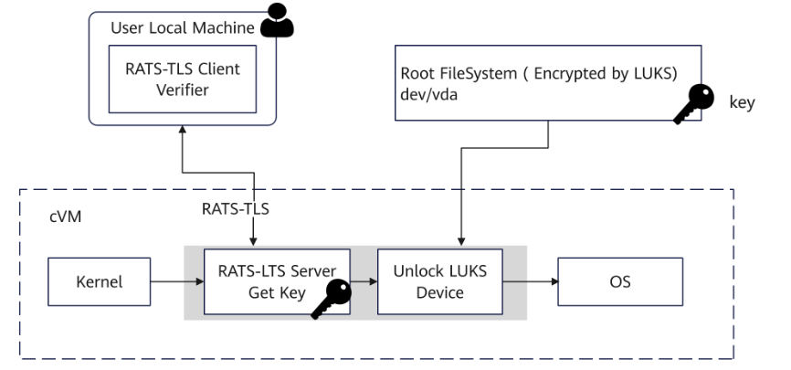

#### Enabling Secure Storage

Full-disk encryption (FDE) is a data security method that dynamically encrypts and decrypts all data (including OS data) on a disk drive.

**Dm-crypt**

dm-crypt is a drive encryption mechanism built in the Linux kernel. It allows users to mount encrypted file systems.



**LUKS**

Linux Unified Key Setup (LUKS) is a drive encryption specification for Linux. Based on the dm-crypt function of the Device Mapper (DM), LUKS maps the content decrypted from an encrypted block device to a virtual block device, which is transparent to file systems.

**Cryptsetup**

cryptsetup is a command line tool that interacts with dm-crypt. It is used to create, access, and manage encrypted devices.

**Early-boot disk encryption**



1. **Encrypt drives.**

   1. Install the cryptsetup tool on the local device, which interacts with dm-crypt to create a LUKS-encrypted device.

      ```
      yum install cryptsetupwhich cryptsetup
      ```

   2. Run the **dd** command to create a file **encrypt.img** whose size (for example 16 GB) is slightly larger than the rootfs. The file path is **/path/to/encrypt.img**.

      ```
      dd if=/dev/zero of=/path/to/encrypt.img bs=1M count=16384
      ```

2. Run the **cryptsetup luksFormat** command to encrypt the **encrypt.img** file and obtain a virtual LUKS device.

   ```
   # format a LUKS device
   cryptsetup luksFormat --type luks1 --key-file=/path/to/keyfile /path/to/encrypt.img
   ```

   Enter **YES** to confirm the encryption. Then enter the password to encrypt the LUKS device. You can also use the **keyfile** to encrypt the LUKS device.

   This operation will format all data on the original device. Back up data in advance.

   - Run the **cryptsetup benchmark** command to display all available encryption and hash algorithms and their performance in the runtime kernel.
   - Run the **cryptsetup --help** command to view options.

   - If the following options are added, replace the default values of the options with the actual ones.
     - --cipher (default value: **aes-xtsplain64**)
     - --key-size (default value: **256**)
     - --hash (default value: **sha256**)
     - --use-urandom (default value: **-- use-random**)

3. Enable the SM4 algorithm.

   ```
   cryptsetup luksFormat /path/to/encrypt.img -c sm4-xts-plain64 --key-size 256 --hash sm3
   ```

4. Run the **cryptsetup luksOPen** command to open (decrypt) the LUKS device.

   ```
   # open (unlock) LUKS device and map it to /dev/mapper/encryptfs
   cryptsetup luksOpen /path/to/encrypt.img encryptfs
   ```

5. Run the following command to check the LUKS device status:

   ```
    cryptsetup -v status encryptfs 
   ```

6. Copy (Restore) the original **rootfs.img** file to the LUKS device, and then close the LUKS device.

   ```
   dd if=/path/to/rootfs.img of=/dev/mapper/encryptfs 
   cryptsetup luksClose encryptfs
   ```

   

7. Build initramfs. See [2.2.2 Compiling the Remote Attestation SDK]

   - Modify the buildroot configuration file **virtcca_qemu_defconfig** to enable initramfs to support cryptsetup.

   - File path: virtCCA_sdk/attestation/initramfs/br2_external/configs/virtcca_qemu_defconfig

     ```
     # cryptsetup for using dm-crypt with LUKS for disk encryption
     BR2_PACKAGE_CRYPTSETUP=y
     ```

#### Starting the cVM

1. Modify the XML file and use QEMU to load the built initramfs and encrypted rootfs. Use the recompiled **guest_kernel**.

   ```
   <os>
   <type arch='aarch64' machine='virt'>hvm</type>
   <kernel>path/guest_kernel</kernel>
   <initrd>/path/rootfs_with_encryptluks.cpio.gz</initrd>
   <cmdline>swiotlb=262144,force console=tty0 console=ttyAMA0 kaslr.disabled=1 root=/dev/vda rw  rodata=off cma=64M cvm_guest=1 virtcca_cvm_guest=1</cmdline>
   </os>
   ```

   ```
   <disk type='file' device='disk' model='virtio-non-transitional'>
   <driver name='qemu' type='raw' queues='4' cache='none' iommu='on'/>
   <source file='/path/encrypt.img'/>
   <target dev='vda' bus='virtio'/>
   </disk>
   ```

2. After verification is complete on the remote attestation client, the server decrypts the drive.

   1. Add **-k** to enter the password of decrypting the drive.

      ```
      ./virtcca-client -i [ip] -r [rim] -k [rootfs_key]
      ```

   2. Perform verification on the client.

      After completing the cVM remote attestation and establishing a secure channel, enter the decryption password. The server then executes the decryption process, and mounts and starts the rootfs.

      

      When compiling **guest_kernel**, set the following options in the **.config** file to enable drive encryption. Otherwise, errors such as unknown types are reported. For details, see [2.2.1 Compiling the rootfs and Guest Kernel].

      ```
      CONFIG_CRYPTO_SM3=y
      CONFIG_CRYPTO_SM3_GENERIC=y
      CONFIG_CRYPTO_SM4=y
      CONFIG_CRYPTO_SM4_GENERIC=y
      CONFIG_CRYPTO_XTS=y
      CONFIG_BLK_DEV_DM=y
      CONFIG_DM_CRYPT=y
      ```

      Enter **y** when "DM "dm-mod.create=" parameter support (DM_INIT) [N/y/?] (NEW)" is displayed.

#### Encrypting Extra Data Drives

1. Define an extra vdb drive in the XML file of the cVM. (Run the **dd** command to create an empty drive.)

   ```
   <disk type='file' device='disk' model='virtio-non-transitional'>
   <driver name='qemu' type='raw' queues='4' cache='none' iommu='on'/>
   <source file='/path/encrypt_empty.img'/>
   <target dev='vdb' bus='virtio'/>
   </disk>
   ```

2. After logging in to the VM, run the **cryptsetup** command to encrypt the vdb drive. For details, see the "Early-boot disk encryption" process in [Enabling Secure Storage].

   ```
   cryptsetup luksFormat /dev/vdb -c sm4-xts-plain64 --key-size 256 --hash sm3
   ```

3. Run the **cryptsetup luksOPen** command to open (decrypt) the LUKS device.

   ```
   cryptsetup luksOpen /dev/vdb encryptfs_sm4
   ```

4. Format the encrypted drive.

   ```
   mkfs.ext4 /dev/mapper/encryptfs_sm4
   ```

5. Create a mount point and mount it to a specified directory.

   ```
   mkdir -p /encryptmntmount /dev/mapper/encryptfs_sm4 /encryptmnt/
   ```

   After the VM is restarted, run the **cryptsetup luksOPen** command to open (decrypt) the LUKS device and mount it to the specified directory.