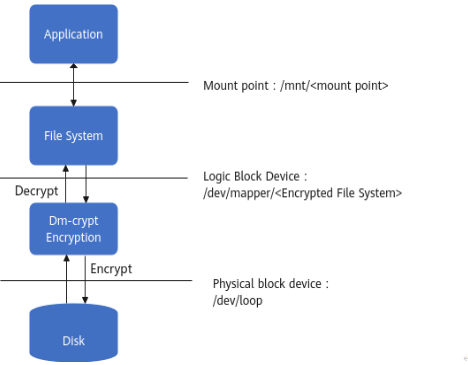
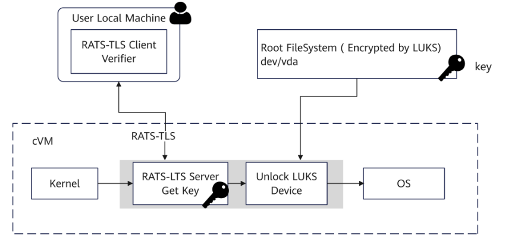

#### 安全存储使能

FDE（Full Disk Encryption）是一种是全磁盘加密技术，通过动态加解密技术对磁盘（硬盘）上所有数据（包括操作系统）进行动态加解密。

**Dm-crypt**

Dm-crypt是Linux内核提供的磁盘加密机制，允许用户挂载加密的文件系统。



**LUKS**

LUKS（Linux Unified Key Setup）是Linux硬盘加密的标准方案。LUKS基于DM（Device Mapper，设备映射器）的dm-crypt功能，将被加密块设备解密后的内容映射成虚拟块设备，对文件系统透明。

**Cryptsetup**

cryptsetup是与dm-crypt交互的命令行工具，用于创建、访问和管理加密设备。

**落盘加密流程（Early-boot Disk Encryption）**



1. 磁盘加密。

   1. 在本地设备安装cryptsetup工具：能够与dm-crypt交互创建LUKS加密设备。

      ```
      sudo yum install cryptsetup
      which cryptsetup
      ```

   2. 用**dd**命令创建一个稍大于rootfs的文件encrypt.img，文件路径是“/path/to/encrypt.img” （示例为16GB）。

      ```
      dd if=/dev/zero of=/path/to/encrypt.img bs=1M count=16384
      ```


2. 使用cryptsetup luksFormat加密encrypt.img文件，获得一个虚拟LUKS设备。

   ```
   # format a LUKS device
   cryptsetup luksFormat --type luks1 --key-file=/path/to/keyfile /path/to/encrypt.img
   ```

   需要输入“YES”进行确认，然后输入密码加密LUKS设备，默认使用密钥文件keyfile加密。

   注意：该操作会格式化原有设备的所有数据，操作前请及时备份原有设备的相关数据。

   - 使用**cryptsetup benchmark**显示运行内核中所有可用的加密、哈希算法以及对应的性能。
   - 使用**cryptsetup --help**查看Options。

   - 若添加了以下选项，则需要根据实际情况替换选项中的默认值。

     - --cipher（默认为aes-xtsplain64）
     - --key-size（默认为256）
     - --hash（默认为sha256）
     - --use-urandom（默认为-- use-random）


3. 使能SM4算法。

   ```
   cryptsetup luksFormat /path/to/encrypt.img -c sm4-xts-plain64 --key-size 256 --hash sm3
   ```

4. 使用cryptsetup luksOPen打开（解密）LUKS设备。

   ```
   # open (unlock) LUKS device and map it to /dev/mapper/encryptfs
   cryptsetup luksOpen --key-file /path/to/keyfile /path/to/encrypt.img encryptfs
   ```

   关键参数说明：

   --key-file：指定密钥文件路径

   /path/to/encrypt.img：加密镜像文件路径

   encryptfs：映射后的设备名称

5. 执行以下命令查看LUKS设备的状态。

   ```
   cryptsetup -v status encryptfs 
   ```


6. 将原始的rootfs文件rootfs.img拷贝（恢复）到LUKS设备，随即关闭LUKS设备。

   ```
   dd if=/path/to/rootfs.img of=/dev/mapper/encryptfs 
   cryptsetup luksClose encryptfs
   ```


7. initramfs构建具体请参见[2.2.2编译远程证明SDK]。

   - 修改buildroot配置文件virtcca_qemu_defconfig，增加initramfs对cryptsetup的支持。

   - 文件路径：“virtCCA_sdk/attestation/initramfs/br2_external/configs/virtcca_qemu_defconfig”。

     ```
     # cryptsetup for using dm-crypt with LUKS for disk encryption
     BR2_PACKAGE_CRYPTSETUP=y
     ```

#### cVM启动

1. 修改XML文件，通过QEMU加载构建的initramfs和加密的rootfs，需使用重新编译后的Guest_kernel

   ```
   <os>
   <type arch='aarch64' machine='virt'>hvm</type>
   <kernel>path/guest_kernel</kernel>
   <initrd>/path/rootfs_with_encryptluks.cpio.gz</initrd>
   <cmdline>swiotlb=262144,force console=tty0 console=ttyAMA0 kaslr.disabled=1 root=/dev/vda rw  rodata=off cma=64M cvm_guest=1 virtcca_cvm_guest=1</cmdline>
   </os>
   ```

   ```
   <disk type='file' device='disk' model='virtio-non-transitional'>
   <driver name='qemu' type='raw' queues='4' cache='none' iommu='on'/>
   <source file='/path/encrypt.img'/>
   <target dev='vda' bus='virtio'/>
   </disk>
   ```

2. 远程证明client客户端验证完成解密磁盘。

   1. 加入-k输入解密磁盘密钥文件路径。

      ```
      ./virtcca-client -i [ip] -r [rim] -k [rootfs_key]
      ```

      

   2. 在client端验证通过。

      在完成cVM远程证明、建立安全信道之后，用户输入解密密钥，server端进行后续的解密和挂载rootfs启动流程。

      

      编译Guest_kernel时需打开以下.config文件中选项启用磁盘加密，否则会报未知类型等异常，具体请参见[2.2.1编译Guest Kernel和rootfs](x-wc://file=zh-cn_topic_0000002187886177.html)。

      ```
      CONFIG_CRYPTO_SM3=y
      CONFIG_CRYPTO_SM3_GENERIC=y
      CONFIG_CRYPTO_SM4=y
      CONFIG_CRYPTO_SM4_GENERIC=y
      CONFIG_CRYPTO_XTS=y
      CONFIG_BLK_DEV_DM=y
      CONFIG_DM_CRYPT=y
      ```

      在提示 DM "dm-mod.create=" parameter support (DM_INIT) [N/y/?] (NEW)  时输入**“y”**后可继续执行。

#### 额外数据盘的加密

1. 在机密虚机XML文件中额外定义一块vdb磁盘。（使用DD命令创建的空磁盘）

   ```
   <disk type='file' device='disk' model='virtio-non-transitional'>
   <driver name='qemu' type='raw' queues='4' cache='none' iommu='on'/>
   <source file='/path/encrypt_empty.img'/>
   <target dev='vdb' bus='virtio'/>
   </disk>
   ```

2. 进入虚机后使用cryptsetup工具加密vdb，方法请参见[安全存储使能](#section558211131209)模块中的“落盘加密”流程。

   ```
   cryptsetup luksFormat /dev/vdb -c sm4-xts-plain64 --key-size 256 --hash sm3
   ```

3. 使用cryptsetup luksOPen打开（解密）LUKS设备。

   ```
   cryptsetup luksOpen /dev/vdb encryptfs_sm4
   ```

4. 格式化加密磁盘。

   ```shell
   mkfs.ext4 /dev/mapper/encryptfs_sm4
   ```

5. 创建挂载点并挂载到指定目录。

   ```
   mkdir -p /encryptmnt
   mount /dev/mapper/encryptfs_sm4 /encryptmnt/
   ```

   虚机重启后需要再次使用**cryptsetup luksOPen**打开（解密）LUKS设备后，挂载到指定目录。