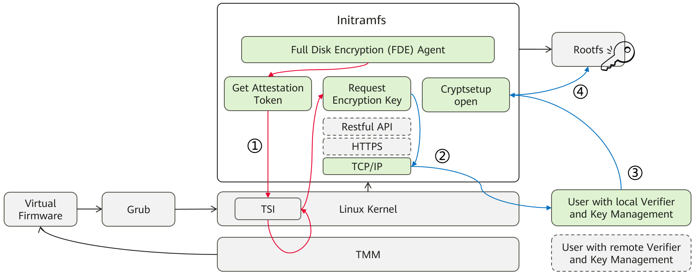

# virtCCA Full Disk Encryption

Full Disk Encryption (FDE) is a security technique designed to safeguard sensitive information by encrypting the entire contents of a disk partition. In standard virtual machines that do not operate in confidential environments, FDE typically employs LUKS (Linux Unified Key Setup) along with a user-provided encryption key. However, in trust execution environments such as Huawei virtCCA, the encryption key must be securely obtained from a attestation service rather than relying on direct user input.

**Note: The default FDE solution is just a reference implementation. If you use other remote service, please adapt scripts in the below sections carefully.**


## Architecture



This section outlines a implementation for integrating FDE with Huawei virtCCA, structured into three steps.

1. Build the user environment for local verifier and generate a key file for image encryption.

2. Create an encrypted CVM image with the key file and install FDE components into its initramfs.

3. Launch a CVM based on the encrypted image through early-boot FDE workflow.

## Prepare local verifier and encryption key

The FDE codes is located in the `FDE_DIR=virtCCA_sdk/attestation/full-disk-encryption` directory.

```shell
cd ${FDE_DIR}/attestation
sh pre-fde.sh
```

Script `pre-fde.sh` will check the existence of `client` and `server` used for attestation. If absent, it will re-compile the `virtCCA_sdk/attestation/sdk` and `virtCCA_sdk/attestation/samples`, then copy attestation apps to the current directory.

Script `pre-fde.sh` will check the existence of key file for image encryption. If absent, it will re-generate the key file in the current directory.

## Create encrypted CVM image

We build the openEuler 24.03 LTS SP1 CVM image and validate it. 

```shell
cd ${FDE_DIR}/image
sh create-fde-image.sh -i <guest image> -g <reference measurements> -o <output image>
```

Script `create_fde_image.sh` will encrypt the root filesystem with the encryption key. It will create a dracut module called `fde` and install FDE releated components into the initrd, such as attestation app `server`, FDE agent `fde-agent.sh` and crypt binary `cryptsetup`. The kernel cmdline is appened with the parameter `root=/dev/mapper/encroot`, which represents the encrypted rootfs partition. Also `\etc\fstab` is updated to append the above parameter to auto-mount encrypted rootfs. 

Since grub configuration file (e.g., `grub.cfg`) and initramfs image is changed, Script `create_fde_image.sh` will update the reference measurements (e.g., hash.json) and copy it into ${FDE_DIR}/attestation for attestation.

Default output image is `${FDE_DIR}/image/virtcca-cvm-openeuler-24.03-encrypted.qcow2`, and the disk partition is as follows.


## Launch CVM by early-boot FDE flow

When the CVM boot into initramfs phrase,

* Step 1: Get attestation token through TMM service interface;

* Step 2: Request the encryption key with attestation token;

Script `fde-agent.sh` in the initrd will run `/usr/bin/server -i ${IP_ADDR} -p 7220 -k ` to achieve the above two steps.

* Step 3: User validates attestation token with local verifier, and release encryption key;

```shell
./client -i <ip> -p <port> -m <measurement> -f <json> -k <keyfile> 
```

User need run the above command to finish Step 3.

* Step 4: Run cryptsetup open with encryption key to decrypt rootfs, then mount rootfs.

Script `fde-agent.sh` in the initrd will run `cryptsetup open /dev/vda2 encroot --key-file /root/rootfs_key.bin` to achieve the final Step.