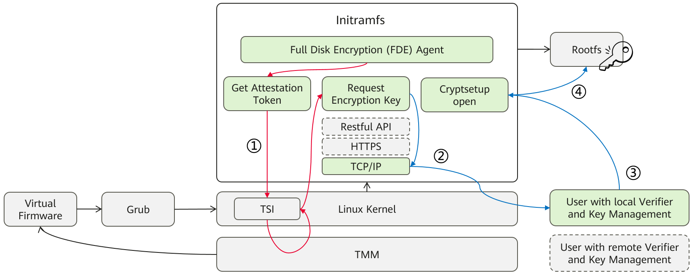
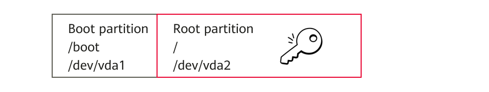

# 全盘加密

全盘加密（Full Disk Encryption, FDE ）是一种通过加密整个磁盘分区来保护敏感信息的安全技术。在非机密计算环境中，`FDE`通常基于`LUKS`（`Linux` 统一密钥设置）和用户提供的密钥实现。然而，在`virtCCA`这类基于`TrustZone`的机密计算架构中，加密密钥需要通过认证服务（attestation service） 安全获取，而非直接依赖用户输入。

**注意：默认的FDE解决方案只是一个参考实现。如果您使用其他远程服务，请仔细调整以下部分中的脚本。** 

## 架构

本节描述将`FDE`与华为`virtCCA`集成的实现步骤，主要分为三个阶段。
1.  构建本地验证器的用户环境，并生成镜像加密的密钥文件。
2.  使用密钥文件创建加密的`cVM`镜像，并将`FDE`组件安装到其初始内存文件系统（`initramfs`）中。
3.  通过`early-boot` `FDE`启动基于加密镜像的`cVM`。

## 准备本地验证器与加密密钥

FDE代码位于目录`FDE_DIR=virtCCA_sdk/attestation/full-disk-encryption/grub-boot`中。

FDE参考实现提供了两种远程证明示例:`virtCCA_sdk/attestation/samples` 和 `virtCCA_sdk/attestation/rats-tls`,两者的区别在于`rats-tls`具有更安全的TLS通信。

```
cd ${FDE_DIR}/attestation
sh pre-fde.sh -a <samples or rats-tls>
```
>-  -a ：输入samples 或者 rats-tls 来选择不同的远程证明示例，如`export ATTEST_CASE=samples`。

-   脚本`pre-fde.sh`会检查远程证明所需的`virtcca-client`和`virtcca-server`是否存在。若不存在，则会重新编译`virtCCA_sdk/attestation/sdk`和远程证明示例，并将远程证明程序复制到当前目录。
-   脚本`pre-fde.sh`还会检查镜像加密的密钥文件是否存在，若不存在，则会在当前目录重新生成密钥文件。

## 创建加密的cVM镜像

构建并验证`openEuler 24.03 LTS SP1`的cVM加密镜像。

```
cd ${FDE_DIR}/image
sh create-fde-image.sh -i <input image> -g <image measurement reference> -o <output image> -a ${ATTEST_CASE}
```
>-   -i ：表示cVM镜像。
>-   -g ：表示cVM镜像组件（grub镜像、grub.cfg 文件、Kernel镜像、initramfs镜像）的参考度量值文件。
>-   -o ：可选参数，用于指定cVM镜像的输出路径。
>-   -a ：输入samples 或者 rats-tls 来选择不同的远程证明示例。

-   脚本`create-fde-image.sh`将使用加密密钥加密根文件系统，它会创建一个名为`fde`的`dracut`模块，并将`FDE`相关组件例如远程证明程序`virtcca-server`、FDE代理`fde-agent.sh`和加密工具`cryptsetup`安装到`initramfs`中。内核启动参数会追加`root=/dev/mapper/encroot`（表示加密的根文件系统分区），同时更新`/etc/fstab`以自动挂载加密根分区。
-   由于`GRUB`配置文件（如 `grub.cfg`）和`initramfs`镜像被修改，因此脚本会更新参考度量值（如 `hash.json`）并将其复制到`${FDE_DIR}/attestation/${ATTEST_CASE}`目录。
-   默认输出镜像为`${FDE_DIR}/image/virtcca-cvm-openeuler-24.03-encrypted.qcow2`，其磁盘分区如下。
   
    >加密后的根分区/dev/vda2通过LUKS保护。

## 基于early-boot FDE启动cVM
当cVM启动进入initramfs阶段时，终端会输出IP地址和端口。
1.  用户根据cVM的输出日志，在宿主机`terminal`中执行如下命令，用来保存IP地址和端口号。

    ```bash
    export IP_ADDR=192.168.122.150 # ip地址根据实际情况修改
    export PORT=7220
    ```
2.  `initramfs`中的脚本`fde-agent.sh`会自动执行如下命令, 该命令会通过TMM服务接口获取度量报告（`attestation token`）， 并等待`virtcca-client`的请求。

    ```bash
    /usr/bin/virtcca-server -i ${IP_ADDR} -p ${PORT} -k
    ```
3.  virtcca-client向virtcca-server发起请求，获取度量报告， 在度量报告验证通过后， 再将加密密钥发送到`virtcca-server`。
    ```bash
    cd ${FDE_DIR}/attestation/${ATTEST_CASE}
    ./virtcca-client -i ${IP_ADDR} -p ${PORT} -m <measurement> -f hash.json -k rootfs_key.bin 
    ```
    >其中`<measurement>`为cVM初始度量值的参考值，是由`gen_rim_ref`（详见 `virtCCA_sdk/attestion/rim_refi`） 工具生成。当`ATTEST_CASE=rats-tls`请输入 `-r <measurement>`。 
4.  脚本`fde-agent.sh`会自动执行如下命令，使用加密密钥解密根文件系统并挂载。
    ```bash
    cryptsetup open /dev/vda2 encroot --key-file /root/rootfs_key.bin 
    ```
5.  启动完成后， 在`cVM`中执行`lsblk`，可看到挂载的加密存储设备encroot。
