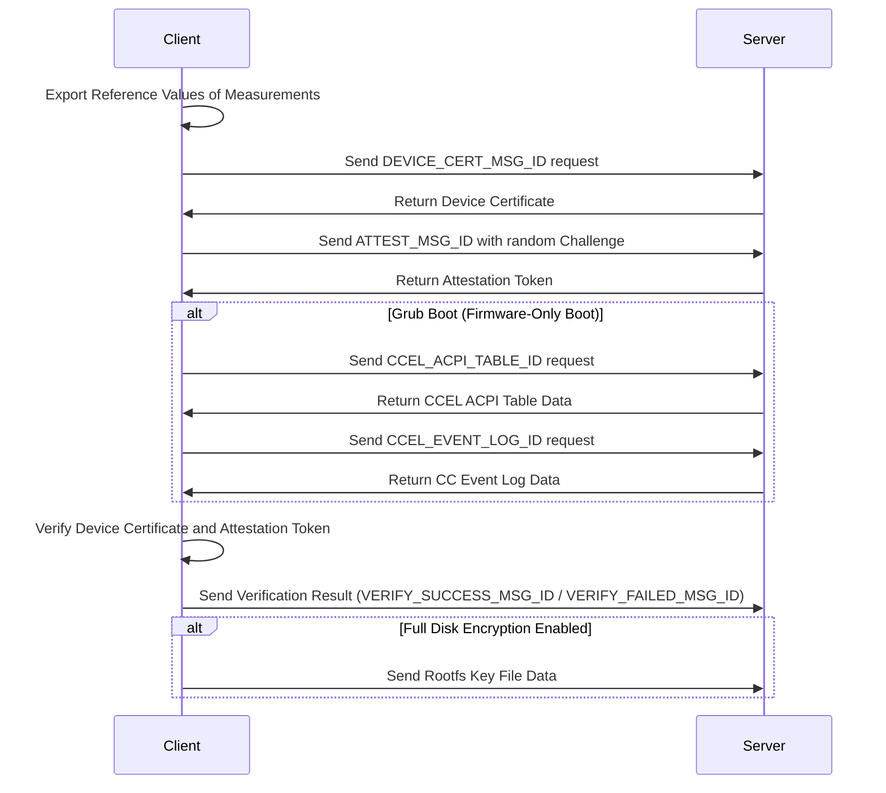
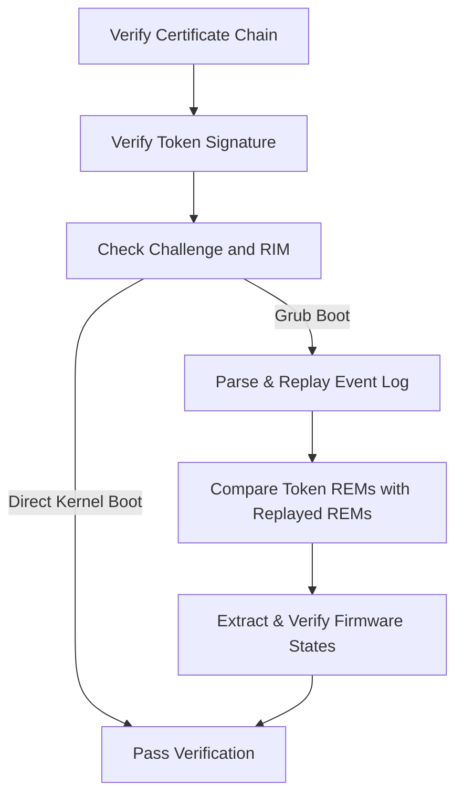

# Attestation Samples

This is a simple demo to show virtCCA attestation, consisting of a client and a server. The server runs in CVM while the client runs locally, e.g., user machine. Here the client simulated a user with a local verifier and key management.

## Preparation

1. Compile and install attestation sdk

```shell
cd attestation/sdk
cmake -S . -B build
cmake --build build
cmake --install build
```

The user-space static library for attestation, i.e., `libvccaattestation.a`, will be installed in the `/usr/local/lib` directory, and the header file `attestation.h` will be installed in the `/usr/local/include` directory.

2. Compile the attestation sample codes

```shell
cd attestation/samples
cmake -S . -B build
cmake --build build
```

The built server and client will be generated in the `build` directory. Please note that they are provided for reference only. 

In this sample, the server calls attestation sdk to get device certificate and attestation report, while the client parses and verifies them. If a CVM boots via firmware (Grub boot), the server collects event logs to support attestation. The server and client use TCP for data transmission.

## Usage

The server supports parameters as below. 

```shell
$ ./server -h
Usage: server [options]
Options:
	-i, --ip <ip>                      Listening IP address
	-p, --port <port>                  Listening tcp port
	-k, --fdekey                       Enable Full Disk Encryption with rootfs key file
	-h, --help                         Print Help (this message) and exit

```

The client supports parameters as below.

```shell
Usage: client [options]
Options:
	-i, --ip <ip>                      Listening IP address
	-p, --port <port>                  Listening tcp port
	-m, --measurement <measurement>    Initial measurement for cVM
	-f, --firmware <json>              Enable firmware verification with JSON reference file
	-e, --eventlog                     Dump event log
	-k, --fdekey <key_file>            Enable Full Disk Encryption with rootfs key file
	-h, --help                         Print Help (this message) and exit
```

Example Commands

- Run attestation samples for direct kernel boot:

```shell
./server -i 127.0.0.1 -p 12345
```

```shell
./client -i 127.0.0.1 -p 12345 -m 38d644db0aeddedbf9e11a50dd56fb2d0c663f664d63ad62762490da41562108 
```

Note: The parameter following `-m` is the reference value for the CVM initial measurement, calculated by the [gen_rim_ref](https://gitee.com/openeuler/virtCCA_sdk/tree/master/attestation/rim_ref) tool.

- Run attestation samples for grub boot:

```shell
./server -i 127.0.0.1 -p 12345
```

```shell
./client -i 127.0.0.1 -p 12345 -m 38d644db0aeddedbf9e11a50dd56fb2d0c663f664d63ad62762490da41562108 -f image_reference_measurement.json
```

The JSON file following `-f` includes golden measurements of the CVM image, such as grub binary, grub configuration, kernels and corresponding initramfs images. This file is generated by the [cvm-image-rewriter](https://gitee.com/openeuler/virtCCA_sdk/tree/master/cvm-image-rewriter) tool.

## Workflow

### Interaction between Client & Server

Below outlines the interaction between the client and the server:



### Verify Attestation Token

The detailed process for "Verify Device Certificate and Attestation Token" is shown as follows. Please refer to `verify_token` in client.c to see code details.


