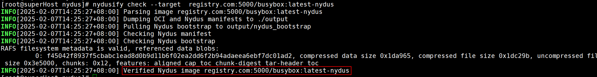
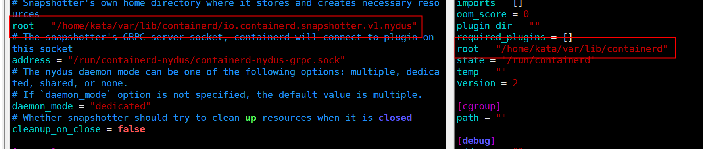
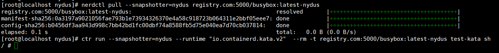
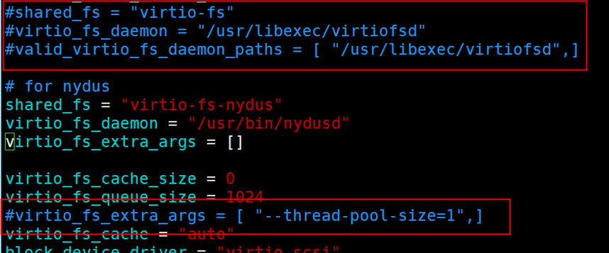
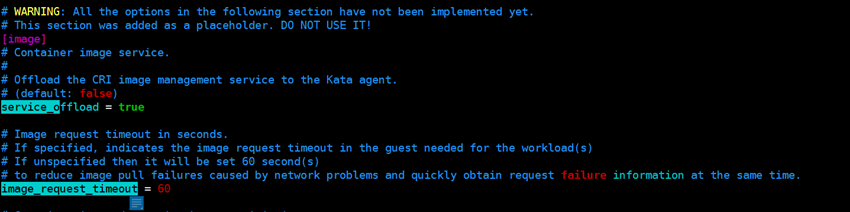
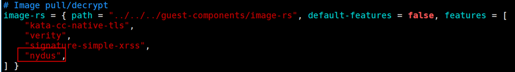
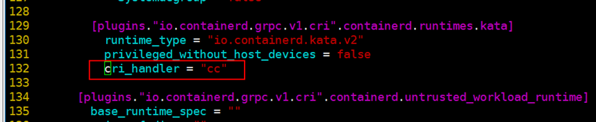
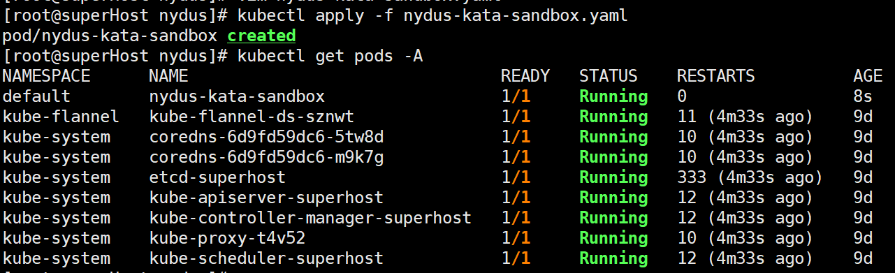
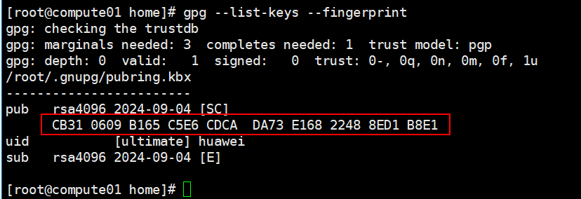
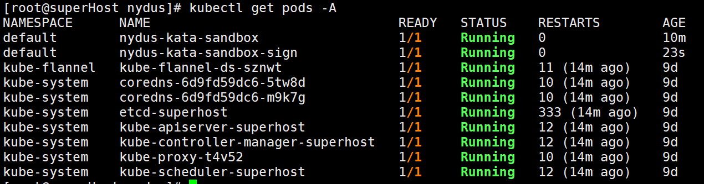

# Nydus 基于机密容器部署
## 部署说明
### 新增软件
1 nydus-static

软件版本：v2.3.0

作用：包含nydusd、nydus-image、nydusify等二进制软件，提供Nydus镜像解析、转换OCI镜像为Nydus等功能。

获取地址：https://github.com/dragonflyoss/nydus/releases/download/v2.3.0/nydus-static-v2.3.0-linux-arm64.tgz

2 Nydus Snapshotter

软件版本：v0.15.0

作用： containerd外部插件，接收containerd的CRI请求，调用nydusd处理nydus镜像。

获取地址：https://github.com/containerd/nydus-snapshotter/releases/download/v0.14.0/nydus-snapshotter-v0.14.0-linux-arm64.tar.gz

3 Nerdctl

软件版本：v1.7.7

作用： containerd 命令行工具。

获取地址：https://github.com/containerd/nydus-snapshotter/releases/download/v0.14.0/nydus-snapshotter-v0.14.0-linux-arm64.tar.gz
### 环境依赖要求
参考 [机密容器部署运行](https://gitee.com/openeuler/virtCCA_sdk/blob/master/doc/confidential_container/%E6%9C%BA%E5%AF%86%E5%AE%B9%E5%99%A8%E9%83%A8%E7%BD%B2%E8%BF%90%E8%A1%8C.md#%E6%9C%BA%E5%AF%86%E5%AE%B9%E5%99%A8%E9%83%A8%E7%BD%B2%E8%BF%90%E8%A1%8C) 完成kata机密容器基础环境部署，主要包括以下组件：
-	runc
-	contaienrd 
-	k8s
-	kata
-	guest kernel 和 rootfs


## nydus基础环境搭建
1 要求部署环境能够正常运行机密容器。

2 安装nydus-image，nydusd，nydusify，nydusctl和nydus-overlayfs。

```bash
wget  https://github.com/dragonflyoss/nydus/releases/download/v2.3.0/nydus-static-v2.3.0-linux-arm64.tgz
tar -zxvf  nydus-static-v2.3.0-linux-arm64.tgz
cd nydus-static
install -D -m 755 nydusd nydus-image  nydusify nydusctl nydus-overlayfs /usr/bin
```

3 安装containerd-nydus-grpc (nydus snapshotter)。

```bash
wget  https://github.com/containerd/nydus-snapshotter/releases/download/v0.14.0/nydus-snapshotter-v0.14.0-linux-arm64.tar.gz
tar -zxvf  nydus-snapshotter-v0.14.0-linux-arm64.tar.gz 
install -D -m 755 bin/containerd-nydus-grpc  /usr/bin
```

4  安装nerdctl

```
wget https://github.com/containerd/nerdctl/releases/download/v1.7.7/nerdctl-1.7.7-linux-arm64.tar.gz
tar -zxvf nerdctl-1.7.7-linux-arm64.tar.gz
install -D -m 755 nerdctl /usr/bin
```

5 使用nydusify转换自建镜像仓中的镜像格式。

```bash
nydusify convert --source registry.com:5000/busybox:latest --target registry.com:5000/busybox:latest-nydus
```

> 本文档以私有仓busybox镜像为例进行说明，实际部署请按需将`registry.com:5000/busybox:latest`自行替换为目标镜像名。

6 使用`nydusify`检查目标镜像，命令显示验证完毕且无错误信息，说明镜像转换成功。

```bash
nydusify check --target  registry.com:5000/busybox:latest-nydus
```



7 配置nydusd，文件路径：`/etc/nydus/nydusd-config.fusedev.json`。

```bash
tee /etc/nydus/nydusd-config.fusedev.json > /dev/null << EOF
{
  "device": {
    "backend": {
      "type": "registry",
      "config": {
        "scheme": "https",
        "skip_verify": true,
        "timeout": 5,
        "connect_timeout": 5,
        "retry_limit": 4,
        "auth": ""
      }
    },
    "cache": {
      "type": "blobcache",
      "config": {
        "work_dir": "cache"
      }
    }
  },
  "mode": "direct",
  "digest_validate": false,
  "iostats_files": false,
  "enable_xattr": true,
  "fs_prefetch": {
    "enable": true,
    "threads_count": 4
  }
}
EOF
```

- `device.backend.config.scheme`:  访问方式https/http；
- `device.backend.config.auth`:  私有仓登录信息，使用以下命令将私有仓的用户名和密码进行base64编码后填入：
```bash
echo -n "username:password" | base64
```
- `device.backend.config.skip_verify`:  是否跳过https证书检查。

8 获取nydus-snapshotter配置文件，

```
wget https://raw.githubusercontent.com/containerd/nydus-snapshotter/refs/tags/v0.14.0/misc/snapshotter/config.toml

vim config.toml
```

9 设置 nydus 的 home 目录`root`选项与本机 containerd 对应的`root`选项，此处设置与 [机密容器部署运行](https://gitee.com/openeuler/virtCCA_sdk/blob/master/doc/confidential_container/%E6%9C%BA%E5%AF%86%E5%AE%B9%E5%99%A8%E9%83%A8%E7%BD%B2%E8%BF%90%E8%A1%8C.m) 中设置的containerd一致； 设置nydusd和nydus-image的实际安装路径
```
root = "/home/kata/var/lib/containerd/io.containerd.snapshotter.v1.nydus"
nydusd_path= "/usr/bin/nydusd"
nydusimage_path= "/usr/bin/nydus-image"
```


9 启动运行containerd-nydus-grpc。

```bash
containerd-nydus-grpc --config config.toml --log-to-stdout
```

10 修改containerd配置文件：`/etc/containerd/config.toml`。

```
[plugins."io.containerd.grpc.v1.cri".containerd]
      default_runtime_name = "runc"
      disable_snapshot_annotations = false
      discard_unpacked_layers = false
      ignore_rdt_not_enabled_errors = false
      no_pivot = false
      snapshotter = "nydus" 
[proxy_plugins]
  [proxy_plugins.nydus]
    type = "snapshot"
    address = "/run/containerd-nydus/containerd-nydus-grpc.sock"
```

11 重启containerd。

```bash
systemctl daemon-reload &&  systemctl restart containerd
```

12 使用nerdctl拉取nydus镜像，使用ctr运行基于kata的nydus镜像。

```bash
nerdctl pull --snapshotter=nydus registry.com:5000/busybox:latest-nydus
ctr run --snapshotter=nydus --runtime "io.containerd.kata.v2"  --rm -t registry.com:5000/busybox:latest-nydus test-kata sh
```



## 使用k8s部署基于nydus镜像的kata容器

1 修改kata配置`/etc/kata-containers/configuration.toml`

配置nydus共享文件系统。

```
shared_fs = "virtio-fs-nydus" 
virtio_fs_daemon =  "/usr/bin/nydusd" 
virtio_fs_extra_args = []
```



设置service\_offload = true。



2 在kata-containers/src/agent/Cargo.toml中image-rs的features新增nydus。



随后重新编译，并安装到guest rootfs：

```bash
cd kata-containers/tools/osbuilder/rootfs-builder/ 
SECCOMP=no CFLAGS=-mno-outline-atomics ./rootfs.sh -r  "\$PWD/kata-overlay" 
mount rootfs.img rootfs 
cp kata-overlay/usr/bin/kata-agent rootfs/usr/bin
```

3 containerd: 修改containerd配置文件`/etc/containerd/config.toml`, 设置cri\_handler = "cc"。



修改containerd配置后需重启使配置生效：

```
systemctl restart containerd
```

4 编辑k8s部署文件`nydus-kata-sandbox.yaml`

```yaml
apiVersion: v1
kind: Pod
metadata:
  name: nydus-kata-sandbox
spec:
  restartPolicy: Never
  runtimeClassName: kata
  containers:
  - name: box-1    
    image: registry.com:5000/busybox:latest-nydus
    imagePullPolicy: Always
    command:
      - sh
    tty: true
```

5 部署pod并查看启动情况

```bash
kubectl apply -f nydus-kata-sandbox.yaml
kubectl get pods
```



# Nydus 部署签名镜像

1 参考[机密容器远程证明](https://gitee.com/openeuler/virtCCA_sdk/blob/master/doc/confidential_container/%E6%9C%BA%E5%AF%86%E5%AE%B9%E5%99%A8%E8%BF%9C%E7%A8%8B%E8%AF%81%E6%98%8E.md)编译部署attestation-agent、attestation-service和KBS；参考[镜像签名验签](https://gitee.com/openeuler/virtCCA_sdk/blob/master/doc/confidential_container/%E5%AE%B9%E5%99%A8%E9%95%9C%E5%83%8F%E7%AD%BE%E5%90%8D%E9%AA%8C%E7%AD%BE.md)配置skopeo和kata，并生成签名密钥。

> 注：当前nydus仅支持镜像签名功能，不支持镜像加密

2 使用skopeo对nydus镜像签名
参考 [镜像签名验签](https://gitee.com/openeuler/virtCCA_sdk/blob/master/doc/confidential_container/%E5%AE%B9%E5%99%A8%E9%95%9C%E5%83%8F%E7%AD%BE%E5%90%8D%E9%AA%8C%E7%AD%BE.md)
生成gpg密钥，通过下述命令获取密钥指纹：

```bash
gpg --list-keys --fingerprint
```



通过密钥指纹`key_hash`指定密钥对目标镜像进行签名。

```bash
skopeo copy --insecure-policy  \
--sign-by {key_hash} \
docker://registry.com:5000/busybox:latest-nydus \
docker://registry.com:5000/busybox_nydus_sign:latest
```

3 配置签名镜像文件`nydus-kata-sandbox-sign.yaml`

```yaml
apiVersion: v1
kind: Pod
metadata:
  name: nydus-kata-sandbox
spec:
  restartPolicy: Never
  runtimeClassName: kata
  containers:
  - name: box-1
    image: registry.com:5000/busybox_nydus_sign:latest
    imagePullPolicy: Always
    command:
      - sh
    tty: true
```

4 部署

```bash
kubectl apply -f nydus-kata-sandbox-sign.yaml
```


