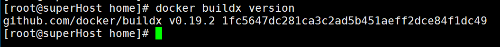
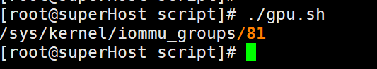
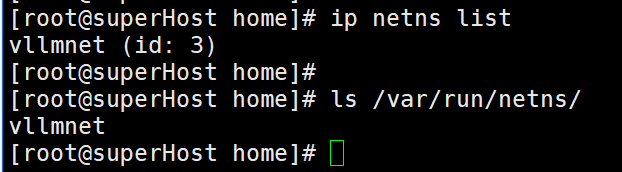
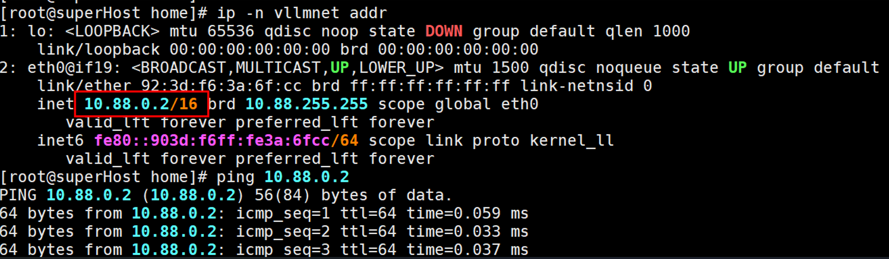
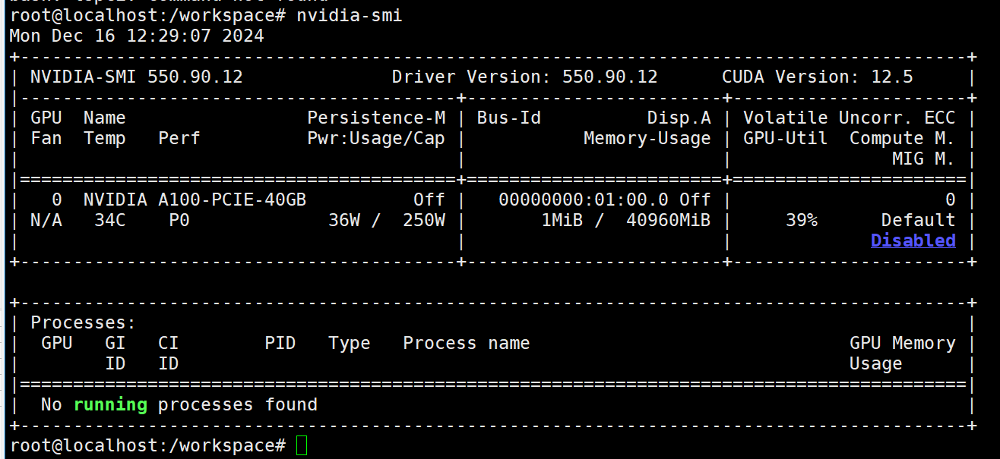
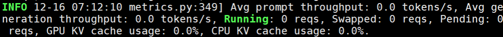
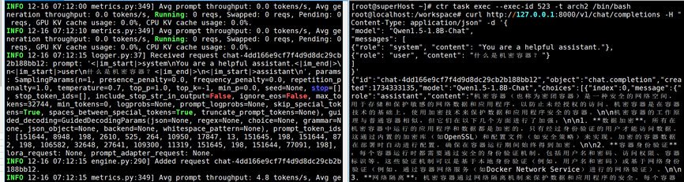

# 机密容器设备直通
本章节介绍基于kata-virtcca机密容器实现GPU设备直通，并在机密容器中运行大模型。要求具备以下条件：
- 完成基础kata-virtcca机密容器环境部署和virtcca设备直通设置；
- 要求host kernel使用OLK-6.6分支，且启用以下选项。
    ```bash
    CONFIG_VFIO
    CONFIG_VFIO_IOMMU_TYPE1
    CONFIG_VFIO_PCI
   ```
- 装配NVIDIA GPU；
- 安装docker，且版本>19.03。

## 配置rootfs.img
安装部署工具。
```bash
curl -s -L https://nvidia.github.io/libnvidia-container/stable/rpm/nvidia-container-toolkit.repo | \
tee /etc/yum.repos.d/nvidia-container-toolkit.repo

mkdir -p /home/mnt
export ROOTFS_DIR=/home/mnt
mount rootfs.img ${ROOTFS_DIR}
dnf --installroot=${ROOTFS_DIR} install pciutils tar gcc nvidia-container-toolkit -y
```

将guest kernel代码复制到rootfs.img中。
```bash
cp kernel/ ${ROOTFS_DIR}/home
```
> 初始部署的rootfs.img容量较小，需要手动扩展镜像容量
> ```bash
> qemu-img resize rootfs.img +20G
> e2fsck -f rootfs.img 
> resize2fs rootfs.img
> ```

挂载关键路径，并切换到guest根目录。
```bash
mount -t sysfs -o ro none ${ROOTFS_DIR}/sys
mount -t proc -o ro none ${ROOTFS_DIR}/proc
mount -t tmpfs none ${ROOTFS_DIR}/tmp
mount -o bind,ro /dev ${ROOTFS_DIR}/dev
mount -t devpts none ${ROOTFS_DIR}/dev/pts

chroot ${ROOTFS_DIR}
```

安装nvidia驱动。
```bash
wget https://cn.download.nvidia.com/tesla/550.127.08/NVIDIA-Linux-aarch64-550.127.08.run
chmod +x NVIDIA-Linux-aarch64-550.127.08.run
./NVIDIA-Linux-aarch64-550.127.08.run --kernel-source-path=/home/kernel/
```

在guest中添加hook，并增加执行权限。
```bash
mkdir -p  /usr/share/oci/hooks/prestart/
vim /usr/share/oci/hooks/prestart/nvidia-container-toolkit.sh
```

增加以下内容：
```bash
#!/bin/bash -x
/usr/bin/nvidia-container-toolkit -debug $@
```

增加执行权限。
```bash
chmod +x /usr/share/oci/hooks/prestart/nvidia-container-toolkit.sh
```

回退到host，解除挂载。
```bash
exit

umount ${ROOTFS_DIR}/sys
umount ${ROOTFS_DIR}/proc
umount ${ROOTFS_DIR}/tmp
umount ${ROOTFS_DIR}/dev/pts
umount ${ROOTFS_DIR}/dev

umount ${ROOTFS_DIR}
```
修改kata container配置，设置`guest_hook_path`选项。
```bash
vim /etc/kata-containers/configuration.toml

guest_hook_path = "/usr/share/oci/hooks"
```


## 制作vllm镜像
安装buildx。
```bash
mkdir -p /home/pass-through && cd /home/pass-through
wget https://github.com/docker/buildx/releases/download/v0.19.2/buildx-v0.19.2.linux-arm64
mv buildx-v0.19.2.linux-arm64 docker-buildx
mkdir -p ~/.docker/cli-plugins/
cp docker-buildx ~/.docker/cli-plugins/
chmod +x ~/.docker/cli-plugins/docker-buildx
```

检查buildx是否成功安装。
```bash
docker buildx version
```


下载并构建基础环境镜像。
```bash
git clone https://github.com/skandermoalla/vllm-build.git
cd vllm-build
```

修改项目内的dockerfile为如下内容：
```bash
# https://github.com/skandermoalla/vllm-build
# The vLLM Dockerfile is used to construct vLLM image that can be directly used
# to run the OpenAI compatible server.

#################### BASE BUILD IMAGE ####################
# prepare basic build environment
FROM nvcr.io/nvidia/pytorch:24.07-py3 AS base

ENV DEBIAN_FRONTEND=noninteractive
RUN sed -i "s@http://ports.ubuntu.com@http://mirrors.tuna.tsinghua.edu.cn@g" /etc/apt/sources.list
RUN apt-get update -y \
    && apt-get install -y ccache software-properties-common git curl sudo vim libibverbs-dev ffmpeg libsm6 libxext6 libgl1

WORKDIR /workspace

ARG torch_cuda_arch_list='8.0 9.0+PTX'
ENV TORCH_CUDA_ARCH_LIST=${torch_cuda_arch_list}
# Override the arch list for flash-attn to reduce the binary size
ARG vllm_fa_cmake_gpu_arches='80-real;90-real'
ENV VLLM_FA_CMAKE_GPU_ARCHES=${vllm_fa_cmake_gpu_arches}
# max jobs used by Ninja to build extensions
ARG max_jobs
ENV MAX_JOBS=${max_jobs}
# number of threads used by nvcc
ARG nvcc_threads
ENV NVCC_THREADS=$nvcc_threads

COPY requirements-common.txt requirements-common.txt
COPY requirements-cuda.txt requirements-cuda.txt
RUN pip uninstall pynvml -y

# Install build and runtime dependencies from unlocked requirements
RUN --mount=type=cache,target=/root/.cache/pip \
    pip install -r requirements-cuda.txt

RUN pip list --format freeze > /opt/requirements-cuda-freeze.txt

#################### BASE BUILD IMAGE ####################

#################### Build IMAGE ####################
FROM base AS build

# build vLLM extensions

RUN mkdir wheels

# xFormers also install its flash-attention inside not visible outside.
# https://github.com/facebookresearch/xformers/blob/d3948b5cb9a3711032a0ef0e036e809c7b08c1e0/.github/workflows/wheels_build.yml#L120
RUN git config --global http.sslVerify false

RUN git clone https://github.com/facebookresearch/xformers.git ; cd xformers ; git checkout v0.0.27.post2 ; git submodule update --init --recursive ; python setup.py bdist_wheel --dist-dir=/workspace/wheels

# Flashinfer.
# https://github.com/flashinfer-ai/flashinfer/blob/8f186cf0ea07717727079d0c92bbe9be3814a9cb/scripts/run-ci-build-wheel.sh#L47C1-L47C39
RUN git clone https://github.com/flashinfer-ai/flashinfer.git ; cd flashinfer ; git checkout v0.1.6 ; git submodule update --init --recursive ; cd python ; python setup.py bdist_wheel --dist-dir=/workspace/wheels

# Bitsandbytes.
RUN git clone https://github.com/bitsandbytes-foundation/bitsandbytes.git ; cd bitsandbytes ; git checkout 0.44.1 ; cmake -DCOMPUTE_BACKEND=cuda -S . ; make ; python setup.py bdist_wheel --dist-dir=/workspace/wheels

# Install them.
RUN pip install --no-deps /workspace/wheels/*.whl

WORKDIR /vllm-workspace

# files and directories related to build wheels
COPY csrc csrc
COPY setup.py setup.py
COPY cmake cmake
COPY CMakeLists.txt CMakeLists.txt
COPY pyproject.toml pyproject.toml
COPY vllm vllm
COPY requirements-common.txt requirements-common.txt
COPY requirements-cuda.txt requirements-cuda.txt

ENV CCACHE_DIR=/root/.cache/ccache
RUN --mount=type=cache,target=/root/.cache/ccache \
    --mount=type=bind,source=.git,target=.git \
    python setup.py bdist_wheel --dist-dir=/workspace/wheels

# Check the size of the wheel if RUN_WHEEL_CHECK is true
COPY .buildkite/check-wheel-size.py check-wheel-size.py
# Default max size of the wheel is 250MB
ARG VLLM_MAX_SIZE_MB=250
ENV VLLM_MAX_SIZE_MB=$VLLM_MAX_SIZE_MB
ARG RUN_WHEEL_CHECK=true
RUN if [ "$RUN_WHEEL_CHECK" = "true" ]; then \
        python check-wheel-size.py dist; \
    else \
        echo "Skipping wheel size check."; \
    fi
####################  Build IMAGE ####################


#################### vLLM installation IMAGE ####################
# image with vLLM installed
FROM base AS vllm-base

RUN --mount=type=bind,from=build,src=/workspace/wheels,target=/workspace/wheels \
    pip install --no-deps /workspace/wheels/*.whl

#################### vLLM installation IMAGE ####################

#################### OPENAI API SERVER ####################
# openai api server alternative
FROM vllm-base AS vllm-openai

# install additional dependencies for openai api server
RUN --mount=type=cache,target=/root/.cache/pip \
    pip install accelerate hf_transfer 'modelscope!=1.15.0' timm==0.9.10

# Freeze the requirements, use this to update the requirements-openai-freeze.txt to reproduce the same environment
RUN pip list --format freeze > /opt/requirements-openai-freeze.txt

ENV VLLM_USAGE_SOURCE production-docker-image
ENV HF_HUB_ENABLE_HF_TRANSFER=0

RUN apt install pciutils -y

ENTRYPOINT ["/bin/bash"]

#################### OPENAI API SERVER ####################
```
> 构建该镜像要求docker具备外网访问权限，内网环境下请按需配置网络环境。

构建镜像。
```bash
DOCKER_BUILDKIT=1 docker build --build-arg max_jobs=64 --build-arg nvcc_threads=8 --target vllm-base --tag vllm-cvm:latest .
```
> 此步骤花费时间较长，请耐心等待。

导入vllm镜像。
```bash
cd /home/pass-through
docker save vllm-cvm -o vllm.tar.gz
ctr image import vllm.tar.gz
```

## 配置host环境
### 配置GPU驱动
编写脚本`gpu.sh`，加载vfio-pci驱动并将其与GPU的BDF（Bus-Device-Function）号绑定。
```bash
#!/bin/bash
modprobe vfio-pci
BDF=$(lspci -nn -D | grep -i nvidia | awk '{print $1}')
DEV="/sys/bus/pci/devices/$BDF"
echo "vfio-pci" > $DEV/driver_override
echo $BDF > /sys/bus/pci/drivers_probe

readlink -e /sys/bus/pci/devices/$BDF/iommu_group
ls -l /dev/vfio
```

运行脚本，使GPU绑定VFIO。
```bash
bash ./gpu.sh
```
> 若需要GPU解绑VFIO，可使用以下命令解除绑定：
> ```bash
> echo > $DEV/preferred_driver
> echo $BDF > $DEV/driver/unbind
> echo $BDF > /sys/bus/pci/drivers_probe
> ```

图中数字代表该设备所属的 IOMMU 组，根据该数字设置下述的环境变量`VFIO`。



设置环境变量。
```bash
export VFIO=/dev/vfio/81
```

### 配置容器网络
下载安装cni plugins。
```bash
wget https://github.com/containernetworking/plugins/releases/download/v1.6.0/cni-plugins-linux-arm-v1.6.0.tgz
mkdir -p /opt/cni/bin/
mkdir -p /etc/cni/net.d
tar -zxvf cni-plugins-linux-arm-v1.6.0.tgz -C /opt/cni/bin
```

下载编译cnitool。
```bash
git clone https://github.com/containernetworking/cni.git
cd cni
go mod tidy
cd cnitool
GOOS=linux GOARCH=arm64 go build .
```

将编译的cnitool可执行文件拷贝到/opt/cni/bin目录下。
```bash
cp cnitool /opt/cni/bin
chmod +x /opt/cni/bin/cnitool
ln -s /opt/cni/bin/cnitool /usr/local/bin/cnitool
```

创建容器网络。
```bash
cat << EOF | tee /etc/cni/net.d/vllmnet.conf
{
    "cniVersion": "0.4.0",
    "name": "vllmnet",
    "type": "bridge",
    "bridge": "cni0",
    "isDefaultGateway": true,
    "forceAddress": false,
    "ipMasq": true,
    "hairpinMode": true,
    "ipam": {
        "type": "host-local",
        "subnet": "{subnetIp}/{mask}"
    }
}
EOF
```
> 子网IP与掩码请根据网络环境自行配置，建议采用私有网段，避免与公网或其他容器网络冲突，本文档中采用的示例子网为：10.88.0.0/16。

创建network namespace。
```bash
ip netns add vllmnet
```
检查网络是否添加成功。
```bash
ip netns list
ls /var/run/netns/
```



向network namespace中添加网络。
```bash
export CNI_PATH=/opt/cni/bin
cnitool add vllmnet /var/run/netns/vllmnet
cnitool check vllmnet /var/run/netns/vllmnet
```

使用下述命令查看分配的ip，并测试网络是否工作。
```bash
ip -n vllmnet addr
ping 10.88.0.2
```



## vllm镜像运行
运行vllm容器。
```bash
ctr --debug run --runtime "io.containerd.kata.v2"  --device $VFIO -t --with-ns=network:/var/run/netns/vllmnet "docker.io/library/vllm-cvm:latest" arch /bin/sh
```

进入容器后，可通过nvidia-smi命令查看显卡直通情况
```bash
nvidia-smi
```



部署llm，等待下载：
```bash
VLLM_USE_MODELSCOPE=True python3 -m vllm.entrypoints.openai.api_server --model qwen/Qwen1.5-1.8B-Chat --trust-remote-code --host 0.0.0.0 --port 8000 --served-model-name Qwen1.5-1.8B-Chat --gpu-memory-utilization 0.95
```
> 该命令依赖外部网络访问权限拉取相关依赖，内网环境下请按需配置网络环境。

待显示以下内容，说明llm部署完成。



另起一shell命令窗口，使用下述命令进入容器，并发送提问请求。
```bash
# exec-id任意设置
ctr task exec --exec-id 523 -t arch /bin/bash

curl http://127.0.0.1:8000/v1/chat/completions -H "Content-Type: application/json" -d '{
"model": "Qwen1.5-1.8B-Chat",
"messages": [
{"role": "system", "content": "You are a helpful assistant."},
{"role": "user", "content": "什么是机密容器？"}
] 
}'
```
收到以下回复，说明llm成功运行。



