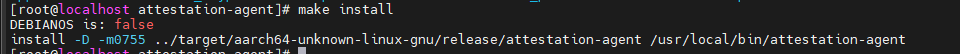
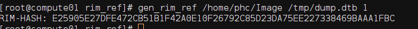
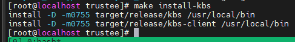
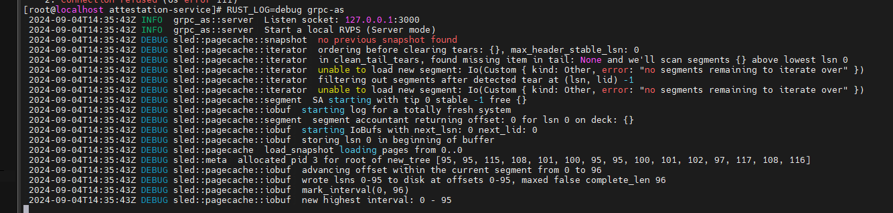
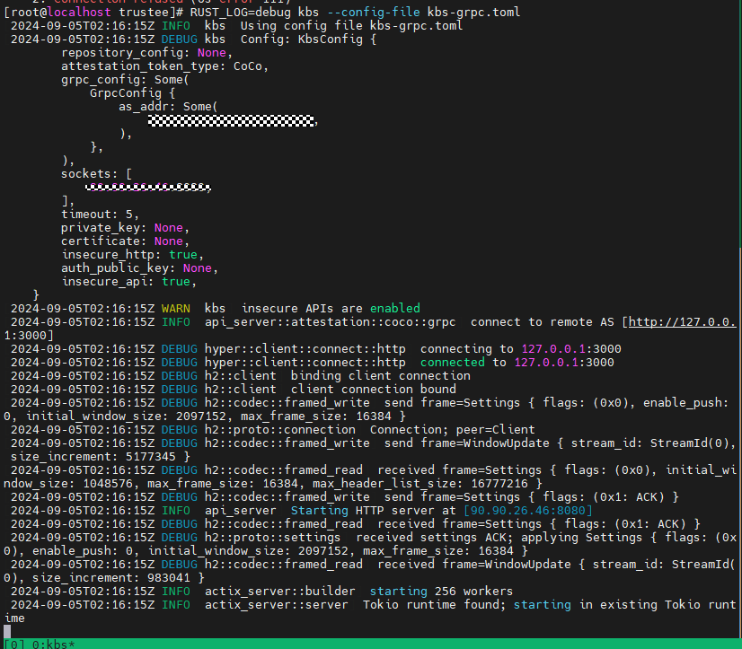
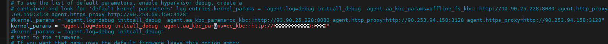
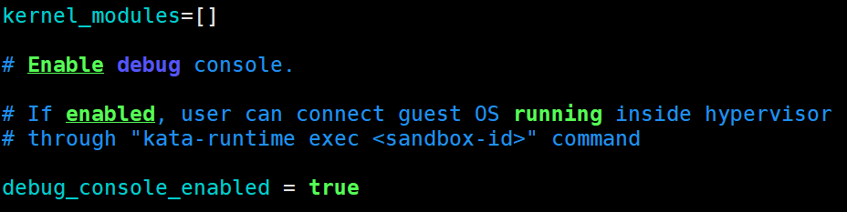
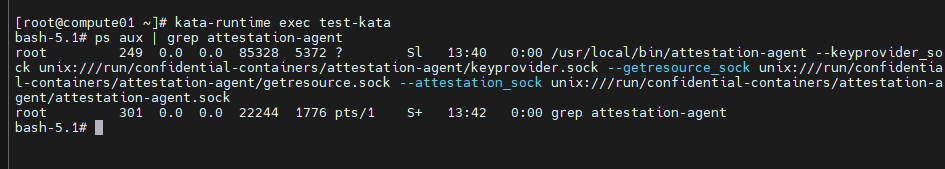

# 机密容器远程证明<a name="ZH-CN_TOPIC_0000002080359729"></a>

本章节主要介绍如何使能机密容器远程证明功能，证明当前机密容器运行在可信任的TEE环境。

参考如下命令安装编译依赖。

```
yum install -y tpm2-tss-devel tpm2-abrmd tpm2-tools protobuf-compiler virtCCA_sdk-devel virtCCA_sdk
```

> **说明：** 
>执行以下命令查看已安装的virtCCA软件包。确保virtCCA\_sdk、virtCCA\_sdk-devel的版本为0.1.2-1.oe2203sp4。
>```
>yum list |grep virtCCA
>```

## 远程证明组件部署<a name="section453410817138"></a>

-   **attestation-agent编译部署。**

1.  编译、部署attestation-agent。

    ```
    cd ../guest-components/attestation-agent
    make KBC=cc_kbc ttrpc=true
    make install
    ```

    成功编译，make install会将attestation-agent部署在系统路径“/usr/local/bin/attestation-agent“下。

    

2.  拷贝attestation-agent到机密虚机rootfs中。

    ```
    cd /home/work/kata-containers/tools/osbuilder/rootfs-builder
    mount rootfs.img rootfs
    cp -rf /usr/local/bin/attestation-agent rootfs/usr/local/bin/
    umount rootfs
    ```

-   **attestation-service编译部署**。

1.  编译、部署attestation-service。

    ```
    cd /home/work/attestation-service
    make
    make install
    ```

    编译成功生成grpc-as二进制文件，grpc-as默认部署安装在“/usr/local/bin“路径下。

2.  新增远程证明服务基线度量值配置文件。
    1.  备份原有containerd-shim-kata-v2。

        ```
        cp /home/work/kata-containers/src/runtime/containerd-shim-kata-v2 /home/work/kata-containers/src/runtime/containerd-shim-kata-v2-origin
        ```

    2.  在[kata-shim编译和部署](机密容器部署运行.md#section425812386177)源码的基础上执行以下脚本。

        ```
        cd /home/work/kata-containers/
        ```

        ```
        sed -i.bak 's|const defaultQemuMachineOptions = "gic-version=3,accel=kvm,kernel_irqchip=on"|const defaultQemuMachineOptions = "gic-version=3,accel=kvm,kernel_irqchip=on,dumpdtb=/tmp/dump.dtb"|' src/runtime/virtcontainers/qemu_arm64.go
        ```

    3.  编译出可以导出dtb文件的containerd-shim-kata-v2版本。

        ```
        make -C src/runtime
        ```

    4.  启动机密容器以导出对应的dtb文件，生成的dtb文件路径为“/tmp/dump.dtb“。

        ```
        ctr run --runtime "io.containerd.kata.v2" --rm -t docker.io/library/busybox:latest test-kata /bin/sh
        ```

    5.  恢复原始的containerd-shim-kata-v2。

        ```
        cp /home/work/kata-containers/src/runtime/containerd-shim-kata-v2 /home/work/kata-containers/src/runtime/containerd-shim-kata-v2-dump-dtb
        cp /home/work/kata-containers/src/runtime/containerd-shim-kata-v2-origin /home/work/kata-containers/src/runtime/containerd-shim-kata-v2
        ```

    6.  基于导出的dtb文件生成基线度量值。
        1.  使用virtCCA\_sdk中[获取基线度量值](zh-cn_topic_0000002080359745.md#section4613113319549)工具计算RIM度量值。

            

        2.  用vim编辑“/etc/attestation/attestation-service/verifier/virtcca/ref\_value.json”配置文件，替换机密虚机基线度量值，可参考如下配置。

            ```
            {
                    "rpv": "54686520717569636B2062726F776E20666F78206A756D7073206F766572203133206C617A7920646F67732E54686520717569636B2062726F776E20666F7820",
                    "rim": "4e972c68682405109dba4b2b9d89532532868f0b82b4dca56eda8fdd95f2c31f",
                    "rem": [
                        "0000000000000000000000000000000000000000000000000000000000000000",
                        "0000000000000000000000000000000000000000000000000000000000000000",
                        "0000000000000000000000000000000000000000000000000000000000000000",
                        "0000000000000000000000000000000000000000000000000000000000000000"
                    ],
                    "hash_alg": "sha-256"
            }
            ```

3.  远程证明服务节点预置远程证明根证书、二级CA证书文件。

    -   根证书下载链接：[https://download.huawei.com/dl/download.do?actionFlag=download&nid=PKI1000000002&partNo=3001&mid=SUP\_PKI](https://download.huawei.com/dl/download.do?actionFlag=download&nid=PKI1000000002&partNo=3001&mid=SUP_PKI)
    -   二级CA证书下载链接：[https://download.huawei.com/dl/download.do?actionFlag=download&nid=PKI1000000040&partNo=3001&mid=SUP\_PKI](https://download.huawei.com/dl/download.do?actionFlag=download&nid=PKI1000000040&partNo=3001&mid=SUP_PKI)

    > **说明：** 
    >需要将根证书、二级CA证书预置到远程证明服务节点的“/etc/attestation/attestation-service/verifier/virtcca/“目录下。

-   **coco\_keyprovider编译、部署。**

1.  <a name="li17161113920814"></a>编译coco\_keyprovider，coco\_keyprovider隶属于guest\_componet开源组件源码。

    ```
    cd /home/work/guest-components/attestation-agent/coco_keyprovider
    cargo build --release
    cd ../../../
    cp ./guest-components/target/release/coco_keyprovider /usr/local/bin
    ```

    编译成功后会在“guest-components/target/release“下生成coco\_keyprovider二进制文件。

    

2.  创建keyprovider auth非对称密钥对文件。

    ```
    #生成认证公私密钥对
    openssl genpkey -algorithm ed25519 > auth.key
    #导出认证公钥
    openssl pkey -in auth.key -pubout -out auth_pub.pem
    ```

-   **密钥代理服务KBS编译、部署**。

1.  编译KBS组件。

    ```
    cd /home/work/trustee
    make COCO_AS_INTEGRATION_TYPE=grpc
    make install-kbs
    ```

    

2.  新增KBS配置文件。

    用vim编辑“kbs-grpc.toml”配置文件，新增KBS配置信息，可参考如下配置。

    ```
    insecure_http = true(需修改)
    insecure_api = false
     
    sockets = ["IP:8080"]
    auth_public_key = "path/to/auth_pub.pem"
    [grpc_config]
    as_addr = "http://IP:3000"
    ```

    > **说明：** 
    >-   sockets指定KBS侦听IP地址和端口（默认8080）。
    >-   as\_addr指定远程证明服务attestation-service侦听IP和端口（默认端口为3000）信息。
    >-   auth\_public\_key指定认证用的公钥，在编译coco\_keyprovider步骤[1](#li17161113920814)生成。

-   **验证各个组件，容器是否正常启动。**\(常驻服务保持进程终端开启\)

1.  启动coco\_keyprovider组件。\(常驻服务\)

    ```
    # --socket指定coco_keyprovider侦听ip和端口(默认50000)，--kbs指定kbs侦听ip和端口(默认8080),-a指定认证私钥(在编译keyprovider 步骤2生成)，请根据实际情况替换
    RUST_LOG=debug coco_keyprovider --socket ip:port --kbs http://ip:port -a /path/to/auth.key
    ```

    

2.  启动attestation-service组件。\(常驻服务\)

    ```
    # 默认侦听本节点3000端口
    RUST_LOG=debug grpc-as --socket ip:3000
    ```

    

3.  启动KBS组件。\(常驻服务\)

    ```
    RUST_LOG=debug kbs --config-file kbs-grpc.toml
    ```

    > **说明：** 
    >```
    >kbs-grpc.toml文件路径根据实际情况替换。
    >```

    

4.  修改kata-agent启动参数，添加attestation-agent启动命令行。
    1.  用vim编辑“/etc/kata-containers/configuration.toml”文件。
    2.  在“kernel\_params”配置项中添加agent.aa\_kbc\_params启动参数，参数格式应遵循“agent.aa\_kbc\_params=cc\_kbc::http://ip:port”，其中ip:port指定为KBS组件的侦听IP和端口。KBS组件默认8080端口。

        

    3.  打开debug\_console\_enabled选项。

        ```
        debug_console_enabled = true
        ```

        

        > **说明：** 
        >debug\_console\_enabled是测试环境下的调试选项，用于辅助定位，生产环境建议关闭。

    4.  验证带有attestation-agent组件的机密容器启动。

        命令行窗口1执行以下命令启动机密容器。

        ```
        ctr run --runtime "io.containerd.kata.v2" --rm -t "docker.io/library/busybox:latest" test-kata sh
        ```

        新起命令行窗口2，通过kata-runtime命令登录机密虚机，查看attestation-agent服务是否正常启动。

        ```
        kata-runtime exec test-kata
        #此时自动登录到机密虚机内部，执行以下命令查看服务进程
        ps aux | grep attestation-agent
        ```

        

