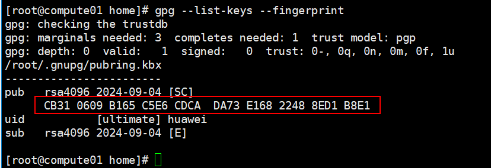

# Deploying a Signed Nydus Image<a name="EN-US_TOPIC_0000002209367368"></a>

1.  Compile and deploy the attestation agent, attestation service, and KBS by following instructions in  [Remote Attestation for Confidential Containers](remote-attestation-for-confidential-containers.md).
2.  Configure Skopeo and Kata by following instructions in  [Verifying Container Image Signatures](verifying-container-image-signatures.md)  and generate a signature key.

    > **NOTE:** 
    >Nydus supports image signature but does not support image encryption.

3.  Use Skopeo to sign the Nydus image and generate a GPG key by following instructions in  [Verifying Container Image Signatures](verifying-container-image-signatures.md). Run the following command to obtain the key fingerprint:

    ```
    gpg --list-keys --fingerprint
    ```

    

4.  Use the key specified by  **key\_hash**  to sign the target image.

    ```
    skopeo copy --insecure-policy  \
    --sign-by {key_hash} \
    docker://registry.com:5000/busybox:latest-nydus \
    docker://registry.com:5000/busybox_nydus_sign:latest
    ```

5.  Generate a signature image deployment file  **nydus-kata-sandbox-sign.yaml**.

    ```
    apiVersion: v1
    kind: Pod
    metadata:
      name: nydus-kata-sandbox
    spec:
      restartPolicy: Never
      runtimeClassName: kata
      containers:
      - name: box-1
        image: registry.com:5000/busybox_nydus_sign:latest
        imagePullPolicy: Always
        command:
          - sh
        tty: true
    ```

6.  Deploy the signed image pod and check the deployment status.

    ```
    kubectl apply -f nydus-kata-sandbox-sign.yaml
    kubectl get pods -A
    ```

