# Deploying and Running Confidential Containers <a name="EN-US_TOPIC_0000002243530381"></a>

Kata containers are also called secure containers. They run in lightweight VMs instead of the host kernel. In this way strong isolation is enabled to prevent security issues between different containers, similar to being on traditional VMs. To use the confidential container feature based on the TEE Kit, install kata-shim and kata-agent patches to match the TEE Kit.

Based on Kata containers, confidential containers replace lightweight VMs with virtCCA cVMs, further improving the security of Kata containers.

## Constraints<a name="section142772153388"></a>

-   Confidential containers cannot be bound to specific cores.
-   The minimum secure memory size of a confidential container is 1 GB, which is the same as that of a cVM.

> **NOTE:** 
>If the  **default\_memory**  value is too small in the  **/etc/kata-containers/configuration.toml**  file, the value may be invalid and the memory size of the confidential container is defaulted to 2 GB.

-   If the total memory size configured for the container to be started exceeds the non-secure memory size of the host, Kubernetes sets the pod status to  **pending**. As a result, the container fails to be started. To avoid this problem, it is a good practice that you set half of the total memory size to secure memory and the other half to non-secure memory.

## Software Architecture<a name="section937105610374"></a>

[Figure](#fig051793514444)  shows the software architecture of confidential containers.

**Figure  1**  Software architecture of confidential containers<a name="fig051793514444"></a>  
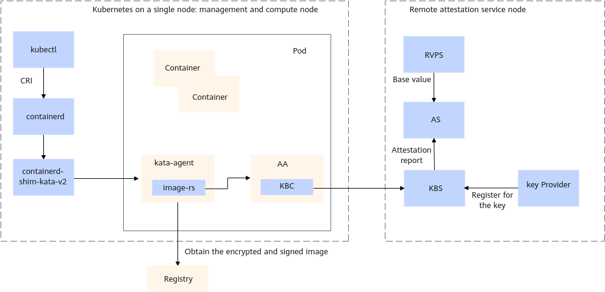

**The host where the Kubernetes node is located contains the following components:**

-   kubectl: It is a Kubernetes command line tool, which interacts with and manages Kubernetes clusters.
-   containerd: It is an open source container runtime, which provides container lifecycle management, image management, and runtime interfaces.
-   containerd-shim-kata-v2: containerd-shim-kata is an extension of containerd and a bridge between containerd and kata-container.

**A pod contains the following components:**

-   kata-agent: It communicates with containerd-shim-kata-v2 on the host and manages the lifecycle of Kata containers.
-   Attestation agent \(AA\): It obtains remote attestation reports from the TMM, and verifies remote attestation reports and obtains keys through the interaction between the KBC and KBS.

**A remote attestation service node includes:**

-   Key Broker Service \(KBS\): It facilitates remote attestation–based identity authentication and authorization, secret resource storage, and access control. In the KBS configuration file, you need to specify the IP address and port for exposing the KBS to other components. The default port is  **8080**.
-   Attestation Service \(AS\): It verifies remote attestation reports and returns results to the KBS. The default listening port of the AS is  **3000**.
-   Reference Value Provider Service \(RVPS\): It provides the functions of registering and querying measurement base values. The default listening port of the RVPS is  **50003**.
-   Key Provider: It manages image encryption keys and automatically registers the encryption keys with the KBS. The default listening port is  **50000**.

**Registry:**

The local image repository, namely the registry, stores container images and responds to image requests from kata-agent.

## Compiling and Deploying kata-shim<a name="section425812386177"></a>

1.  Install Golang.

    ```
    wget https://golang.google.cn/dl/go1.22.4.linux-arm64.tar.gz
    tar -zxvf go1.22.4.linux-arm64.tar.gz -C /usr/local
    echo "export GO_HOME=/usr/local/go" >> /etc/profile
    echo "export GOPATH=/home/work/go" >> /etc/profile
    source /etc/profile
    echo "export PATH=${GO_HOME}/bin:${PATH}" >> /etc/profile
    source /etc/profile
    ```

2.  Install Cargo and Rust.
    1.  Install Cargo and Rust. Select option 1 to start the default installation.

        ```
        curl https://sh.rustup.rs -sSf | sh
        ```

        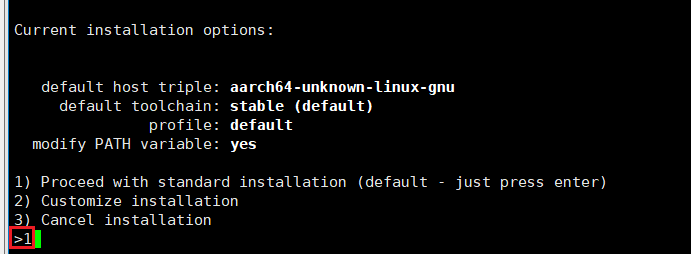

    2.  Update the environment variable.

        ```
        source "$HOME/.cargo/env"
        echo "export $HOME/.cargo/env" >> /etc/profile
        ```

    3.  Switch the Rust version to 1.77.1.

        ```
        rustup install 1.77.1
        rustup default 1.77.1
        ```

    4.  Add a tag.

        ```
        rustup target add aarch64-unknown-linux-musl
        ```

    5.  Install musl-gcc.

        ```
        yum install -y musl-gcc
        ```

3.  <a name="li187686137192"></a>Download the kata-container code.
    1.  Create a working directory and go to the directory. All code repositories must be in the same directory. Replace the example directory with the actual one.

        ```
        mkdir -p /home/work && cd /home/work
        ```

    2.  Download the code of kata-container components.

        ```
        git clone https://github.com/kata-containers/kata-containers.git -b CC-0.8.0
        git clone https://github.com/confidential-containers/guest-components.git -b v0.8.0
        git clone https://github.com/virtee/kbs-types.git
        git clone https://github.com/confidential-containers/attestation-service.git -b v0.8.0
        git clone https://github.com/confidential-containers/trustee.git -b v0.8.0
        ```

4.  Obtain the patch for modifying kata-container.

    ```
    git clone https://gitee.com/openeuler/virtCCA_sdk.git
    ```

5.  Apply the patches for modifying kata-container components.
    1.  Apply the kata-containers code patch.

        ```
        cd /home/work/kata-containers
        git apply ../virtCCA_sdk/confidential_container/kata-container.patch
        ```

    2.  Apply the guest-components code patch.

        ```
        cd /home/work/guest-components
        git apply ../virtCCA_sdk/confidential_container/guest-components.patch
        ```

        > **NOTE:** 
        >\(Optional\) Perform the following steps only when  [Container Image Measurement](en-us_topic_0000002055827284.md)  is required:
        >1.  Apply the  **image-ima-measurement**  code patch.
        >    ```
        >    git apply ../virtCCA_sdk/confidential_container/image-ima-measurement.patch
        >    ```
        >2.  Recompile kata-agent and deploy it into the rootfs.

    3.  Apply the kbs-types code patch.

        ```
        cd /home/work/kbs-types
        git checkout c90df0
        git apply ../virtCCA_sdk/confidential_container/kbs-types.patch
        ```

    4.  Apply the attestation service code patch.

        ```
        cd /home/work/attestation-service
        git apply ../virtCCA_sdk/confidential_container/attestation-service.patch
        ```

    5.  Apply the trustee code patch.

        ```
        cd /home/work/trustee
        git apply ../virtCCA_sdk/confidential_container/trustee.patch
        ```

6.  Compile containerd-shim-kata-v2.

    ```
    cd /home/work/kata-containers
    make -C src/runtime
    ```

    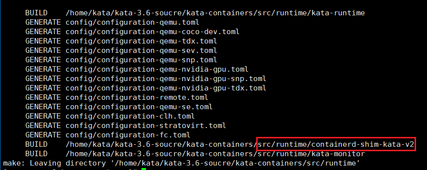

    > **NOTE:** 
    >The file generated after compilation is stored in the  **src/runtime/containerd-shim-kata-v2**  directory.

7.  Deploy containerd-shim-kata-v2 and kata-runtime.

    ```
    cp /home/work/kata-containers/src/runtime/kata-runtime /usr/bin/kata-runtime
    ln -snf /home/work/kata-containers/src/runtime/containerd-shim-kata-v2 /usr/bin/containerd-shim-kata-v2
    ```

8.  Deploy the Kata configuration.

    ```
    mkdir -p /etc/kata-containers
    cp /home/work/kata-containers/src/runtime/config/configuration-qemu.toml /etc/kata-containers/configuration.toml
    ```

9.  Modify the Kata configuration.

    > **NOTE:** 
    >The configuration file is stored in the  **/etc/kata-containers/configuration.toml**  directory.

    1.  Set  **kernel**,  **image**, and  **path**  to the actual paths used for the cVM.
        -   **kernel**  is the kernel image of the guest OS. For details, see  [Compiling the Guest Kernel](en-us_topic_0000002044440426.md#section573574019719).
        -   **image**  is the rootfs of the guest OS. For details, see  [Compiling the rootfs](en-us_topic_0000002044440426.md#section144719383010).
        -   **path**  indicates the path of the QEMU executable file. Perform the following compilation command and the generated example path is  **/home/work/qemu/build/qemu-system-aarch64**.

            Obtain the  **qemu.patch**  file from the virtCCA\_sdk repository and save the file into the  **/home/work**  directory.

            ```
            yum install sphinx python3-sphinx_rtd_theme
            cd /home/work
            git clone https://gitee.com/openeuler/qemu.git -b qemu-8.2.0 --depth=1
            cd qemu
            git apply ../virtCCA_sdk/confidential_container/qemu.patch
            mkdir build && cd build
            ../configure --target-list=aarch64-softmmu
            make -j64
            ```

            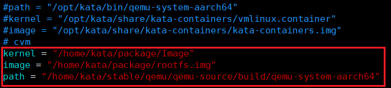

    1.  To enable a virtio-fs shared file system, perform the following steps:

        1. Obtain the virtiofsd installation package.

        ```
        curl  -o virtiofsd-1.10.1-2.oe2403.aarch64.rpm https://repo.openeuler.org/openEuler-24.03-LTS/EPOL/main/aarch64/Packages/virtiofsd-1.10.1-2.oe2403.aarch64.rpm
        ```

        > **NOTE:** 
        >You can add the  **-k**  command option to skip server SSL certificate verification when sending HTTPS requests. This operation can avoid the self-signed certificate problem, but may cause security bypass risks. Therefore, do not use the  **-k**  command unless you know how to deal with the risks.

        2. Install the virtiofsd RPM package.

        ```
        rpm -ivh virtiofsd-1.10.1-2.oe2403.aarch64.rpm --force
        ```

        3. View the executable file path.

        ```
        ll /usr/libexec/virtiofsd
        ```

        4. Modify the Kata configuration in  **vim /etc/kata-containers/configuration.toml **:

        -   **virtio\_fs\_daemon = "/usr/libexec/virtiofsd"**
        -   **virtio\_fs\_extra\_args = \["--thread-pool-size=1"\]**  \(Delete the default  **--announce-submounts**  parameter.\)

    2.  Set  **sandbox\_cgroup\_only**  and  **static\_sandbox\_resource\_mgmt**  to  **true**.

        

## Configuring kata-agent to Start by Default in the rootfs<a name="section12153172619284"></a>

1.  Build the basic rootfs. For details, see  [Compiling the rootfs](en-us_topic_0000002044440426.md#section144719383010).
    1.  Copy the rootfs image file to the target path.

        ```
        cd /home/work/kata-containers/tools/osbuilder/rootfs-builder
        cp /tmp/rootfs.img ./
        ```

    2.  Mount  **rootfs.img**  to the temporary directory.

        ```
        mkdir rootfs
        mount rootfs.img rootfs
        ```

2.  Use the source code downloaded in  [Downloading kata-container](#li187686137192)  to build the auto-start configuration of kata-agent systemd.

    ```
    yum install -y lvm2-devel clang clang-devel --allowerasing
    mkdir $PWD/kata-overlay
    SECCOMP=no CFLAGS=-mno-outline-atomics ./rootfs.sh -r "$PWD/kata-overlay"
    ```

    

    > **NOTE:** 
    >If the compilation fails, an error is reported stating "Too many open files \(os error 24\)."
    >
    >Run the following command to solve the problem:
    >```
    >ulimit -n 65536
    >```

3.  Copy the files in the  **kata-overlay**  directory to the  **rootfs**  directory.

    ```
    cp -rf kata-overlay/etc/systemd/system/basic.target.wants/  rootfs/etc/systemd/system/
    cp -rf kata-overlay/etc/systemd/system/kata-containers.target.wants  rootfs/etc/systemd/system/
    cp -rf kata-overlay/usr/lib/systemd/system/*  rootfs/usr/lib/systemd/system/
    cp -rf kata-overlay/usr/bin/kata-agent  rootfs/usr/bin
    ```

    Ensure that the rootfs contains the files shown in red boxes:

    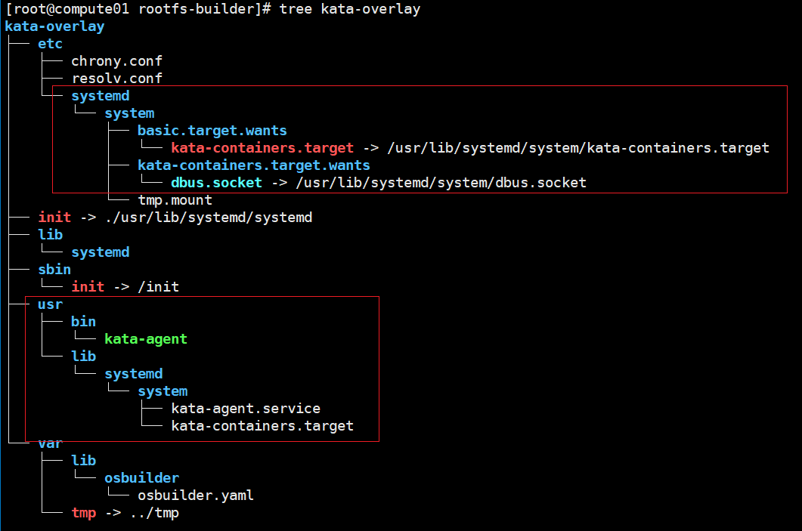

4.  Unmount the directory.

    ```
    umount rootfs
    ```

## Deploying containerd<a name="section1118305916393"></a>

1.  Download containerd 1.6.8.2 provided by the CoCo community.

    ```
    wget https://github.com/confidential-containers/containerd/releases/download/v1.6.8.2/containerd-1.6.8.2-linux-arm64.tar.gz
    ```

2.  Decompress the package to obtain the executable file.

    ```
    tar -xvf containerd-1.6.8.2-linux-arm64.tar.gz
    ```

    The following files are generated:

    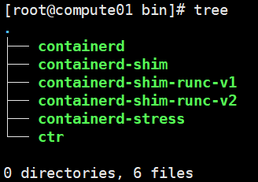

3.  Copy the executable file to the  **/usr/local/bin**  directory.

    ```
    cp bin/*  /usr/local/bin
    ```

4.  Install runc.

    ```
    yum install runc -y
    ```

5.  Create the containerd configuration file.

    ```
    mkdir /etc/containerd/
    containerd config default > /etc/containerd/config.toml
    ```

6.  Add the following content to the configuration file:

    ```
    [plugins."io.containerd.grpc.v1.cri".containerd.runtimes.kata]
              runtime_type = "io.containerd.kata.v2"
              privileged_without_host_devices = false
    ```

    

7.  Install  **containerd.service**.

    ```
    wget raw.githubusercontent.com/confidential-containers/containerd/v1.6.8.2/containerd.service
    cp ./containerd.service  /usr/lib/systemd/system/
    ```

8.  Configure the containerd proxy.

    > **NOTE:** 
    >If the deployment environment is connected to the Internet, skip this step.

    1.  Create the directory.

        ```
        mkdir -p /etc/systemd/system/containerd.service.d/
        ```

    2.  Open the configuration file.

        ```
        vim /etc/systemd/system/containerd.service.d/http-proxy.conf
        ```

    3.  Press  **i**  to enter the insert mode and add the following content:

        ```
        [Service]
        Environment="HTTP_PROXY=Proxy_server"
        Environment="HTTPS_PROXY=Proxy_server"
        Environment="NO_PROXY=localhost"
        ```

9.  Start containerd.

    ```
    systemctl daemon-reload
    systemctl start containerd
    systemctl enable containerd
    ```

    Check whether the containerd service is running properly.

    

10. Start the container using the containerd command line tool ctr.
    1.  Pull the image.

        ```
        ctr image pull docker.io/library/busybox:latest
        ```

    2.  Start the container.
        -   Run a container. Use the default runtime runc.

            ```
            ctr run --rm -t docker.io/library/busybox:latest test-kata /bin/sh
            ```

            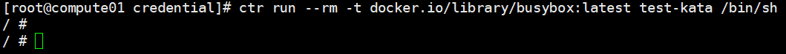

        -   Run a container. Use Kata as the runtime.

            ```
            ctr run --runtime "io.containerd.kata.v2" --rm -t docker.io/library/busybox:latest test-kata /bin/sh
            ```

            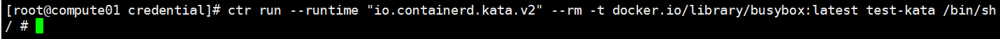

## Deploying Kubernetes \(Single Node\)<a name="section112772026183416"></a>

1.  Add a yum source.
    1.  Create the  **k8s.repo**  file.

        ```
        vim /etc/yum.repos.d/k8s.repo
        ```

    2.  Press  **i**  to enter the insert mode and add the following content:

        ```
        [k8s]
        name=Kubernetes
        baseurl=https://mirrors.aliyun.com/kubernetes/yum/repos/kubernetes-el7-aarch64/
        enabled=1
        gpgcheck=0
        repo_gpgcheck=0
        ```

    3.  Update the yum source.

        ```
        yum clean all
        yum makecache
        ```

2.  Install the Kubernetes components.

    ```
    yum install -y kubelet-1.18.20 kubeadm-1.18.20 kubectl-1.18.20 kubernetes-cni --nobest
    ```

3.  Add the system configuration.
    1.  Disable the firewall.

        ```
        systemctl stop firewalld && systemctl disable firewalld
        ```

        > **NOTE:** 
        >Disable the firewall to ensure normal communication between Kubernetes components. You are advised to do so only in the debugging environment. In the production environment, configure firewall rules to ensure normal communication.

    2.  Load the kernel module.

        ```
        modprobe br_netfilter
        ```

    3.  Enable the  **NET.BRIDGE.BRIDGE-NF-CALL-IPTABLES**  kernel option.

        ```
        sysctl -w net.bridge.bridge-nf-call-iptables=1
        ```

    4.  Disable the swap partition.

        ```
        swapoff -a
        cp -p /etc/fstab /etc/fstab.bak$(date '+%Y%m%d%H%M%S')
        sed -i "s/\/dev\/mapper\/openeuler-swap/\#\/dev\/mapper\/openeuler-swap/g" /etc/fstab
        ```

        > **NOTE:** 
        >After the openEuler OS is restarted, the swap partition function is automatically restored. As a result, the Kubernetes service fails to be started after the server is restarted. You need to manually run the command of disabling the swap partition.

    5.  Enable the kubelet service to automatically start upon system startup.

        ```
        systemctl enable kubelet
        ```

4.  Initialize the Kubernetes cluster.
    1.  Delete the proxy.

        ```
        export -n http_proxy
        export -n https_proxy
        export -n no_proxy
        ```

    2.  Create  **etc/resolv.conf**.

        ```
        touch /etc/resolv.conf
        ```

    3.  Generate the initial configuration.

        ```
        kubeadm config print init-defaults > kubeadm-init.yaml
        ```

    4.  Generate the configuration script in a directory that has the same parent directory as  **kubeadm-init.yaml**.

        ```
        vim update_kubeadm_init.sh
        ```

        ```
        #!/bin/bash
        
        IP_ADDRESS=$(hostname -I | awk '{print $1}')
        CONFIG_FILE="kubeadm-init.yaml"
        
        sed -i "s/^  advertiseAddress: .*/  advertiseAddress: ${IP_ADDRESS}/" "$CONFIG_FILE"
        sed -i "s|criSocket: /var/run/dockershim.sock|criSocket: /run/containerd/containerd.sock|" "$CONFIG_FILE"
        sed -i "s/^imageRepository: .*/imageRepository: k8smx/" "$CONFIG_FILE"
        sed -i "s/^kubernetesVersion: .*/kubernetesVersion: v1.18.20/" "$CONFIG_FILE"
        sed -i '/serviceSubnet: 10.96.0.0\/12/a\  podSubnet: 10.244.0.0/16' "$CONFIG_FILE"
        ```

    5.  Run the following command in the directory that has the same parent directory as  **kubeadm-init.yaml**.

        ```
        chmod 755 update_kubeadm_init.sh
        ./update_kubeadm_init.sh
        ```

        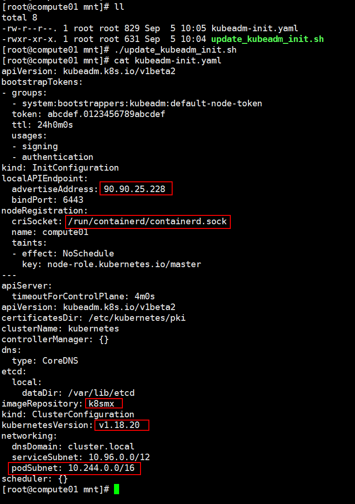

    6.  Run the following command to reset the Kubernetes node and enter  **y**  in the interaction bar to complete the reset process.

        ```
        kubeadm reset
        ```

        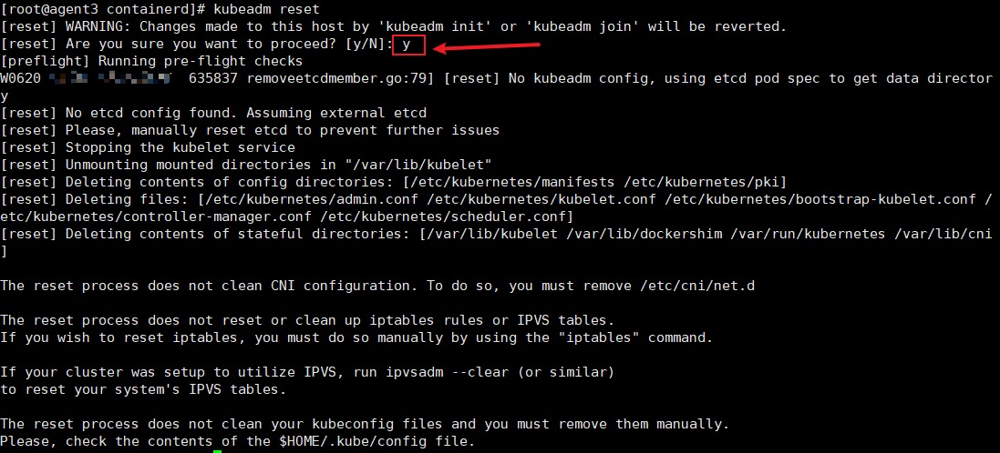

        > **NOTE:** 
        >1.  During the secondary deployment of Kubernetes, if the error message "etcdserver: re-configuration failed due to not enough started members" is displayed when you run the  **kubeadm reset**  command, run the following command to rectify the fault:
        >    ```
        >    rm -rf /etc/kubernetes/*
        >    rm -rf /root/.kube/
        >    ```
        >    Then run the  **kubeadm reset**  command again.
        >2.  The Kubernetes scheduling policy checks the node running status. When the drive usage of the root directory on the node exceeds 85%, the node is evicted and becomes unavailable. Therefore, check that the root directory has a sufficient storage space.
        >    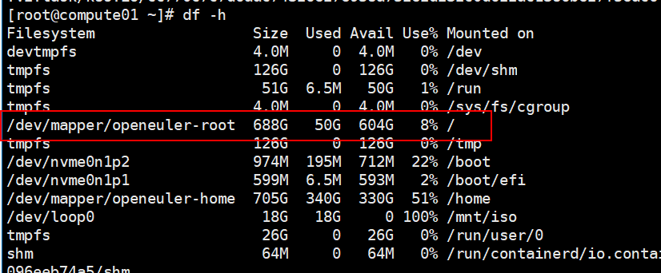
        >    To ensure node availability, configure the containerd running space properly. Change the path corresponding to the root option to suit your requirements.
        >    ```
        >    vim /etc/containerd/config.toml
        >    root = "/home/kata/var/lib/containerd"
        >    :wq
        >    ```
        >    

    7.  Initialize the Kubernetes node.

        ```
        kubeadm init --config kubeadm-init.yaml
        ```

        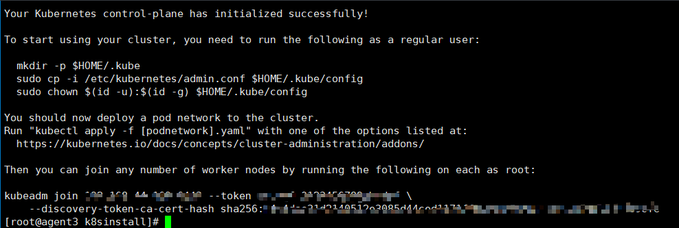

        > **NOTE:** 
        >When initializing the Kubernetes node, if the error message "\[kubelet-check\] Initial timeout of 40s passed" is displayed:
        >
        >Run the following command to solve the problem:
        >```
        >kubeadm reset
        >rm -rf /var/lib/etcd
        >iptables -F && iptables -t nat -F && iptables -t mangle -F
        >```
        >Run the following command again:
        >```
        >kubeadm init --config kubeadm-init.yaml
        >```

    8.  Create a configuration and export environment variables.

        ```
        mkdir -p $HOME/.kube
        cp -i /etc/kubernetes/admin.conf $HOME/.kube/config
        chown $(id -u):$(id -g) $HOME/.kube/config
        export KUBECONFIG=/etc/kubernetes/admin.conf
        ```

    9.  Write the Kubernetes configuration path to the file.

        ```
        vim /etc/profile
        export KUBECONFIG=/etc/kubernetes/admin.conf
        ```

5.  Modify the pod CIDR to support the CNI component.
    1.  Modify ConfigMap.

        ```
        kubectl edit cm kubeadm-config -n kube-system
        ```

    2.  Add the following content:

        ```
        podSubnet: 10.244.0.0/16
        ```

        

    3.  Create the  **kube-controller-manager.yaml**  file.

        ```
        vim /etc/kubernetes/manifests/kube-controller-manager.yaml
        ```

    4.  Press  **i**  to enter the insert mode and add the following content:

        ```
        - --allocate-node-cidrs=true
        - --cluster-cidr=10.244.0.0/16
        ```

        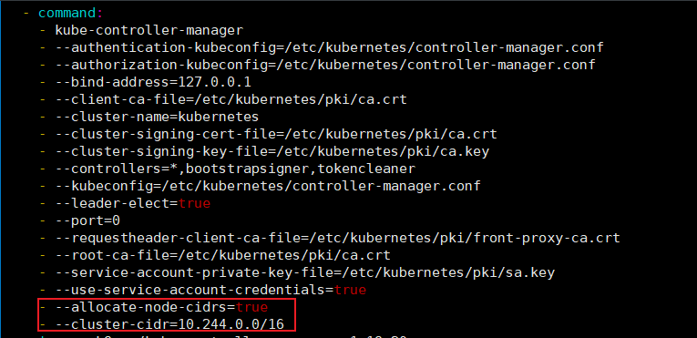

    5.  Press  **Esc**, type  **:wq!**, and press  **Enter**  to save the file and exit.

6.  Install the Flannel plugin.
    1.  Download and install the CNI plugin.

        ```
        wget https://github.com/containernetworking/plugins/releases/download/v1.5.1/cni-plugins-linux-arm64-v1.5.1.tgz
        tar -C /opt/cni/bin -zxvf cni-plugins-linux-arm64-v1.5.1.tgz
        ```

    2.  Create the  **kube-flannel.yaml**  file.

        ```
        vim kube-flannel.yaml
        ```

    3.  Press  **i**  to enter the insert mode and add the following content:

        ```
        ---
        kind: Namespace
        apiVersion: v1
        metadata:
          name: kube-flannel
          labels:
            k8s-app: flannel
            pod-security.kubernetes.io/enforce: privileged
        ---
        kind: ClusterRole
        apiVersion: rbac.authorization.k8s.io/v1
        metadata:
          labels:
            k8s-app: flannel
          name: flannel
        rules:
        - apiGroups:
          - ""
          resources:
          - pods
          verbs:
          - get
        - apiGroups:
          - ""
          resources:
          - nodes
          verbs:
          - get
          - list
          - watch
        - apiGroups:
          - ""
          resources:
          - nodes/status
          verbs:
          - patch
        - apiGroups:
          - networking.k8s.io
          resources:
          - clustercidrs
          verbs:
          - list
          - watch
        ---
        kind: ClusterRoleBinding
        apiVersion: rbac.authorization.k8s.io/v1
        metadata:
          labels:
            k8s-app: flannel
          name: flannel
        roleRef:
          apiGroup: rbac.authorization.k8s.io
          kind: ClusterRole
          name: flannel
        subjects:
        - kind: ServiceAccount
          name: flannel
          namespace: kube-flannel
        ---
        apiVersion: v1
        kind: ServiceAccount
        metadata:
          labels:
            k8s-app: flannel
          name: flannel
          namespace: kube-flannel
        ---
        kind: ConfigMap
        apiVersion: v1
        metadata:
          name: kube-flannel-cfg
          namespace: kube-flannel
          labels:
            tier: node
            k8s-app: flannel
            app: flannel
        data:
          cni-conf.json: |
            {
              "name": "cbr0",
              "cniVersion": "0.3.1",
              "plugins": [
                {
                  "type": "flannel",
                  "delegate": {
                    "hairpinMode": true,
                    "isDefaultGateway": true
                  }
                },
                {
                  "type": "portmap",
                  "capabilities": {
                    "portMappings": true
                  }
                }
              ]
            }
          net-conf.json: |
            {
              "Network": "10.244.0.0/16",
              "Backend": {
                "Type": "vxlan"
              }
            }
        ---
        apiVersion: apps/v1
        kind: DaemonSet
        metadata:
          name: kube-flannel-ds
          namespace: kube-flannel
          labels:
            tier: node
            app: flannel
            k8s-app: flannel
        spec:
          selector:
            matchLabels:
              app: flannel
          template:
            metadata:
              labels:
                tier: node
                app: flannel
            spec:
              affinity:
                nodeAffinity:
                  requiredDuringSchedulingIgnoredDuringExecution:
                    nodeSelectorTerms:
                    - matchExpressions:
                      - key: kubernetes.io/os
                        operator: In
                        values:
                        - linux
              hostNetwork: true
              priorityClassName: system-node-critical
              tolerations:
              - operator: Exists
                effect: NoSchedule
              serviceAccountName: flannel
              initContainers:
              - name: install-cni-plugin
                image: docker.io/flannel/flannel-cni-plugin:v1.2.0
                command:
                - cp
                args:
                - -f
                - /flannel
                - /opt/cni/bin/flannel
                volumeMounts:
                - name: cni-plugin
                  mountPath: /opt/cni/bin
              - name: install-cni
                image: docker.io/flannel/flannel:v0.22.3
                command:
                - cp
                args:
                - -f
                - /etc/kube-flannel/cni-conf.json
                - /etc/cni/net.d/10-flannel.conflist
                volumeMounts:
                - name: cni
                  mountPath: /etc/cni/net.d
                - name: flannel-cfg
                  mountPath: /etc/kube-flannel/
              containers:
              - name: kube-flannel
                image: docker.io/flannel/flannel:v0.22.3
                command:
                - /opt/bin/flanneld
                args:
                - --ip-masq
                - --kube-subnet-mgr
                resources:
                  requests:
                    cpu: "200m"
                    memory: "100Mi"
                securityContext:
                  privileged: false
                  capabilities:
                    add: ["NET_ADMIN", "NET_RAW"]
                env:
                - name: POD_NAME
                  valueFrom:
                    fieldRef:
                      fieldPath: metadata.name
                - name: POD_NAMESPACE
                  valueFrom:
                    fieldRef:
                      fieldPath: metadata.namespace
                - name: EVENT_QUEUE_DEPTH
                  value: "5000"
                volumeMounts:
                - name: run
                  mountPath: /run/flannel
                - name: flannel-cfg
                  mountPath: /etc/kube-flannel/
                - name: xtables-lock
                  mountPath: /run/xtables.lock
              volumes:
              - name: run
                hostPath:
                  path: /run/flannel
              - name: cni-plugin
                hostPath:
                  path: /opt/cni/bin
              - name: cni
                hostPath:
                  path: /etc/cni/net.d
              - name: flannel-cfg
                configMap:
                  name: kube-flannel-cfg
              - name: xtables-lock
                hostPath:
                  path: /run/xtables.lock
                  type: FileOrCreate
        ```

    4.  Press  **Esc**, type  **:wq!**, and press  **Enter**  to save the file and exit.
    5.  Start Flannel.

        ```
        kubectl apply -f kube-flannel.yaml
        ```

7.  Check the cluster status.
    1.  After Flannel is deployed, check whether the status of the master node is  **Ready**.

        ```
        kubectl get nodes
        ```

        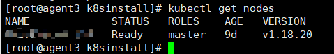

    2.  All the pods are in the  **Running**  state.

        ```
        kubectl get pods -A
        ```

        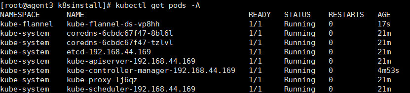

8.  Set the Kubernetes master node as a worker node.

    ```
    kubectl taint nodes --all node-role.kubernetes.io/master-
    ```

9.  Create a Kata runtime in Kubernetes.
    1.  Create the  **runtime.yaml**  file.

        ```
        vim runtime.yaml
        ```

    2.  Press  **i**  to enter the insert mode and add the following content:

        ```
        kind: RuntimeClass
        apiVersion: node.k8s.io/v1beta1
        metadata:
          name: kata
        handler: kata
        ```

    3.  Press  **Esc**, type  **:wq!**, and press  **Enter**  to save the file and exit.
    4.  Create a Kata runtime.

        ```
        kubectl apply -f runtime.yaml
        ```

10. <a name="li0343125545419"></a>Create a sample container to check whether the deployment is successful.
    1.  Create the  **kata-test.yaml**  file.

        ```
        vim kata-test.yaml
        ```

    2.  Press  **i**  to enter the insert mode and add the following content:

        ```
        apiVersion: v1
        kind: Pod
        metadata:
          name: box-kata
          annotations:
            io.katacontainers.config_path: "docker.io/library/busybox:latest"
        spec:
          runtimeClassName: kata
          containers:
          - name: box
            image: docker.io/library/busybox:latest
        ```

    3.  Press  **Esc**, type  **:wq!**, and press  **Enter**  to save the file and exit.
    4.  Start the container and check the status of pods.

        ```
        kubectl apply -f kata-test.yaml
        kubectl get pods -A
        ```

        The  **box-kata**  pod is in the  **Running**  state.

        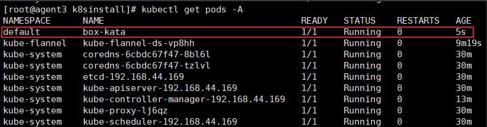

        > **NOTE:** 
        >The  **kubectl run**  command does not specify container runtime type. However, the default container runtime configured in the  **/etc/containerd/config.toml**  file is runc. Therefore, the  **kubectl run**  command starts a common container. You are advised to perform  [Step 10](#li0343125545419)  to start a Kata confidential container. Forcibly changing the default container runtime in  **/etc/containerd/config.toml**  to Kata may cause the secure memory to be fully occupied. Exercise caution when performing this operation.

