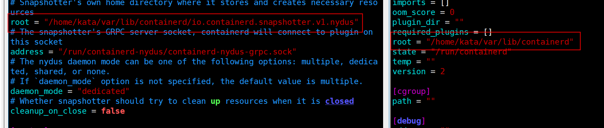
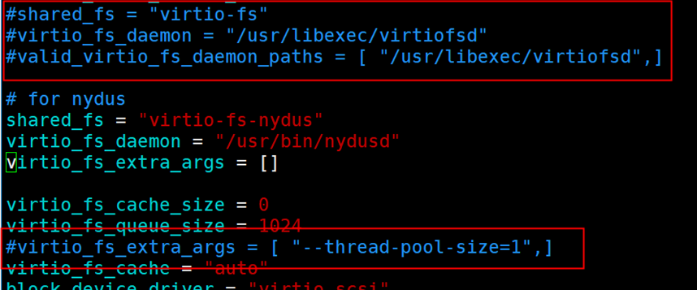
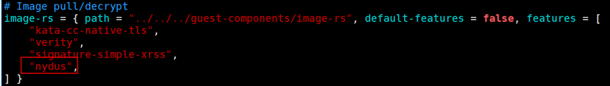
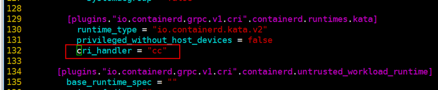

# Deploying Nydus in Confidential Containers<a name="EN-US_TOPIC_0000002244447453"></a>

## Environment Dependencies<a name="section1997545945219"></a>

<a name="table314151513536"></a>
<table><thead align="left"><tr id="row11997150531"><th class="cellrowborder" valign="top" width="24.97%" id="mcps1.1.5.1.1"><p id="p3199131511534"><a name="p3199131511534"></a><a name="p3199131511534"></a>Software Package</p>
</th>
<th class="cellrowborder" valign="top" width="25.03%" id="mcps1.1.5.1.2"><p id="p41990159537"><a name="p41990159537"></a><a name="p41990159537"></a>Version</p>
</th>
<th class="cellrowborder" valign="top" width="25%" id="mcps1.1.5.1.3"><p id="p18199101515532"><a name="p18199101515532"></a><a name="p18199101515532"></a>Description</p>
</th>
<th class="cellrowborder" valign="top" width="25%" id="mcps1.1.5.1.4"><p id="p9199171515320"><a name="p9199171515320"></a><a name="p9199171515320"></a>How to Obtain</p>
</th>
</tr>
</thead>
<tbody><tr id="row4199151510532"><td class="cellrowborder" valign="top" width="24.97%" headers="mcps1.1.5.1.1 "><p id="p1719918158534"><a name="p1719918158534"></a><a name="p1719918158534"></a>runc</p>
</td>
<td class="cellrowborder" valign="top" width="25.03%" headers="mcps1.1.5.1.2 "><p id="p1719911511536"><a name="p1719911511536"></a><a name="p1719911511536"></a>v1.1.8</p>
</td>
<td class="cellrowborder" valign="top" width="25%" headers="mcps1.1.5.1.3 "><p id="p1019911515537"><a name="p1019911515537"></a><a name="p1019911515537"></a>Low-level container runtime</p>
</td>
<td class="cellrowborder" valign="top" width="25%" headers="mcps1.1.5.1.4 "><p id="p61991915105313"><a name="p61991915105313"></a><a name="p61991915105313"></a>Download or install the software package using the yum source.</p>
</td>
</tr>
<tr id="row019921535318"><td class="cellrowborder" valign="top" width="24.97%" headers="mcps1.1.5.1.1 "><p id="p1419961575316"><a name="p1419961575316"></a><a name="p1419961575316"></a>contaienrd</p>
</td>
<td class="cellrowborder" valign="top" width="25.03%" headers="mcps1.1.5.1.2 "><p id="p11996153536"><a name="p11996153536"></a><a name="p11996153536"></a>v1.6.8.2</p>
</td>
<td class="cellrowborder" valign="top" width="25%" headers="mcps1.1.5.1.3 "><p id="p8199181555313"><a name="p8199181555313"></a><a name="p8199181555313"></a>High-level container runtime provided by the CoCo community</p>
</td>
<td class="cellrowborder" valign="top" width="25%" headers="mcps1.1.5.1.4 "><p id="p101995159534"><a name="p101995159534"></a><a name="p101995159534"></a><a href="https://gitee.com/link?target=https://github.com/confidential-containers/containerd/releases/download/v1.6.8.2/containerd-1.6.8.2-linux-arm64.tar.gz" target="_blank" rel="noopener noreferrer">https://github.com/confidential-containers/containerd/releases/download/v1.6.8.2/containerd-1.6.8.2-linux-arm64.tar.gz</a></p>
</td>
</tr>
<tr id="row119917154538"><td class="cellrowborder" valign="top" width="24.97%" headers="mcps1.1.5.1.1 "><p id="p61991715105319"><a name="p61991715105319"></a><a name="p61991715105319"></a>Kubernetes</p>
</td>
<td class="cellrowborder" valign="top" width="25.03%" headers="mcps1.1.5.1.2 "><p id="p71991215145317"><a name="p71991215145317"></a><a name="p71991215145317"></a>1.18.20</p>
</td>
<td class="cellrowborder" valign="top" width="25%" headers="mcps1.1.5.1.3 "><p id="p41994157537"><a name="p41994157537"></a><a name="p41994157537"></a>Container orchestration system</p>
</td>
<td class="cellrowborder" valign="top" width="25%" headers="mcps1.1.5.1.4 "><p id="p6200141575310"><a name="p6200141575310"></a><a name="p6200141575310"></a>Download or install the software package using the yum source.</p>
</td>
</tr>
<tr id="row7200415105312"><td class="cellrowborder" valign="top" width="24.97%" headers="mcps1.1.5.1.1 "><p id="p3200191555310"><a name="p3200191555310"></a><a name="p3200191555310"></a>Kata</p>
</td>
<td class="cellrowborder" valign="top" width="25.03%" headers="mcps1.1.5.1.2 "><p id="p02001154537"><a name="p02001154537"></a><a name="p02001154537"></a>cc0.8.0</p>
</td>
<td class="cellrowborder" valign="top" width="25%" headers="mcps1.1.5.1.3 "><p id="p02006154537"><a name="p02006154537"></a><a name="p02006154537"></a>Secure container</p>
</td>
<td class="cellrowborder" valign="top" width="25%" headers="mcps1.1.5.1.4 "><p id="p16200315145319"><a name="p16200315145319"></a><a name="p16200315145319"></a>Compile and deploy it by following instructions in <a href="deploying-and-running-confidential-containers.md">Deploying and Running Confidential Containers</a>.</p>
</td>
</tr>
<tr id="row6200715175316"><td class="cellrowborder" valign="top" width="24.97%" headers="mcps1.1.5.1.1 "><p id="p52003150535"><a name="p52003150535"></a><a name="p52003150535"></a>Guest kernel</p>
</td>
<td class="cellrowborder" valign="top" width="25.03%" headers="mcps1.1.5.1.2 "><p id="p02001415195311"><a name="p02001415195311"></a><a name="p02001415195311"></a>-</p>
</td>
<td class="cellrowborder" valign="top" width="25%" headers="mcps1.1.5.1.3 "><p id="p10200415115315"><a name="p10200415115315"></a><a name="p10200415115315"></a>-</p>
</td>
<td class="cellrowborder" valign="top" width="25%" headers="mcps1.1.5.1.4 "><p id="p520091585315"><a name="p520091585315"></a><a name="p520091585315"></a>Compile and deploy it by following instructions in <a href="deploying-and-running-confidential-containers.md">Deploying and Running Confidential Containers</a>.</p>
</td>
</tr>
<tr id="row720020153535"><td class="cellrowborder" valign="top" width="24.97%" headers="mcps1.1.5.1.1 "><p id="p1020031565316"><a name="p1020031565316"></a><a name="p1020031565316"></a>rootfs</p>
</td>
<td class="cellrowborder" valign="top" width="25.03%" headers="mcps1.1.5.1.2 "><p id="p112001315195316"><a name="p112001315195316"></a><a name="p112001315195316"></a>-</p>
</td>
<td class="cellrowborder" valign="top" width="25%" headers="mcps1.1.5.1.3 "><p id="p11200201519537"><a name="p11200201519537"></a><a name="p11200201519537"></a>-</p>
</td>
<td class="cellrowborder" valign="top" width="25%" headers="mcps1.1.5.1.4 "><p id="p15200151512531"><a name="p15200151512531"></a><a name="p15200151512531"></a>Compile and deploy it by following instructions in <a href="deploying-and-running-confidential-containers.md">Deploying and Running Confidential Containers</a>.</p>
</td>
</tr>
<tr id="row12149210125519"><td class="cellrowborder" valign="top" width="24.97%" headers="mcps1.1.5.1.1 "><p id="p160382035512"><a name="p160382035512"></a><a name="p160382035512"></a>nydus-static</p>
</td>
<td class="cellrowborder" valign="top" width="25.03%" headers="mcps1.1.5.1.2 "><p id="p36031020105514"><a name="p36031020105514"></a><a name="p36031020105514"></a>v2.3.0</p>
</td>
<td class="cellrowborder" valign="top" width="25%" headers="mcps1.1.5.1.3 "><p id="p196036207555"><a name="p196036207555"></a><a name="p196036207555"></a>Contains binary software such as Nydusd, Nydus-image, and Nydusify, and provides functions such as parsing Nydus images and converting OCI images into Nydus images.</p>
</td>
<td class="cellrowborder" valign="top" width="25%" headers="mcps1.1.5.1.4 "><p id="p1360312065511"><a name="p1360312065511"></a><a name="p1360312065511"></a><a href="https://gitee.com/link?target=https://github.com/dragonflyoss/nydus/releases/download/v2.3.0/nydus-static-v2.3.0-linux-arm64.tgz" target="_blank" rel="noopener noreferrer">https://github.com/dragonflyoss/nydus/releases/download/v2.3.0/nydus-static-v2.3.0-linux-arm64.tgz</a></p>
</td>
</tr>
<tr id="row6525201410554"><td class="cellrowborder" valign="top" width="24.97%" headers="mcps1.1.5.1.1 "><p id="p160352018554"><a name="p160352018554"></a><a name="p160352018554"></a>Nydus-snapshotter</p>
</td>
<td class="cellrowborder" valign="top" width="25.03%" headers="mcps1.1.5.1.2 "><p id="p6603122035510"><a name="p6603122035510"></a><a name="p6603122035510"></a>v0.15.0</p>
</td>
<td class="cellrowborder" valign="top" width="25%" headers="mcps1.1.5.1.3 "><p id="p18603120125519"><a name="p18603120125519"></a><a name="p18603120125519"></a>An external plugin of containerd, which receives CRI requests from containerd and invokes Nydusd to process Nydus images.</p>
</td>
<td class="cellrowborder" valign="top" width="25%" headers="mcps1.1.5.1.4 "><p id="p16034203555"><a name="p16034203555"></a><a name="p16034203555"></a><a href="https://gitee.com/link?target=https://github.com/containerd/nydus-snapshotter/releases/download/v0.14.0/nydus-snapshotter-v0.14.0-linux-arm64.tar.gz" target="_blank" rel="noopener noreferrer">https://github.com/containerd/nydus-snapshotter/releases/download/v0.14.0/nydus-snapshotter-v0.14.0-linux-arm64.tar.gz</a></p>
</td>
</tr>
<tr id="row206581175557"><td class="cellrowborder" valign="top" width="24.97%" headers="mcps1.1.5.1.1 "><p id="p5603152011557"><a name="p5603152011557"></a><a name="p5603152011557"></a>nerdctl</p>
</td>
<td class="cellrowborder" valign="top" width="25.03%" headers="mcps1.1.5.1.2 "><p id="p206031520165519"><a name="p206031520165519"></a><a name="p206031520165519"></a>v1.7.7</p>
</td>
<td class="cellrowborder" valign="top" width="25%" headers="mcps1.1.5.1.3 "><p id="p1060352035515"><a name="p1060352035515"></a><a name="p1060352035515"></a>containerd command line tool</p>
</td>
<td class="cellrowborder" valign="top" width="25%" headers="mcps1.1.5.1.4 "><p id="p1060312207557"><a name="p1060312207557"></a><a name="p1060312207557"></a><a href="https://gitee.com/link?target=https://github.com/containerd/nerdctl/releases/download/v1.7.7/nerdctl-1.7.7-linux-arm64.tar.gz" target="_blank" rel="noopener noreferrer">https://github.com/containerd/nerdctl/releases/download/v1.7.7/nerdctl-1.7.7-linux-arm64.tar.gz</a></p>
</td>
</tr>
</tbody>
</table>

## Setting up the Basic Nydus Environment<a name="section549083818559"></a>

1.  Install Nydus-image, Nydusd, Nydusify, Nydusctl, and Nydus-overlayfs.

    ```
    wget  https://github.com/dragonflyoss/nydus/releases/download/v2.3.0/nydus-static-v2.3.0-linux-arm64.tgz tar -zxvf  nydus-static-v2.3.0-linux-arm64.tgz cd nydus-static install -D -m 755 nydusd nydus-image  nydusify nydusctl nydus-overlayfs /usr/bin
    ```

2.  Install containerd-nydus-grpc \(Nydus-snapshotter\).

    ```
    wget  https://github.com/containerd/nydus-snapshotter/releases/download/v0.14.0/nydus-snapshotter-v0.14.0-linux-arm64.tar.gz tar -zxvf  nydus-snapshotter-v0.14.0-linux-arm64.tar.gz  install -D -m 755 bin/containerd-nydus-grpc  /usr/bin
    ```

3.  Install nerdctl.

    ```
    wget https://github.com/containerd/nerdctl/releases/download/v1.7.7/nerdctl-1.7.7-linux-arm64.tar.gz tar -zxvf nerdctl-1.7.7-linux-arm64.tar.gz install -D -m 755 nerdctl /usr/bin
    ```

4.  Use Nydusify to convert the format of images in the private image repository.

    ```
    nydusify convert --source registry.com:5000/busybox:latest --target registry.com:5000/busybox:latest-nydus
    ```

    > **NOTE:** 
    >This document uses BusyBox images in a private repository as an example. Replace  **registry.com:5000/busybox:latest**  with the actual target image name.

5.  Run the Nydusify command to check the target image. If the command output shows that the verification is complete and no error information is displayed, image conversion is successful.

    ```
    nydusify check --target  registry.com:5000/busybox:latest-nydus
    ```

6.  Configure Nydusd in  **/etc/nydus/nydusd-config.fusedev.json**.

    ```
    tee /etc/nydus/nydusd-config.fusedev.json > /dev/null << EOF
    {
      "device": {
        "backend": {
          "type": "registry",
          "config": {
            "scheme": "https",
            "skip_verify": false,
            "timeout": 5,
            "connect_timeout": 5,
            "retry_limit": 4,
            "auth": ""
          }
        },
        "cache": {
          "type": "blobcache",
          "config": {
            "work_dir": "cache"
          }
        }
      },
      "mode": "direct",
      "digest_validate": false,
      "iostats_files": false,
      "enable_xattr": true,
      "fs_prefetch": {
        "enable": true,
        "threads_count": 4
      }
    }
    EOF
    ```

    -   **device.backend.config.scheme**: Set the access mode to  **https**  or  **http**.
    -   **device.backend.config.auth**: Set the private repository login information. Run the following command to perform Base64 encoding on the user name and password of the private repository and enter the information again:

        ```
        echo -n "username:password" | base64
        ```

    -   **device.backend.config.skip\_verify**: indicates whether to skip the HTTPS certificate check.

7.  Obtain the Nydus-snapshotter configuration file.

    ```
    wget https://raw.githubusercontent.com/containerd/nydus-snapshotter/refs/tags/v0.14.0/misc/snapshotter/config.toml
    ```

8.  Set the  **root**  option in the  **home**  directory of Nydus, and also the  **root**  option of the local containerd, which must be consistent as that of containerd set in  [Deploying and Running Confidential Containers](deploying-and-running-confidential-containers.md). Set the actual installation paths of Nydusd and Nydus-image and disable the  **virtio\_fs\_extra\_args**  option.

    ```
    vim config.toml
    root = "/home/kata/var/lib/containerd/io.containerd.snapshotter.v1.nydus" 
    nydusd_path= "/usr/bin/nydusd" 
    nydusimage_path= "/usr/bin/nydus-image"  
    :wq
    ```

    

9.  Start and run containerd-nydus-grpc.

    ```
    containerd-nydus-grpc --config config.toml --log-to-stdout
    ```

10. Modify the containerd configuration file in the  **/etc/containerd/config.toml**  directory.

    ```
    vim /etc/containerd/config.toml
    
    [plugins."io.containerd.grpc.v1.cri".containerd]
          default_runtime_name = "runc"
          disable_snapshot_annotations = false
          discard_unpacked_layers = false
          ignore_rdt_not_enabled_errors = false
          no_pivot = false
          snapshotter = "nydus" 
    [proxy_plugins]
      [proxy_plugins.nydus]
        type = "snapshot"
        address = "/run/containerd-nydus/containerd-nydus-grpc.sock"
    ```

11. Restart containerd.

    ```
    systemctl daemon-reload && systemctl restart containerd
    ```

12. Use nerdctl to pull the Nydus image and use ctr to run the Kata-based Nydus image.

    ```
    nerdctl pull --snapshotter=nydus registry.com:5000/busybox:latest-nydus
    ctr run --snapshotter=nydus --runtime "io.containerd.kata.v2"  --rm -t registry.com:5000/busybox:latest-nydus test-kata sh
    ```

    

## Using Kubernetes to Deploy a Kata Container Based on a Nydus Image<a name="section162216387816"></a>

1.  Modify the Kata configuration in the  **/etc/kata-containers/configuration.toml**  file.

    ```
    vim /etc/kata-containers/configuration.toml
    ```

2.  Configure a shared Nydus file system.

    ```
    shared_fs = "virtio-fs-nydus" 
    virtio_fs_daemon =  "/usr/bin/nydusd" 
    virtio_fs_extra_args = []
    # virtio_fs_extra_args = [ "--thread-pool-size=1",]
    ```

    

3.  Set  **service\_offload**  to  **true**.

    ```
    service_offload = true
    ```

4.  Add Nydus to the features of image-rs in  **kata-containers/src/agent/Cargo.toml**.

    

5.  Recompile kata-agent and install it in the guest rootfs.

    ```
    cd kata-containers/tools/osbuilder/rootfs-builder/ 
    SECCOMP=no CFLAGS=-mno-outline-atomics ./rootfs.sh -r  "$PWD/kata-overlay" 
    mount rootfs.img rootfs 
    cp kata-overlay/usr/bin/kata-agent rootfs/usr/bin
    ```

6.  In the  **/etc/containerd/config.toml**  file, set  **cri\_handler**  to  **cc**.

    

7.  Restart containerd for the new configuration to take effect. 

    ```
    systemctl restart containerd
    ```

8.  Create a Kubernetes deployment file  **nydus-kata-sandbox.yaml**.

    ```
    apiVersion: v1
    kind: Pod
    metadata:
      name: nydus-kata-sandbox
    spec:
      restartPolicy: Never
      runtimeClassName: kata
      containers:
      - name: box-1    
        image: registry.com:5000/busybox:latest-nydus
        imagePullPolicy: Always
        command:
          - sh
        tty: true
    ```

9.  Deploy a pod and check its status.

    ```
    kubectl apply -f nydus-kata-sandbox.yaml
    kubectl get pods
    ```

    

