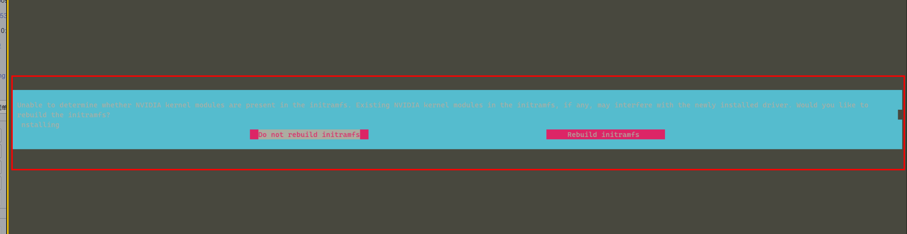
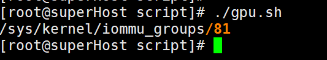
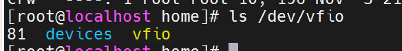
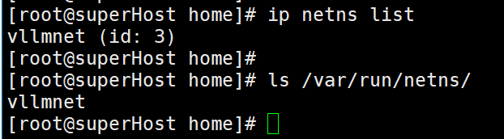
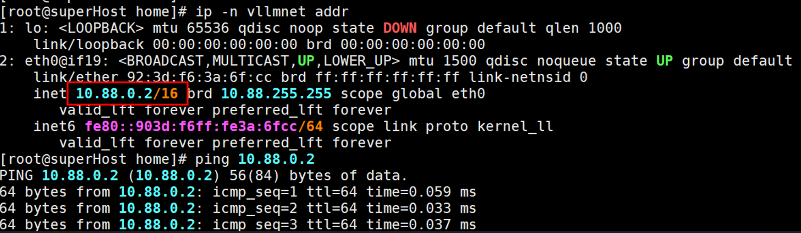
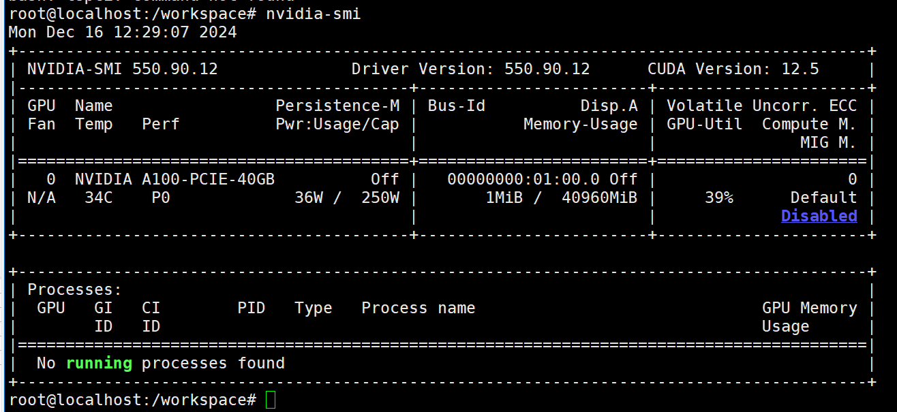
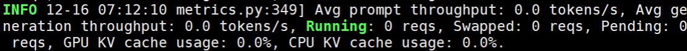
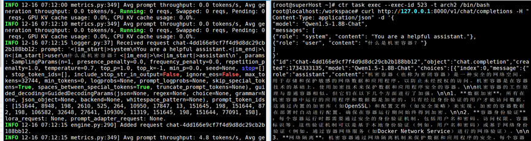

# Enabling Device Passthrough Using Confidential Containers <a name="EN-US_TOPIC_0000002244579925"></a>

This section describes how to use Kata-virtCCA confidential containers to implement GPU passthrough and how to run a large model in a confidential container.

Check that the following conditions are met:

-   You have deployed the basic Kata-virtCCA confidential container environment and configured virtCCA device passthrough.
-   The host kernel branch is OLK-6.6 and the following options are enabled:

    ```
    CONFIG_VFIO
    CONFIG_VFIO_IOMMU_TYPE1
    CONFIG_VFIO_PCI
    ```

-   NVIDIA GPUs are installed.
-   Docker 19.03 or later is installed.

> **NOTE:** 
>The device passthrough feature can be used only in CTR mode.

## Configuring rootfs.img<a name="section7757138142715"></a>

1.  Install the deployment tool.

    ```
    mkdir -p /home/mnt
    export ROOTFS_DIR=/home/mnt
    mount rootfs.img ${ROOTFS_DIR}
    
    curl -s -L https://nvidia.github.io/libnvidia-container/stable/rpm/nvidia-container-toolkit.repo | \
    tee ${ROOTFS_DIR}/etc/yum.repos.d/nvidia-container-toolkit.repo
    
    dnf --installroot=${ROOTFS_DIR} install pciutils tar gcc wget nvidia-container-toolkit -y
    ```

2.  Copy the guest kernel code to  **rootfs.img**.

    ```
    cp -r kernel/ ${ROOTFS_DIR}/home
    ```

    > **NOTE:** 
    >The initial capacity of  **rootfs.img**  file is small. You need to manually expand the image capacity.
    >```
    >qemu-img resize rootfs.img +20G 
    >e2fsck -f rootfs.img  
    >resize2fs rootfs.img
    >```

3.  Mount the key path and switch to the guest root directory.

    ```
    mount -t sysfs -o ro none ${ROOTFS_DIR}/sys
    mount -t proc -o ro none ${ROOTFS_DIR}/proc
    mount -t tmpfs none ${ROOTFS_DIR}/tmp
    mount -o bind,ro /dev ${ROOTFS_DIR}/dev
    mount -t devpts none ${ROOTFS_DIR}/dev/pts
    
    chroot ${ROOTFS_DIR}
    ```

4.  Install the NVIDIA driver.

    ```
    wget https://cn.download.nvidia.com/tesla/550.127.08/NVIDIA-Linux-aarch64-550.127.08.run
    chmod +x NVIDIA-Linux-aarch64-550.127.08.run
    ./NVIDIA-Linux-aarch64-550.127.08.run --kernel-source-path=/home/kernel/
    ```

5.  Select  **do not rebuild initramfs**.

    

6.  Add a hook to the guest and grant the execute permission.

    ```
    mkdir -p  /usr/share/oci/hooks/prestart/
    vim /usr/share/oci/hooks/prestart/nvidia-container-toolkit.sh
    ```

7.  Add the following content:

    ```
    #!/bin/bash -x
    /usr/bin/nvidia-container-toolkit -debug $@
    ```

8.  Add the execution permission.

    ```
    chmod +x /usr/share/oci/hooks/prestart/nvidia-container-toolkit.sh
    ```

9.  Return to the host and unmount the file system.

    ```
    exit
    
    umount ${ROOTFS_DIR}/sys
    umount ${ROOTFS_DIR}/proc
    umount ${ROOTFS_DIR}/tmp
    umount ${ROOTFS_DIR}/dev/pts
    umount ${ROOTFS_DIR}/dev
    
    umount ${ROOTFS_DIR}
    ```

10. Modify the Kata container configuration.
    1.  Open the  **/etc/kata-containers/configuration.toml**  file.

        ```
        vim /etc/kata-containers/configuration.toml
        ```

    2.  Press  **i**  to enter the insert mode and set the following configuration items:

        ```
        default_memory = 20480
        cold_plug_vfio = "root-port"
        guest_hook_path = "/usr/share/oci/hooks"
        ```

    3.  Press  **Esc**  to exit the insert mode. Type  **:wq!**  and press  **Enter**  to save the file and exit.

## Creating a vLLM Image<a name="section10220103411256"></a>

1.  Install Buildx.

    ```
    mkdir -p /home/pass-through && cd /home/pass-through
    wget https://github.com/docker/buildx/releases/download/v0.19.2/buildx-v0.19.2.linux-arm64
    mv buildx-v0.19.2.linux-arm64 docker-buildx
    mkdir -p ~/.docker/cli-plugins/
    cp docker-buildx ~/.docker/cli-plugins/
    chmod +x ~/.docker/cli-plugins/docker-buildx
    ```

2.  Check whether Buildx has been installed.

    ```
    docker buildx version
    ```

    

3.  Download and build the basic environment image and replace the Dockerfile.

    ```
    git clone https://github.com/skandermoalla/vllm-build.git
    cd vllm-build
    mv Dockerfile Dockerfile.bak
    vim Dockerfile
    ```

4.  Add the following content to the Dockerfile:

    ```
    # https://github.com/skandermoalla/vllm-build
    # The vLLM Dockerfile is used to construct vLLM image that can be directly used
    # to run the OpenAI compatible server.
    
    #################### BASE BUILD IMAGE ####################
    # prepare basic build environment
    FROM nvcr.io/nvidia/pytorch:24.07-py3 AS base
    
    ENV DEBIAN_FRONTEND=noninteractive
    RUN sed -i "s@http://ports.ubuntu.com@http://mirrors.tuna.tsinghua.edu.cn@g" /etc/apt/sources.list
    RUN apt-get update -y \
        && apt-get install -y ccache software-properties-common git curl sudo vim libibverbs-dev ffmpeg libsm6 libxext6 libgl1
    
    WORKDIR /workspace
    
    ARG torch_cuda_arch_list='8.0 9.0+PTX'
    ENV TORCH_CUDA_ARCH_LIST=${torch_cuda_arch_list}
    # Override the arch list for flash-attn to reduce the binary size
    ARG vllm_fa_cmake_gpu_arches='80-real;90-real'
    ENV VLLM_FA_CMAKE_GPU_ARCHES=${vllm_fa_cmake_gpu_arches}
    # max jobs used by Ninja to build extensions
    ARG max_jobs
    ENV MAX_JOBS=${max_jobs}
    # number of threads used by nvcc
    ARG nvcc_threads
    ENV NVCC_THREADS=$nvcc_threads
    
    COPY requirements-common.txt requirements-common.txt
    COPY requirements-cuda.txt requirements-cuda.txt
    RUN pip uninstall pynvml -y
    
    # Install build and runtime dependencies from unlocked requirements
    RUN --mount=type=cache,target=/root/.cache/pip \
        pip install -r requirements-cuda.txt
    
    RUN pip list --format freeze > /opt/requirements-cuda-freeze.txt
    
    #################### BASE BUILD IMAGE ####################
    
    #################### Build IMAGE ####################
    FROM base AS build
    
    # build vLLM extensions
    
    RUN mkdir wheels
    
    # xFormers also install its flash-attention inside not visible outside.
    # https://github.com/facebookresearch/xformers/blob/d3948b5cb9a3711032a0ef0e036e809c7b08c1e0/.github/workflows/wheels_build.yml#L120
    RUN git config --global http.sslVerify false
    
    RUN git clone https://github.com/facebookresearch/xformers.git ; cd xformers ; git checkout v0.0.27.post2 ; git submodule update --init --recursive ; python setup.py bdist_wheel --dist-dir=/workspace/wheels
    
    # Flashinfer.
    # https://github.com/flashinfer-ai/flashinfer/blob/8f186cf0ea07717727079d0c92bbe9be3814a9cb/scripts/run-ci-build-wheel.sh#L47C1-L47C39
    RUN git clone https://github.com/flashinfer-ai/flashinfer.git ; cd flashinfer ; git checkout v0.1.6 ; git submodule update --init --recursive ; cd python ; python setup.py bdist_wheel --dist-dir=/workspace/wheels
    
    # Bitsandbytes.
    RUN git clone https://github.com/bitsandbytes-foundation/bitsandbytes.git ; cd bitsandbytes ; git checkout 0.44.1 ; cmake -DCOMPUTE_BACKEND=cuda -S . ; make ; python setup.py bdist_wheel --dist-dir=/workspace/wheels
    
    # Install them.
    RUN pip install --no-deps /workspace/wheels/*.whl
    
    WORKDIR /vllm-workspace
    
    # files and directories related to build wheels
    COPY csrc csrc
    COPY setup.py setup.py
    COPY cmake cmake
    COPY CMakeLists.txt CMakeLists.txt
    COPY pyproject.toml pyproject.toml
    COPY vllm vllm
    COPY requirements-common.txt requirements-common.txt
    COPY requirements-cuda.txt requirements-cuda.txt
    
    ENV CCACHE_DIR=/root/.cache/ccache
    RUN --mount=type=cache,target=/root/.cache/ccache \
        --mount=type=bind,source=.git,target=.git \
        python setup.py bdist_wheel --dist-dir=/workspace/wheels
    
    # Check the size of the wheel if RUN_WHEEL_CHECK is true
    COPY .buildkite/check-wheel-size.py check-wheel-size.py
    # Default max size of the wheel is 250MB
    ARG VLLM_MAX_SIZE_MB=250
    ENV VLLM_MAX_SIZE_MB=$VLLM_MAX_SIZE_MB
    ARG RUN_WHEEL_CHECK=true
    RUN if [ "$RUN_WHEEL_CHECK" = "true" ]; then \
            python check-wheel-size.py dist; \
        else \
            echo "Skipping wheel size check."; \
        fi
    ####################  Build IMAGE ####################
    
    
    #################### vLLM installation IMAGE ####################
    # image with vLLM installed
    FROM base AS vllm-base
    
    RUN --mount=type=bind,from=build,src=/workspace/wheels,target=/workspace/wheels \
        pip install --no-deps /workspace/wheels/*.whl
    
    #################### vLLM installation IMAGE ####################
    
    #################### OPENAI API SERVER ####################
    # openai api server alternative
    FROM vllm-base AS vllm-openai
    
    # install additional dependencies for openai api server
    RUN --mount=type=cache,target=/root/.cache/pip \
        pip install accelerate hf_transfer 'modelscope!=1.15.0' timm==0.9.10
    
    # Freeze the requirements, use this to update the requirements-openai-freeze.txt to reproduce the same environment
    RUN pip list --format freeze > /opt/requirements-openai-freeze.txt
    
    ENV VLLM_USAGE_SOURCE production-docker-image
    ENV HF_HUB_ENABLE_HF_TRANSFER=0
    
    RUN apt install pciutils -y
    
    ENTRYPOINT ["/bin/bash"]
    
    #################### OPENAI API SERVER ####################
    ```

    > **NOTE:** 
    >Building this image requires Docker to have access to the Internet. If you are in an intranet, configure the network environment as required.

5.  Build an image.

    ```
    DOCKER_BUILDKIT=1 docker build --build-arg max_jobs=64 --build-arg nvcc_threads=8 --tag vllm-cvm:latest .
    ```

    -   Set  **max\_jobs**  and  **nvcc\_threads**  based on the hardware environment.
    -   It takes a long time to build an image. Please wait.

6.  Import the vLLM image.

    ```
    cd /home/pass-through
    docker save vllm-cvm -o vllm.tar.gz
    ctr image import vllm.tar.gz
    ```

## **Configuring the Host Environment**<a name="section9319115713018"></a>

**Configuring the GPU Driver**

1.  Compile the  **gpu.sh**  script to load the vfio-pci driver and bind it to the BDF of the GPU.

    ```
    #!/bin/bash
    modprobe vfio-pci
    BDF=$(lspci -nn -D | grep -i nvidia | awk '{print $1}')
    DEV="/sys/bus/pci/devices/$BDF"
    echo "vfio-pci" > $DEV/driver_override
    echo $BDF > /sys/bus/pci/drivers_probe
    
    readlink -e /sys/bus/pci/devices/$BDF/iommu_group
    ```

2.  Run the script to bind the GPU to VFIO.

    ```
    bash ./gpu.sh
    ```

    The number in the figure indicates the IOMMU group to which the device belongs. Set the VFIO environment variable based on this number.

    

3.  Run the following command to check whether VFIO is successfully bound. If the IOMMU group corresponding to the GPU is inconsistent with VFIO, the vfio-pci driver may not be loaded. In this case, run the script again.

    ```
    ls /dev/vfio
    ```

    

    > **NOTE:** 
    >To unbind a GPU from VFIO, run the following command:
    >```
    >echo > $DEV/preferred_driver
    >echo $BDF > $DEV/driver/unbind
    >echo $BDF > /sys/bus/pci/drivers_probe
    >```

4.  Set the environment variable.

    ```
    export VFIO=/dev/vfio/81
    ```

**Configuring the Container Network**

1.  Download and install the CNI plugins.

    ```
    wget https://github.com/containernetworking/plugins/releases/download/v1.6.0/cni-plugins-linux-arm64-v1.6.0.tgz
    mkdir -p /opt/cni/bin/
    mkdir -p /etc/cni/net.d
    tar -zxvf cni-plugins-linux-arm64-v1.6.0.tgz -C /opt/cni/bin
    ```

2.  Download and compile cnitool.

    ```
    git clone https://github.com/containernetworking/cni.git
    cd cni
    go mod tidy
    cd cnitool
    GOOS=linux GOARCH=arm64 go build .
    ```

3.  Copy the compiled cnitool executable file to the  **/opt/cni/bin**  directory.

    ```
    cp cnitool /opt/cni/bin
    chmod +x /opt/cni/bin/cnitool
    ln -s /opt/cni/bin/cnitool /usr/local/bin/cnitool
    ```

4.  Create a container network.

    ```
    cat << EOF | tee /etc/cni/net.d/vllmnet.conf
    {
        "cniVersion": "0.4.0",
        "name": "vllmnet",
        "type": "bridge",
        "bridge": "cni1",
        "isDefaultGateway": true,
        "forceAddress": false,
        "ipMasq": true,
        "hairpinMode": true,
        "ipam": {
            "type": "host-local",
            "subnet": "{subnetIp}/{mask}"
        }
    }
    EOF
    ```

    > **NOTE:** 
    >-   The bridge device name specified by the  **bridge**  option may conflict with other container networks. Therefore, run the  **ip a**  command to check the bridge device name.
    >-   Configure the subnet IP address and mask based on the actual network environment. To avoid conflicts with the Internet or other container networks, it is a good practice that you use a private IP address segment, which is 10.88.0.0/16 in this example.

5.  Create a CNI configuration script  **cni.sh**. The values of  **BRIDGE**  and  **NET**  must be the same as those in the  **vllmnet.conf**  file.

    ```
    #!/bin/bash
    export CNI_PATH=/opt/cni/bin
    
    BRIDGE="cni1"
    NET="vllmnet"
    
    add_cni() {
        echo "add" ${NET}
        ip netns add $NET
        ip netns list
    
        cnitool add $NET /var/run/netns/$NET
        cnitool check $NET /var/run/netns/$NET
    }
    
    reset_cni() {
        cnitool del ${NET} /var/run/netns/$NET
        ip netns del ${NET}
        add_cni
    }
    
    delete_cni() {
        cnitool del $NET /var/run/netns/$NET
        ip netns del $NET
        ifconfig $BRIDGE down
        ip link delete $BRIDGE
    
        rm -rf /var/lib/cni/networks/*
        rm -rf /var/lib/cni/results/*
    }
    
    show() {
        ip -n ${NET} addr
    }
    if [ $# -eq 0 ]; then
        echo "error: no params offered!"
        exit 1
    fi
    
    case $1 in
        "add")
            add_cni
            ;;
        "reset")
            reset_cni
            ;;
        "del")
            delete_cni
            ;;
        "show")
            show
            ;;
        *)
            echo "unknown param: $1"
            exit 1
            ;;
    esac
    ```

6.  Run the  **add**  command in the script to create a network namespace and add a network.

    ```
    bash ./cni.sh add
    ```

    -   The added network is exclusively occupied after being used by a container. To configure the network for a redeployed container, run the  **./cni.sh reset**  command to reset the network.
    -   Run the  **./cni.sh del**  command to delete the configured network resources.

7.  Check whether the network has been added.

    ```
    ip netns list
    ls /var/run/netns/
    ```

    

8.  Check the allocated IP address and test whether the network is functioning properly.

    ```
    ip -n vllmnet addr
    ping 10.88.0.2
    ```

    

## **Running the vLLM Image**<a name="section431175915421"></a>

1.  Start the vLLM container.

    ```
    ctr --debug run --runtime "io.containerd.kata.v2"  --device $VFIO -t --with-ns=network:/var/run/netns/vllmnet "docker.io/library/vllm-cvm:latest" arch /bin/sh
    ```

2.  Run the  **nvidia-smi**  command to check the GPU passthrough status.

    ```
    nvidia-smi
    ```

    

3.  Deploy the large language model \(LLM\) and wait for the download.

    ```
    VLLM_USE_MODELSCOPE=True python3 -m vllm.entrypoints.openai.api_server --model qwen/Qwen1.5-1.8B-Chat --trust-remote-code --host 0.0.0.0 --port 8000 --served-model-name Qwen1.5-1.8B-Chat --gpu-memory-utilization 0.95
    ```

    This command requires Internet access to pull the dependencies. In an intranet, configure the network environment as required.

    If the following information is displayed, the LLM has been deployed:

    

4.  Open another shell command window, run the following command to access the container, and send a question request:

    ```
    # Set exec-id to any value.
    ctr task exec --exec-id 523 -t arch /bin/bash
    
    curl http://127.0.0.1:8000/v1/chat/completions -H "Content-Type: application/json" -d '{
    "model": "Qwen1.5-1.8B-Chat",
    "messages": [
    {"role": "system", "content": "You are a helpful assistant."},
    {"role": "user", "content": "What is a confidential container?"}
    ] 
    }'
    ```

    If the following information is displayed, the LLM is running properly:

    

