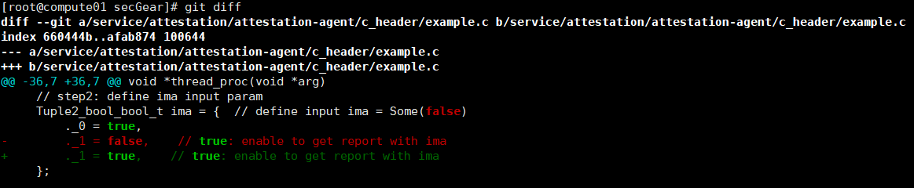
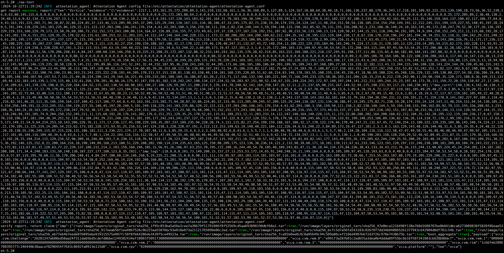

# Measuring Container Images <a name="EN-US_TOPIC_0000002243530385"></a>

Container image measurement is implemented using the attestation agent and attestation service of the secGear project, and secGear has not been adapted to the CoCo community. Therefore, container image measurement does not support the common scenario where the attestation agent is deployed on the guest OS. Currently, the attestation agent is packaged as an SO file in the container image and is invoked by the measurement test program.

## Prerequisites<a name="section1797634684218"></a>

-   You have set up an environment where a local image repository is available. The following operations will be performed in this environment to facilitate Docker image creation and upload. The attestation service in attestation scenarios can be directly deployed in the local image repository.
-   Ensure that IMA has been enabled for the created rootfs. For details, see  [6.d](en-us_topic_0000002044440426.md#li1632006326).
-   Ensure that IMA has been enabled in the guest component and kata-agent has been recompiled and deployed. For details, see  [recompiling and deploying the agent](en-us_topic_0000002044282130.md#li168411548115316).

## Preparations<a name="section197821631172513"></a>

1.  Go to the  **home**  directory and download the secGear code.

    ```
    cd /home
    git clone https://gitee.com/openeuler/secGear.git
    ```

2.  Install the Rust environment by following instructions in  [Step 2](en-us_topic_0000002044282130.md#li363891994015)  of  [Compiling and Deploying kata-shim](en-us_topic_0000002044282130.md#section425812386177).
3.  Enable kata-agent to pull container images by following instructions in  [Setting Kata Image Pulls](en-us_topic_0000002044282114.md#section584474810210).
4.  Install the dependencies.

    ```
    yum install virtCCA_sdk-devel skopeo jq kunpengsecl-attester
    ```

    > **NOTE:** 
    >kunpengsecl-attester is required for running attestation-server and must be installed in the attestation-server running environment.

5.  Download the openEuler container image and import it.

    ```
    wget  http://repo.openeuler.org/openEuler-24.03-LTS-SP1/docker_img/aarch64/openEuler-docker.aarch64.tar.xz
    docker load -i openEuler-docker.aarch64.tar.xz
    ```

    > **NOTE:** 
    >If the wget operation fails, change  **HTTP**  in the download URL to  **HTTPS**  and try again.

6.  Create a container repo file. The proxy is used to download dependencies when using Dockerfile to create images. If the environment is connected to the Internet, you do not need to configure the proxy.

    ```
    vim openEuler.repo 
    ```

    The file content is as follows:

    ```
    [everything]
    name=everything
    baseurl=https://repo.openeuler.org/openEuler-24.03-LTS-SP1/everything/$basearch/
    metalink=https://mirrors.openeuler.org/metalink?repo=$releasever/everything&arch=$basearch
    metadata_expire=1h
    enabled=1
    gpgcheck=0
    proxy=http://IP:PORT 
    ```

7.  Modify the test program to enable the function of obtaining IMA measurement reports.

    ```
    vim secGear/service/attestation/attestation-agent/c_header/example.c
    ```

    Enable IMA parameter initialization and change the  **.\_1**  setting from  **false**  to  **true**.

    ```
    Tuple2_bool_bool_t ima = {  // define input ima = Some(true)
        ._0 = true,
        ._1 = true,  // The default value is false. Change it to true to enable the function of obtaining IMA reports.
    }; 
    ```

    

## Without Attestation Service<a name="section188968121274"></a>

1.  Compile  **libattestation\_agent.so**.

    ```
    cd secGear/service/attestation/attestation-agent
    cargo build --features no_as,virtcca-attester,virtcca-verifier --lib --release
    cp target/release/libattestation_agent.so /lib64/ 
    ```

2.  Compile the test program aa-test.

    ```
    cd c_header 
    gcc example.c -o aa-test -L. -lattestation_agent -lcrypto
    ```

3.  Create a configuration file.

    ```
    mkdir -p /home/no_as/etc/attestation/attestation-agent/ 
    vim /home/no_as/etc/attestation/attestation-agent/attestation-agent.conf
    {
        "svr_url": "http://127.0.0.1:8080",
        "token_cfg": {
            "cert": "/etc/attestation/attestation-agent/as_cert.pem",
            "iss": "oeas"
        }
    }
    ```

4.  Configure the cVM base value.

    Obtain the RIM base value of the cVM corresponding to the confidential container to be started \(following instructions in  [2](en-us_topic_0000002080359729.md#li18143447184411)\) and configure the value in the  **ref\_value.json**  file.

    ```
    mkdir -p /home/no_as/etc/attestation/attestation-agent/local_verifier/virtcca/
    vim /home/no_as/etc/attestation/attestation-agent/local_verifier/virtcca/ref_value.json
    ```

5.  Configure the Huawei certificate.
    1.  Download  **Huawei Equipment Root CA.pem**  and  **Huawei IT Product CA.pem**.

        ```
        https://download.huawei.com/dl/download.do?actionFlag=download&nid=PKI1000000002&partNo=3001&mid=SUP_PKI
        https://download.huawei.com/dl/download.do?actionFlag=download&nid=PKI1000000040&partNo=3001&mid=SUP_PKI 
        ```

    2.  Copy the certificate to the target path.

        ```
        mv *.pem /home/no_as/etc/attestation/attestation-agent/local_verifier/virtcca/
        ```

6.  Copy the file to the image creation directory.

    ```
    cd /home/no_as
    cp /home/secGear/service/attestation/attestation-agent/target/release/libattestation_agent.so .
    cp /home/secGear/service/attestation/attestation-agent/c_header/aa-test . 
    cp /home/openEuler.repo . 
    ```

7.  Create a Dockerfile.

    ```
    vim Dockerfile
    FROM openeuler-24.03-LTS-SP1
    COPY etc /etc/
    COPY libattestation_agent.so /lib64/
    COPY aa-test /home/
    COPY openEuler.repo /etc/yum.repos.d/
    RUN yum -y install compat-openssl11-libs 
    ```

    > **NOTE:** 
    >If an error is reported for the self-signed certificate, change  **https**  in  **openEuler.repo**  to  **http**.

8.  Build a container image and push it to the local image repository.

    ```
    docker build -t aa-test-no-as .
    docker tag aa-test-no-as:latest registry.hw.com:5000/aa-test-no-as
    docker push registry.hw.com:5000/aa-test-no-as
    ```

9.  <a name="li174511711144919"></a>Generate the base value in  **digest\_list\_file**.

    ```
    skopeo inspect docker://registry.hw.com:5000/aa-test-no-as | jq -r '.Layers[]' | sed 's/sha256://g' > digest_list_file
    ```

10. Return to the cVM running environment and create the Kubernetes pod configuration file.

    ```
    vim test-no-as.yaml
    apiVersion: v1
    kind: Pod
    metadata:
      name: no-as
    spec:
      runtimeClassName: kata
      containers:
      - name: box
         image: registry.hw.com:5000/aa-test-no-as:latest
         volumeMounts:
        - name: sys-volume
          mountPath: /sys
          readOnly: false
        - name: dev-volume
          mountPath: /dev
          readOnly: false
      volumes:
      - name: sys-volume
        hostPath:
          path: /sys
          type: Directory
      - name: dev-volume
        hostPath:
          path: /dev
          type: Directory
    ```

    > **NOTE:** 
    >The space alignment format may be corrupted when the configuration file is copied. You are advised to manually modify the configuration file.

11. Create a pod.

    ```
    kubectl apply -f test-no-as.yaml
    ```

12. Access the container and configure  **digest\_list\_file**.

    ```
    kubectl exec -it no-as -c box -- /bin/sh
    mkdir -p /etc/attestation/attestation-agent/local_verifier/virtcca/ima/
    vi /etc/attestation/attestation-agent/local_verifier/virtcca/ima/digest_list_file
    ```

    Manually copy the content in the  **digest\_list\_file**  of  [9](#li174511711144919)  to the  **digest\_list\_file**  of the container.

13. Start the image measurement test file.

    ```
    cd /home
    ./aa-test
    ```

    

## With Attestation Service<a name="section1451916168522"></a>

1.  Compile  **libattestation\_agent.so**.

    ```
    cd /home/secGear/service/attestation/attestation-agent
    cargo build --features virtcca-attester --lib --release
    cp target/release/libattestation_agent.so /lib64/ 
    ```

2.  Compile the test program  **aa-test**.

    ```
    cd c_header 
    gcc example.c -o aa-test -L. -lattestation_agent -lcrypto
    ```

3.  <a name="li2731946172114"></a>Create a configuration file. The IP address and port are those of the attestation-server running environment.

    ```
    mkdir -p /home/as/etc/attestation/attestation-agent/ 
    vim /home/as/etc/attestation/attestation-agent/attestation-agent.conf
    {
        "svr_url": "http://IP:PORT",
        "token_cfg": {
            "cert": "/etc/attestation/attestation-agent/as_cert.pem",
            "iss": "oeas"
        }
    }
    ```

4.  Generate the private key and self-signed certificate of the attestation service.

    ```
    cd /home/as
    openssl genrsa -out private.pem 3072
    openssl req -new -key private.pem -out server.csr # Keep pressing Enter.
    openssl x509 -req -in server.csr -out as_cert.pem -signkey private.pem -days 3650
    cp as_cert.pem /home/as/etc/attestation/attestation-agent/
    ```

5.  Copy the file to the image creation directory.

    ```
    cp /home/secGear/service/attestation/attestation-agent/target/release/libattestation_agent.so .
    cp /home/secGear/service/attestation/attestation-agent/c_header/aa-test .
    cp /home/openEuler.repo .
    ```

6.  Create a Dockerfile.

    ```
    vim Dockerfile
    FROM openeuler-24.03-LTS-SP1
    COPY etc /etc/
    COPY libattestation_agent.so /lib64/
    COPY aa-test /home/
    COPY openEuler.repo /etc/yum.repos.d/
    RUN yum -y install compat-openssl11-libs 
    ```

7.  Build a container image and push it to the local image repository.

    ```
    docker build -t aa-test-as .
    docker tag aa-test-as:latest registry.hw.com:5000/aa-test-as
    docker push registry.hw.com:5000/aa-test-as
    ```

    > **NOTE:** 
    >If an error is reported for the self-signed certificate, change  **https**  in  **openEuler.repo**  to  **http**.

8.  Generate the base value in  **digest\_list\_file**.

    ```
    skopeo inspect docker://registry.hw.com:5000/aa-test-as | jq -r '.Layers[]' | sed 's/sha256://g' > digest_list_file
    ```

9.  Compile the attestation service.

    ```
    cd /home/secGear/service/attestation/attestation-service
    cargo build --release
    cp target/release/attestation-service /usr/bin
    ```

10. Create an attestation service configuration file.

    ```
    mkdir -p /etc/attestation/attestation-service/
    vim /etc/attestation/attestation-service/attestation-service.conf
    {
            "token_cfg": {
                    "key": "/etc/attestation/attestation-service/token/private.pem",
                    "iss": "oeas",
                    "nbf": 0,
                    "valid_duration": 300,
                    "alg": "PS256"
            }
    }
    mkdir -p /etc/attestation/attestation-service/token
    cp /home/as/private.pem /etc/attestation/attestation-service/token
    ```

11. Configure the Huawei certificate.
    1.  Download  **Huawei Equipment Root CA.pem**  and  **Huawei IT Product CA.pem**.

        ```
        https://download.huawei.com/dl/download.do?actionFlag=download&nid=PKI1000000002&partNo=3001&mid=SUP_PKI
        https://download.huawei.com/dl/download.do?actionFlag=download&nid=PKI1000000040&partNo=3001&mid=SUP_PKI 
        ```

    2.  Copy the certificate to the target path.

        ```
        mkdir -p /etc/attestation/attestation-service/verifier/virtcca
        mv *.pem /etc/attestation/attestation-service/verifier/virtcca
        ```

12. Start the attestation service.

    ```
    /usr/bin/attestation-service -s IP:PORT
    ```

    The IP address and port are the same as those set in  [Step 3](#li2731946172114).

13. Configure the RIM base value to the attestation service.

    Obtain the RIM base value of the cVM corresponding to the confidential container to be started \(following instructions in  [2](en-us_topic_0000002080359729.md#li18143447184411)\) and used the value to replace the value of  **vcca.cvm.rim**.

    ```
    curl -H "Content-Type:application/json" -X POST -d '{"refs":"{\"vcca.cvm.rim\":\"7d2e49c8d29f18b748e658e7243ecf26bc292e5fee93f72af11ad9da9810142a\"}"}' http://IP:PORT/reference
    ```

14. Configure the default attestation service policy.

    ```
    cp /home/secGear/service/attestation/attestation-service/policy/src/opa/default_vcca.rego /etc/attestation/attestation-service/policy/
    ```

15. Configure the IMA baseline file  **digest\_list\_file**.

    ```
    cp /home/as/digest_list_file /etc/attestation/attestation-service/verifier/virtcca/ima/
    ```

16. Return to the cVM running environment and create the Kubernetes pod configuration file.

    ```
    vim test-as.yaml
    apiVersion: v1
    kind: Pod
    metadata:
      name: as
    spec:
      runtimeClassName: kata
      containers:
      - name: box
         image: registry.hw.com:5000/aa-test-as:latest
         volumeMounts:
        - name: sys-volume
          mountPath: /sys
          readOnly: false
        - name: dev-volume
          mountPath: /dev
          readOnly: false
      volumes:
      - name: sys-volume
        hostPath:
          path: /sys
          type: Directory
      - name: dev-volume
        hostPath:
          path: /dev
          type: Directory
    ```

17. Create a pod.

    ```
    kubectl apply -f test-as.yaml
    ```

18. Access the container and configure  **digest\_list\_file**.

    ```
    kubectl exec -it as -c box -- /bin/sh
    ```

19. Start the image measurement test file.

    ```
    cd /home
    ./aa-test
    ```

## Tool for Generating the Container Image Measurement Base Value<a name="section668582512314"></a>

-   The tool receives one parameter, that is, the image path of the container to be measured.
-   The tool outputs two files:  **digest\_list\_file**  indicates the hash value list of image layer files, and  **manifest.json**  outputs the image layer file name list in JSON format.

1.  Deploy the tool. 

    ```
    vim gen_layers_ref.sh
    ```

    ```
    #!/bin/bash
    
    # Check if the image address parameter is provided
    if [ "$#" -ne 1 ]; then
        echo "Usage: $0 <image_address>"
        exit 1
    fi
    
    IMAGE=$1
    DIGEST_FILE="digest_list_file"
    MANIFEST_FILE="manifest.json"
    
    # Extract the hash values of the image layers and write to digest_list_file
    skopeo inspect "docker://$IMAGE" | jq -r '.Layers[]' | sed 's/sha256://g' > "$DIGEST_FILE"
    
    # Generate the manifest.json file
    skopeo inspect "docker://$IMAGE" | jq -r '.Layers[]' | sed 's/sha256://g' | awk '{print "sha256_" $0 ".tar"}' | jq -R . | jq -s '{Layers: .}' > "$MANIFEST_FILE"
    
    echo "Output has been generated:"
    echo "  - $DIGEST_FILE"
    echo "  - $MANIFEST_FILE"
    ```

    chmod +550 gen\_layers\_ref.sh

2.  Use the tool.

    ```
    ./gen_layers_ref.sh <image_address>
    ```

    

