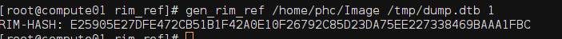
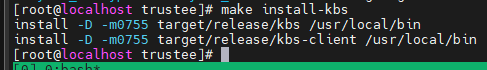
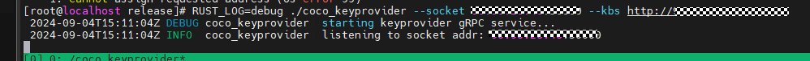

# Remote Attestation for Confidential Containers <a name="EN-US_TOPIC_0000002243690229"></a>

This section describes how to enable remote attestation for confidential containers so that confidential containers run in the TEE.

Install the compilation dependencies.

```
yum install -y tpm2-tss-devel tpm2-abrmd tpm2-tools protobuf-compiler virtCCA_sdk-devel virtCCA_sdk
```

> **NOTE:** 
>Run the following command to check the installed virtCCA software package. Ensure that the versions of both  **virtCCA\_sdk**  and  **virtCCA\_sdk-devel**  are  **0.1.2-1.oe2203sp4**.
>```
>yum list |grep virtCCA
>```

## Deploying Remote Attestation Components<a name="section453410817138"></a>

-   **Compile and deploy the attestation agent.**

1.  Compile and deploy the attestation agent.

    ```
    cd ../guest-components/attestation-agent
    make KBC=cc_kbc ttrpc=true
    make install
    ```

    If the compilation is successful, the  **make install**  command deploys the attestation agent into the system path  **/usr/local/bin/attestation-agent**.

    

2.  Copy the attestation agent to the rootfs in the cVM.

    ```
    cd /home/work/kata-containers/tools/osbuilder/rootfs-builder
    mount rootfs.img rootfs
    cp -rf /usr/local/bin/attestation-agent rootfs/usr/local/bin/
    umount rootfs
    ```

-   **Compile and deploy the attestation service.**

1.  Compile and deploy the attestation service.

    ```
    cd /home/work/attestation-service
    make
    make install
    ```

    After the compilation is successful, the grpc-as binary file is generated. By default, the file is deployed in the  **/usr/local/bin**  directory.

2.  Generate the measurement base value configuration file of the remote attestation service.
    1.  Back up the original containerd-shim-kata-v2.

        ```
        cp /home/work/kata-containers/src/runtime/containerd-shim-kata-v2 /home/work/kata-containers/src/runtime/containerd-shim-kata-v2-origin
        ```

    2.  Run the following script based on the  [Compiling and Deploying kata-shim](en-us_topic_0000002044282130.md#section425812386177)  source code:

        ```
        cd /home/work/kata-containers/
        ```

        ```
        sed -i.bak 's|const defaultQemuMachineOptions = "gic-version=3,accel=kvm,kernel_irqchip=on"|const defaultQemuMachineOptions = "gic-version=3,accel=kvm,kernel_irqchip=on,dumpdtb=/tmp/dump.dtb"|' src/runtime/virtcontainers/qemu_arm64.go
        ```

    3.  Compile the containerd-shim-kata-v2 version that can be used to export the DTB file.

        ```
        make -C src/runtime
        ```

    4.  Start the confidential container to export the DTB file. The DTB file is saved in the  **/tmp/dump.dtb**  directory.

        ```
        ctr run --runtime "io.containerd.kata.v2" --rm -t docker.io/library/busybox:latest test-kata /bin/sh
        ```

    5.  Restore the original containerd-shim-kata-v2.

        ```
        cp /home/work/kata-containers/src/runtime/containerd-shim-kata-v2 /home/work/kata-containers/src/runtime/containerd-shim-kata-v2-dump-dtb
        cp /home/work/kata-containers/src/runtime/containerd-shim-kata-v2-origin /home/work/kata-containers/src/runtime/containerd-shim-kata-v2
        ```

    6.  Generate a measurement base value based on the exported DTB file.
        1.  Use the tool contained in the  **virtCCA\_sdk**  package \(see  [Obtaining the Measurement Base Value](en-us_topic_0000002080359745.md#section4613113319549)\) to calculate the RIM value.

            

        2.  Use vim to edit the  **/etc/attestation/attestation-service/verifier/virtcca/ref\_value.json**  configuration file and replace the measurement base value of cVMs. Refer to the following configuration:

            ```
            {
                    "rpv": "54686520717569636B2062726F776E20666F78206A756D7073206F766572203133206C617A7920646F67732E54686520717569636B2062726F776E20666F7820",
                    "rim": "4e972c68682405109dba4b2b9d89532532868f0b82b4dca56eda8fdd95f2c31f",
                    "rem": [
                        "0000000000000000000000000000000000000000000000000000000000000000",
                        "0000000000000000000000000000000000000000000000000000000000000000",
                        "0000000000000000000000000000000000000000000000000000000000000000",
                        "0000000000000000000000000000000000000000000000000000000000000000"
                    ],
                    "hash_alg": "sha-256"
            }
            ```

3.  Preset the remote attestation root certificate and level-2 CA certificate on the remote attestation service node.

    -   Download the root certificate from  [https://download.huawei.com/dl/download.do?actionFlag=download&nid=PKI1000000002&partNo=3001&mid=SUP\_PKI](https://download.huawei.com/dl/download.do?actionFlag=download&nid=PKI1000000002&partNo=3001&mid=SUP_PKI).
    -   Download the level-2 CA certificate from  [https://download.huawei.com/dl/download.do?actionFlag=download&nid=PKI1000000040&partNo=3001&mid=SUP\_PKI](https://download.huawei.com/dl/download.do?actionFlag=download&nid=PKI1000000040&partNo=3001&mid=SUP_PKI).

    > **NOTE:** 
    >Preset the root certificate and level-2 CA certificate in the  **/etc/attestation/attestation-service/verifier/virtcca/**  directory on the remote attestation node.

-   **Compile and deploy coco\_keyprovider.**

1.  <a name="li17161113920814"></a>Compile coco\_keyprovider, which is included in the source code of the guest\_component open source component.

    ```
    cd /home/work/guest-components/attestation-agent/coco_keyprovider
    cargo build --release
    cd ../../../
    cp ./guest-components/target/release/coco_keyprovider /usr/local/bin
    ```

    After the compilation is successful, the coco\_keyprovider binary file is generated in the  **guest-components/target/release**  directory.

    

2.  Create an asymmetric key pair file  **keyprovider auth**.

    ```
    # Generate a public/private key pair.
    openssl genpkey -algorithm ed25519 > auth.key
    # Export the public key.
    openssl pkey -in auth.key -pubout -out auth_pub.pem
    ```

-   **Compile and deploy the Key Broker Service \(KBS\).**

1.  Compile the KBS component.

    ```
    cd /home/work/trustee
    make COCO_AS_INTEGRATION_TYPE=grpc
    make install-kbs
    ```

    

2.  Create a KBS configuration file.

    Use vim to edit the  **kbs-grpc.toml**  configuration file and add the KBS configuration information. Refer to the following configuration:

    ```
    insecure_http = true
    insecure_api = false
     
    sockets = ["IP:8080"]
    auth_public_key = "path/to/auth_pub.pem"
    [grpc_config]
    as_addr = "http://IP:3000"
    ```

    > **NOTE:** 
    >-   **sockets**: specifies the listening IP address and port \(8080 by default\) of the KBS.
    >-   **as\_addr**: specifies the listening IP address and port \(3000 by default\) of the attestation service.
    >-   **auth\_public\_key**: specifies the public key used for authentication, which is generated in  [1](#li17161113920814)  when compiling coco\_keyprovider.

-   **Check each component to see whether the container is running properly.**  \(Keep the processes of resident services running on the terminal.\)

1.  Start coco\_keyprovider \(resident service\).

    ```
    # --socket specifies the listening IP address and port (50000 by default) of coco_keyprovider, --kbs specifies the listening IP address and port (8080 by default) of the KBS, and -a specifies the authentication private key (generated in step 2 of compiling the key provider). Set them based on your service requirements.
    RUST_LOG=debug coco_keyprovider --socket ip:port --kbs http://ip:port -a /path/to/auth.key
    ```

    

2.  Start the attestation service \(resident service\).

    ```
    # By default, port 3000 of the local node is listened on.
    RUST_LOG=debug grpc-as --socket ip:3000
    ```

    

3.  Start KBS \(resident service\).

    ```
    RUST_LOG=debug kbs --config-file kbs-grpc.toml
    ```

    > **NOTE:** 
    >```
    >Replace the example kbs-grpc.toml file path with the actual one.
    >```

    

4.  Modify the kata-agent startup parameters and add the attestation agent startup command.
    1.  Use vim to edit the  **/etc/kata-containers/configuration.toml**  file.
    2.  Add the  **agent.aa\_kbc\_params**  startup parameter to the  **kernel\_params**  configuration item. The parameter is in the format of  **agent.aa\_kbc\_params=cc\_kbc::http://**_ip\_address:port_, where  _ip\_address:port_  indicates the listening IP address and port of the KBS. The default port of the KBS is 8080.

        

    3.  Enable the  **debug\_console\_enabled**  option.

        ```
        debug_console_enabled = true
        ```

        

        > **NOTE:** 
        >Disable  **debug\_console\_enabled**  in production environments. Use it only in test environments to facilitate location.

    4.  Verify that a confidential container with the attestation agent component can be started.

        Run the following command in CLI 1 to start the confidential container:

        ```
        ctr run --runtime "io.containerd.kata.v2" --rm -t "docker.io/library/busybox:latest" test-kata sh
        ```

        Open CLI 2, log in to the cVM by running the  **kata-runtime**  command, and check whether the attestation agent is started properly.

        ```
        kata-runtime exec test-kata
        # Log in to the cVM and run the following command to check the service process:
        ps aux | grep attestation-agent
        ```

        

