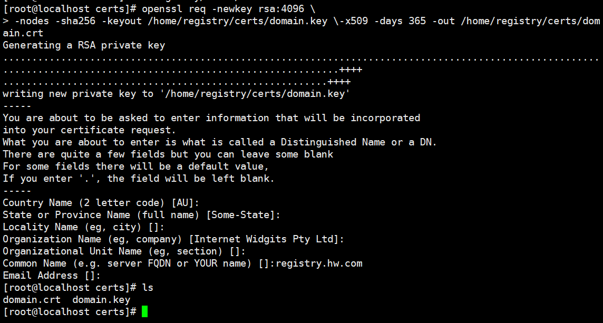
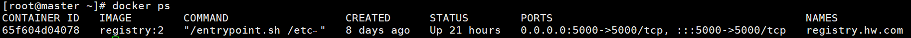
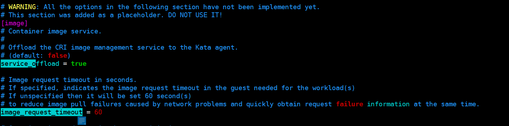
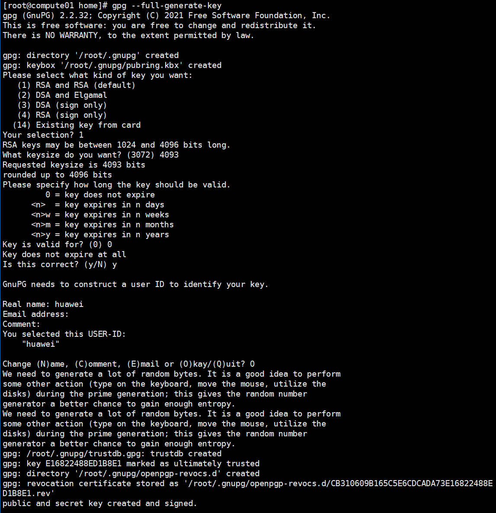
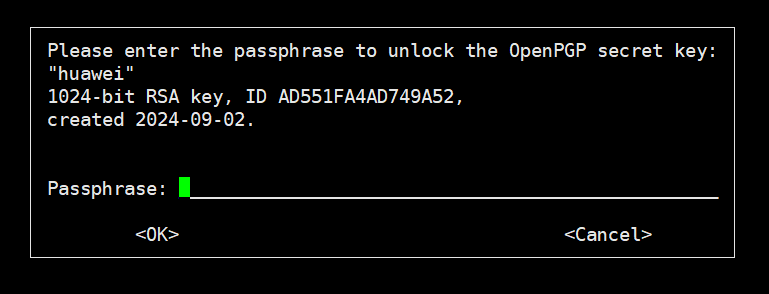
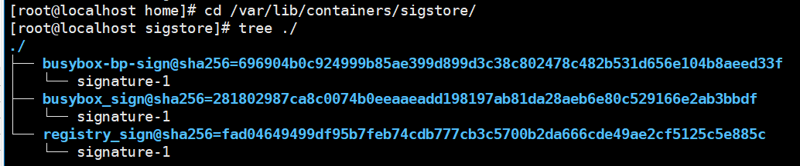

# Verifying Container Image Signatures <a name="EN-US_TOPIC_0000002208530342"></a>

## Compiling and Installing Skopeo<a name="section1967520191014"></a>

1.  Download Skopeo.

    ```
    git clone -b v1.9.1 https://github.com/containers/skopeo.git $GOPATH/src/github.com/containers/skopeo
    ```

2.  Download the dependencies.

    ```
    yum install -y gpgme-devel device-mapper-devel
    ```

3.  Perform the compilation and installation.

    ```
    cd $GOPATH/src/github.com/containers/skopeo && make bin/skopeo
    cp bin/skopeo /usr/local/bin
    ```

4.  <a name="li98111624578"></a>Pull the image to the local computer. The image is successfully pulled.

    ```
    mkdir -p /home/work/images && cd /home/work/images
    skopeo copy --insecure-policy   
    docker://docker.io/library/busybox:latest dir:busybox:latest
    ```

    

    > **NOTE:** 
    >By default, Skopeo reads the  **$HOME/.config/containers/policy.json**  or  **/etc/containers/policy.json**  policy file and verifies the image based on the image signature verification policy defined in the file. The policy format and requirements are the same as those for  [the image repository](#li395515366199). When verifying the deployment result, you can use the  **--insecure-policy**  parameter to ignore the verification policy. Set the policy as required in production environments and delete the  **--insecure-policy**  parameter.

## Building a Local Docker Repository<a name="section1936114544214"></a>

> **NOTE:** 
>The dependencies of Docker conflict with the dependencies of containerd. You are advised to set up a local Docker repository on another server.

1.  Install Docker.

    ```
    yum install -y docker httpd-tools
    ```

2.  Start the Docker service and enable it to automatically start upon system startup.

    ```
    systemctl start docker
    systemctl enable docker
    ```

3.  Configure the Docker mirror source.

    ```
    vim /etc/docker/daemon.json
    
    {
      "registry-mirrors": [
            "https://registry.docker-cn.com",
            "http://hub-mirror.c.163.com"
      ],
     
      "dns": [
        "114.114.114.114",
        "110.110.110.110",
        "8.8.8.8"
      ]
    }
    ```

4.  Configure the Docker proxy.

    ```
    mkdir -p /etc/systemd/system/docker.service.d
    vim /etc/systemd/system/docker.service.d/http-proxy.conf
    ```

5.  Configure the proxy IP address.

    ```
    [Service]
    Environment="HTTP_PROXY=http://proxy.example.com:port/"
    Environment="HTTPS_PROXY=https://proxy.example.com:port/"
    ```

    > **NOTE:** 
    >If no HTTPS proxy is available for the  **HTTPS\_PROXY**  field, use an HTTP proxy instead.

6.  Restart Docker.

    ```
    systemctl daemon-reload
    systemctl restart docker
    ```

7.  Pull the registry image.

    ```
    docker pull registry:2
    ```

8.  Configure the HTTPS certificate and set the domain name of the image repository.

    ```
    mkdir -p /home/registry/certs
    openssl req -newkey rsa:4096 \
    -addext "subjectAltName = DNS:registry.hw.com" \
    -nodes -sha256 -keyout /home/registry/certs/domain.key \
    -x509 -days 365 -out /home/registry/certs/domain.crt
    ```

    Set the domain name  **registry.hw.com**. For other parameters, press  **Enter**  to use default settings.

    

    Set the domain name and IP address of the server where the local Docker repository is located.

    ```
    vim /etc/hosts
    127.0.0.1 registry.hw.com
    ```

    > **NOTE:** 
    >To access the private repository from an external server, configure the IP address of the server where the private repository is located. For intranet access, cancel the proxy.

9.  Write the image repository certificate to the root certificate of the server where the local Docker repository is located.

    ```
    cat /home/registry/certs/domain.crt >>/etc/pki/ca-trust/extracted/pem/tls-ca-bundle.pem
    cat /home/registry/certs/domain.crt >>/etc/pki/ca-trust/extracted/openssl/ca-bundle.trust.crt
    ```

    > **NOTE:** 
    >Copy  **domain.crt**  to the confidential container execution server and run the following commands to add the content of  **domain.crt**  to  **tls-ca-bundle.pem**  and  **ca-bundle.trust.crt**:
    >```
    >cat /home/registry/certs/domain.crt >>/etc/pki/ca-trust/extracted/pem/tls-ca-bundle.pem
    >cat /home/registry/certs/domain.crt >>/etc/pki/ca-trust/extracted/openssl/ca-bundle.trust.crt
    >```

10. Return to the confidential container execution server, write the local repository certificate to the guest, and change the domain name and IP address of the guest.
    1.  Mount the rootfs image.

        ```
        cd /home/work/kata-containers/tools/osbuilder/rootfs-builder/
        mount rootfs.img rootfs
        ```

    2.  Add the local repository certificate to the root certificate of the rootfs.

        ```
        cat domain.crt >> rootfs/etc/pki/ca-trust/extracted/pem/tls-ca-bundle.pem
        cat domain.crt >> rootfs/etc/pki/ca-trust/extracted/openssl/ca-bundle.trust.crt
        ```

    3.  Modify the domain name configuration file of the guest. Ensure that the guest can resolve the IP address of the local Docker image repository.

        ```
        vim rootfs/etc/hosts
        IP address of the server where the local Docker repository is located registry.hw.com
        ```

    4.  Cancel the mounting.

        ```
        umount rootfs
        ```

    5.  Return to the server where the local Docker repository is located and perform subsequent steps.

11. Generate the registry login password.

    ```
    mkdir -p /home/registry/auth/
    htpasswd -B -c /home/registry/auth/htpasswd <User name>
    ```

    

12. Start the registry container.

    ```
    docker run -d -p 5000:5000 \
    --restart=always \
    --name registry.hw.com \
    -v /home/registry/auth:/auth \
    -v /home/registry/certs:/certs \
    -e REGISTRY_HTTP_TLS_CERTIFICATE=/certs/domain.crt \
    -e REGISTRY_HTTP_TLS_KEY=/certs/domain.key \
    -v /home/registry/data:/var/lib/registry \
    -e "REGISTRY_AUTH=htpasswd" \
    -e "REGISTRY_AUTH_HTPASSWD_REALM=Registry Realm" \
    -e REGISTRY_AUTH_HTPASSWD_PATH=/auth/htpasswd \
    registry:2
    ```

    View the running registry container.

    ```
    docker ps
    ```

    

13. Test the running status of the image repository.
    1.  Use Skopeo to log in to the local repository, run the following command, and enter your user name and password:

        ```
        skopeo login  --insecure-policy registry.hw.com:5000
        ```

        

    2.  Use Skopeo to upload the downloaded local image for testing.

        ```
        cd /home/work/images
        skopeo copy --insecure-policy  dir:busybox:latest docker://registry.hw.com:5000/busybox:latest
        ```

        > **NOTE:** 
        >In this step, you need to use the local image downloaded in  [Step 4](#li98111624578)  of  [Compiling and Installing Skopeo](#section1967520191014)  to perform the test.

    3.  Enter the image repository password as prompted and check whether the image has been uploaded to the repository.

        ```
        curl -u User_name https://registry.hw.com:5000/v2/_catalog
        ```

## Setting Kata Image Pulls<a name="section584474810210"></a>

1.  Modify the Kata configuration.

    Modify the values of  **service\_offload**  and  **image\_request\_timeout**.

    ```
    vim /etc/kata-containers/configuration.toml
    service_offload = true
    image_request_timeout = 600
    :wq
    ```

    

    > **NOTE:** 
    >The value of  **image\_request\_timeout**  varies depending on the image size and network speed.

2.  Modify the containerd configuration.

    ```
    vim /etc/containerd/config.toml
    :/[plugins."io.containerd.grpc.v1.cri".containerd.runtimes.kata]
    ```

    Add  **cri\_handler = "cc"**  to the position shown in the following figure:

    

    ```
    :wq
    systemctl daemon-reload
    systemctl restart containerd
    ```

## Signing the Image<a name="section2086319468917"></a>

1.  Use GPG to generate a signature key.

    ```
    gpg --full-generate-key
    ```

    1.  Set the key type, key length, and key validity as prompted.

        

    2.  Enter the passphrase.

        

    3.  Check the signature key fingerprint.

        ```
        gpg --list-keys --fingerprint
        ```

        

    4.  Export the public key of the signature key based on the key fingerprint.

        ```
        mkdir -p /home/work/keys/
        gpg -a -o /home/work/keys/pubkey.gpg --export CB310609B165C5E6CDCADA73E16822488ED1B8E1 
        ```

    5.  Obtain the Base64-encoded content of  **pubkey.gpg**.

        ```
        cat pubkey.gpg | base64
        ```

        

2.  Sign the image.
    1.  Use the key fingerprint specified by Skopeo to sign the image and push the image to the local image repository.

        ```
        skopeo copy --insecure-policy  \
        --sign-by CB310609B165C5E6CDCADA73E16822488ED1B8E1 \
        docker://registry.hw.com:5000/busybox:latest \
        docker://registry.hw.com:5000/busybox_sign:latest
        ```

    2.  Enter the passphrase that you have set.

        

        By default, the image signature is stored in the local directory  **/var/lib/containers/sigstore/**.

        

3.  Configure the KBS.
    1.  Log in to the KBS server. Then create a  **security-policy**  directory and configure the image signature verification policy.

        ```
        mkdir -p /opt/confidential-containers/kbs/repository/default/security-policy/
        cd /opt/confidential-containers/kbs/repository/default/security-policy/
        vim test
        ```

    2.  <a name="li395515366199"></a>Set the verification policy and public key location of the image repository.

        ```
        {
            "default": [
                {
                    "type": "reject"
                }
            ],
            "transports": {
                "docker": {
                    "registry.hw.com:5000": [
                        {
                            "type": "signedBy",
                            "keyType": "GPGKeys",
                            "keyData": "LS0tLS1CRUdJTiBQR1AgUFVCTElDIEtFWSBCTE9DSy0tLS0tCgptSTBFWnRValZRRUVBTDBpd3FWdDFhK0JKUCs0Rnp2ZzNqL0ltMTJmT1BrS0UwWTdSeE0wRGtGdU9EaXd5anBBCjJvd0N1NExYR0ZnUENhVkFRYk5oVlRpYTBkblNZbFAzQWwzNVUxTFlMWFhDWWJIQWdFdlRMdkpySzdPVisxaDAKWDVCMXRmLzU1VW5BcDVMYTh6ejhCczltaklXbGhVYVJ6T21RdzNwdHpRNEk2SU5INjlMRGVhOGpBQkVCQUFHMApCbWgxWVhkbGFZak5CQk1CQ0FBM0ZpRUVLWERYSHZiWXRMNEFZUDVSclZVZnBLMTBtbElGQW1iVkkxVUNHd01GCkN3a0lCd0lHRlFvSkNBc0NBeFlDQVFJZUFRSVhnQUFLQ1JDdFZSK2tyWFNhVWxuUkEvOTUvUUl5MENyQlBNa2sKY2s4NE9rVy9xYVIvL0orZVBKNWo3bTdwa0lHNVFBRmZ5NVI3K1hxd29kR2NOVUxMQjQxTFBsR2N0dkw2R1hPbAphUmszN2hZdVdsaWFOSUVXeDRFOW1tVHZBbCtNOGRPMW4zWmlDT3FxN0x0YzN0N0NGTWJnQVF1RVFGeUV2UWNrClZsWFdrVFczZTA5ekNxYzVGNVk5eUxxVlc0NFRhN2lOQkdiVkkxVUJCQUMzbkI3Zzlja0wrTTdTeEQybnNTSzIKcVZqOHd4ejRuUDcxYUdacEJ1VFA4T2ZsQWV4TEJtRWdmaXZJdUFJVUdxNFBUOHI1MENHUnlWVnhXdXRySElvMQpadWdydTAvUWtYWUE1cjhTZ2xvazdKaWZtVllLditOV2dhWStnYjZvU0k0S3p5UzluMEdhaU1tQ2paT25YYW1CCnNMU2NDN0g1QTR3LzgrSmhMby9ST3dBUkFRQUJpTFlFR0FFSUFDQVdJUVFwY05jZTl0aTB2Z0JnL2xHdFZSK2sKclhTYVVnVUNadFVqVlFJYkRBQUtDUkN0VlIra3JYU2FVa1RyQkFDNVhyQ01iSjZNNzJlREVxdHhPdy8rUXRtTAprLzk3MG94aHRhbTFtcEdJRDZ2Rlh5MFRoNTBtUXZQaTNkeDdUOWdNblFFbzNJd1ZKSGhUVjVuVVBHL0EwTi8yCklKczlWRVBFN3ZnendMQ3k1RmZHTEFHcVIzWkZ3bnBadEI1OUlKRXVjUlZSSGhDSitYbDlzYnJiRDYzYmVaODQKd0FKTXlmWmU1OWxxOVRoTlpRPT0KPTd3N1oKLS0tLS1FTkQgUEdQIFBVQkxJQyBLRVkgQkxPQ0stLS0tLQo="
                        }
                    ]
                }
            }
        }
        ```

    3.  Create a  **sigstore-config**  directory and configure the signature deployment file.

        ```
        mkdir -p /opt/confidential-containers/kbs/repository/default/sigstore-config/
        vim /opt/confidential-containers/kbs/repository/default/sigstore-config/test
        ```

    4.  Set a location to store signatures.

        ```
        docker:
            registry.hw.com:5000:
                sigstore: file:///var/lib/containers/sigstore
                sigstore-staging: file:///var/lib/containers/sigstore
        ```

    5.  <a name="li155371958201211"></a>Set the image repository user name and password in the following format and encode them using Base64.

        ```
        <User name>:<Password>
        ```

    6.  Configure the image repository login key and write the code in  [5](#li155371958201211)  to the configuration file.

        ```
        mkdir -p /opt/confidential-containers/kbs/repository/default/credential/
        ```

        ```
        vim /opt/confidential-containers/kbs/repository/default/credential/test
        
        {
            "auths": {
                "registry.hw.com:5000": {
                    "auth": "<Base64 code>"
                }
            }
        }
        ```

        > **NOTE:** 
        >In the preceding  **/opt/confidential-containers/kbs/repository/default/credential/test**  file, you need to enter the Base64 code of the image repository user and password. Set the read and write permissions on the file as required.

4.  Deploy the signature and public key.
    1.  Mount the guest image.

        ```
        cd /home/work/kata-containers/tools/osbuilder/rootfs-builder/kata-overlay/
        mount rootfs.img rootfs
        ```

    2.  Save the signature and public key to the specified directory of the guest based on the paths configured in  **sigstore-config**  and  **security-policy**.

        ```
        mkdir -p rootfs/var/lib/containers/sigstore/
        cp -r /var/lib/containers/sigstore/* rootfs/var/lib/containers/sigstore/
        mkdir -p rootfs/run/image-security/simple_signing/
        cp /home/work/keys/pubkey.gpg rootfs/run/image-security/simple_signing/pubkey.gpg
        ```

    3.  Cancel the mounting.

        ```
        umount rootfs
        ```

5.  Verify the signed image.
    1.  Deploy the signed image and write the pod configuration.

        ```
        cd /home/work/
        vim sign-test.yaml
        ```

    2.  Add the following content to the configuration file:

        ```
        apiVersion: v1
        kind: Pod
        metadata:
          name: sign-test
        spec:
          runtimeClassName: kata
          containers:
          - name: box
            image: registry.hw.com:5000/busybox_sign:latest
        ```

    3.  Deploy the pod.

        ```
        kubectl apply -f sign-test.yaml
        ```

    4.  Check whether the image passes the verification and whether the container is running properly.

        ```
        kubectl get pods
        ```

