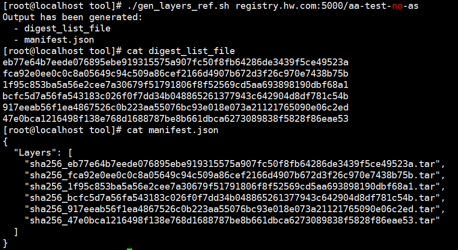

# 容器镜像度量<a name="ZH-CN_TOPIC_0000002055827284"></a>

当前容器镜像度量基于secGear项目的attestation-agent/attestation-service实现，且secGear暂未适配CoCo社区，因此当前容器度量暂不支持attestation-agent部署在guest OS的通用场景，当前attestation-agent以.so的形式打包在容器镜像中供度量测试程序调用。

## 前提条件<a name="section1797634684218"></a>

-   建议在搭建有本地镜像仓的环境执行下述步骤，方便docker镜像制作和上传，有证明场景的as服务可以直接部署在本地镜像仓环境。
-   确保制作的rootfs完成了ima使能。 具体请参见[6.d](zh-cn_topic_0000002044440426.md#li1632006326)
-   确保guest component合入了使能ima的修改，并重新编译和部署kata-agent。具体请参见[重新编译并部署agent](机密容器部署运行.md#li168411548115316)。

## 准备工作<a name="section197821631172513"></a>

1.  执行以下命令进入“home“目录并下载secGear代码。

    ```
    cd /home
    git clone --branch v1.0.0 https://gitee.com/openeuler/secGear.git
    ```

2.  请参见[kata-shim编译和部署](机密容器部署运行.md#section425812386177)的[步骤2](机密容器部署运行.md#li363891994015)完成rust环境安装。
3.  请参见[kata镜像拉取设置](容器镜像签名验签.md#section584474810210)使能kata-agent拉取容器镜像。
4.  执行以下命令安装相关依赖。

    ```
    yum install virtCCA_sdk-devel skopeo jq kunpengsecl-attester
    ```

    > **说明：** 
    >kunpengsecl-attester为attestation-server运行所需依赖，需安装在attestation-server所在运行环境。

5.  下载openEuler容器镜像并导入。

    ```
    wget  http://repo.openeuler.org/openEuler-24.09/docker_img/aarch64/openEuler-docker.aarch64.tar.xz
    docker load -i openEuler-docker.aarch64.tar.xz
    ```

    > **说明：** 
    >若wget失败，则将下载地址的http修改为https后再次尝试。

6.  创建容器repo文件，proxy代理用于Dockerfile创建镜像时下载依赖，环境直通公网则无需配置。

    ```
    vim openEuler.repo 
    ```

    内容如下：

    ```
    [everything]
    name=everything
    baseurl=https://repo.openeuler.org/openEuler-24.09/everything/$basearch/
    metalink=https://mirrors.openeuler.org/metalink?repo=$releasever/everything&arch=$basearch
    metadata_expire=1h
    enabled=1
    gpgcheck=0
    proxy=http://IP:PORT 
    ```

7.  修改测试程序，启用获取ima度量报告。

    ```
    vim secGear/service/attestation/attestation-agent/c_header/example.c
    ```

    启用ima参数初始化，将.\_1由**false**改为**true**。

    ```
    Tuple2_bool_bool_t ima = {  // define input ima = Some(true)
        ._0 = true,
        ._1 = true,  // 默认false，修改为true启用获取ima报告
    }; 
    ```

    

## 无证明服务<a name="section188968121274"></a>

1.  执行以下命令编译libattestation\_agent.so。

    ```
    cd secGear/service/attestation/attestation-agent
    cargo build --features no_as,virtcca-attester,virtcca-verifier --lib --release
    cp target/release/libattestation_agent.so /lib64/ 
    ```

2.  执行以下命令编译测试程序aa-test。

    ```
    cd c_header 
    gcc example.c -o aa-test -L. -lattestation_agent -lcrypto
    ```

3.  创建配置文件。

    ```
    mkdir -p /home/no_as/etc/attestation/attestation-agent/ 
    vim /home/no_as/etc/attestation/attestation-agent/attestation-agent.conf
    {
        "svr_url": "http://127.0.0.1:8080",
        "token_cfg": {
            "cert": "/etc/attestation/attestation-agent/as_cert.pem",
            "iss": "oeas"
        }
    }
    ```

4.  配置cvm基线值。

    请参见[2](机密容器远程证明.md#li18143447184411)获取待启动机密容器对应cvm的rim基线值并配置到下述ref\_value.json文件中。

    ```
    mkdir -p /home/no_as/etc/attestation/attestation-agent/local_verifier/virtcca/
    vim /home/no_as/etc/attestation/attestation-agent/local_verifier/virtcca/ref_value.json
    ```

5.  配置华为证书。
    1.  下载Huawei Equipment Root CA.pem、Huawei IT Product CA.pem。

        ```
        https://download.huawei.com/dl/download.do?actionFlag=download&nid=PKI1000000002&partNo=3001&mid=SUP_PKI
        https://download.huawei.com/dl/download.do?actionFlag=download&nid=PKI1000000040&partNo=3001&mid=SUP_PKI 
        ```

    2.  拷贝证书到目标路径。

        ```
        mv *.pem /home/no_as/etc/attestation/attestation-agent/local_verifier/virtcca/
        ```

6.  拷贝文件到镜像制作目录。

    ```
    cd /home/no_as
    cp /home/secGear/service/attestation/attestation-agent/target/release/libattestation_agent.so .
    cp /home/secGear/service/attestation/attestation-agent/c_header/aa-test . 
    cp /home/openEuler.repo . 
    ```

7.  创建Dockerfile。

    ```
    vim Dockerfile
    FROM openeuler-24.09
    COPY etc /etc/
    COPY libattestation_agent.so /lib64/
    COPY aa-test /home/
    COPY openEuler.repo /etc/yum.repos.d/
    RUN yum -y install compat-openssl11-libs 
    ```

    > **说明：** 
    >若自签名证书报错，则将openEuler.repo中的https改成http。

8.  构建容器镜像并推送到本地镜像仓。

    ```
    docker build -t aa-test-no-as .
    docker tag aa-test-no-as:latest registry.com:5000/aa-test-no-as
    docker push registry.com:5000/aa-test-no-as
    ```

9.  <a name="li174511711144919"></a>生成digest\_list\_file基线值。

    ```
    skopeo inspect docker://registry.com:5000/aa-test-no-as | jq -r '.Layers[]' | sed 's/sha256://g' > digest_list_file
    ```

10. 返回到运行cvm的环境，执行下方命令创建K8s的pod配置文件。

    ```
    vim test-no-as.yaml
    apiVersion: v1
    kind: Pod
    metadata:
      name: no-as
    spec:
      runtimeClassName: kata
      containers:
      - name: box
         image: registry.com:5000/aa-test-no-as:latest
         volumeMounts:
        - name: sys-volume
          mountPath: /sys
          readOnly: false
        - name: dev-volume
          mountPath: /dev
          readOnly: false
      volumes:
      - name: sys-volume
        hostPath:
          path: /sys
          type: Directory
      - name: dev-volume
        hostPath:
          path: /dev
          type: Directory
    ```

    > **说明：** 
    >拷贝配置文件可能存在空格对齐格式问题，建议手动修改。

11. 创建pod。

    ```
    kubectl apply -f test-no-as.yaml
    ```

12. 进入容器并配置digest\_list\_file。

    ```
    kubectl exec -it no-as -c box -- /bin/sh
    mkdir -p /etc/attestation/attestation-agent/local_verifier/virtcca/ima/
    vi /etc/attestation/attestation-agent/local_verifier/virtcca/ima/digest_list_file
    ```

    手动拷贝[9](#li174511711144919)中digest\_list\_file中的内容到容器的digest\_list\_file。

13. 启动镜像度量测试文件。

    ```
    cd /home
    ./aa-test
    ```

    

## 有证明服务<a name="section1451916168522"></a>

1.  编译libattestation\_agent.so。

    ```
    cd /home/secGear/service/attestation/attestation-agent
    cargo build --features virtcca-attester --lib --release
    cp target/release/libattestation_agent.so /lib64/ 
    ```

2.  编译测试程序aa-test。

    ```
    cd c_header 
    gcc example.c -o aa-test -L. -lattestation_agent -lcrypto
    ```

3.  <a name="li2731946172114"></a>创建配置文件，其中ip端口为attestation-server运行环境的ip和端口。

    ```
    mkdir -p /home/as/etc/attestation/attestation-agent/ 
    vim /home/as/etc/attestation/attestation-agent/attestation-agent.conf
    {
        "svr_url": "http://IP:PORT",
        "token_cfg": {
            "cert": "/etc/attestation/attestation-agent/as_cert.pem",
            "iss": "oeas"
        }
    }
    ```

4.  生成 attestation service的私钥和自签名证书 。

    ```
    cd /home/as
    openssl genrsa -out private.pem 3072
    openssl req -new -key private.pem -out server.csr # 一直回车即可
    openssl x509 -req -in server.csr -out as_cert.pem -signkey private.pem -days 3650
    cp as_cert.pem /home/as/etc/attestation/attestation-agent/
    ```
    > **说明：** 
    >-   当前开源框架secGear仅支持明文读取私钥，存在安全风险，请设置该文件读写权限
5.  拷贝文件到镜像制作目录。

    ```
    cp /home/secGear/service/attestation/attestation-agent/target/release/libattestation_agent.so .
    cp /home/secGear/service/attestation/attestation-agent/c_header/aa-test .
    cp /home/openEuler.repo .
    ```

6.  创建Dockerfile。

    ```
    vim Dockerfile
    FROM openeuler-24.09
    COPY etc /etc/
    COPY libattestation_agent.so /lib64/
    COPY aa-test /home/
    COPY openEuler.repo /etc/yum.repos.d/
    RUN yum -y install compat-openssl11-libs 
    ```

7.  构建容器镜像并推送到本地镜像仓。

    ```
    docker build -t aa-test-as .
    docker tag aa-test-as:latest registry.com:5000/aa-test-as
    docker push registry.com:5000/aa-test-as
    ```

    > **说明：** 
    >若自签名证书报错，则将openEuler.repo中的https改成http。

8.  生成digest\_list\_file基线值。

    ```
    skopeo inspect docker://registry.com:5000/aa-test-as | jq -r '.Layers[]' | sed 's/sha256://g' > digest_list_file
    ```

9.  编译attestation service。

    ```
    cd /home/secGear/service/attestation/attestation-service
    cargo build --release
    cp target/release/attestation-service /usr/bin
    ```

10. 创建attestation service配置文件。

    ```
    mkdir -p /etc/attestation/attestation-service/
    vim /etc/attestation/attestation-service/attestation-service.conf
    {
            "token_cfg": {
                    "key": "/etc/attestation/attestation-service/token/private.pem",
                    "iss": "oeas",
                    "nbf": 0,
                    "valid_duration": 300,
                    "alg": "PS256"
            }
    }
    mkdir -p /etc/attestation/attestation-service/token
    cp /home/as/private.pem /etc/attestation/attestation-service/token
    ```

11. 配置华为证书。
    1.  下载Huawei Equipment Root CA.pem、Huawei IT Product CA.pem。

        ```
        https://download.huawei.com/dl/download.do?actionFlag=download&nid=PKI1000000002&partNo=3001&mid=SUP_PKI
        https://download.huawei.com/dl/download.do?actionFlag=download&nid=PKI1000000040&partNo=3001&mid=SUP_PKI 
        ```

    2.  拷贝证书到目标路径。

        ```
        mkdir -p /etc/attestation/attestation-service/verifier/virtcca
        mv *.pem /etc/attestation/attestation-service/verifier/virtcca
        ```

12. 启动attestation-service服务。

    ```
    /usr/bin/attestation-service -s IP:PORT
    ```

    IP和PORT和[步骤3](#li2731946172114)中的配置保持一致。

13. 配置rim基线值到attestation-service。

    请参见[2](机密容器远程证明.md#li18143447184411)获取待启动机密容器对应cvm的rim基线值并替换下述命令中vcca.cvm.rim的值。

    ```
    curl -H "Content-Type:application/json" -X POST -d '{"refs":"{\"vcca.cvm.rim\":\"7d2e49c8d29f18b748e658e7243ecf26bc292e5fee93f72af11ad9da9810142a\"}"}' http://IP:PORT/reference
    ```

14. 配置attestation-service默认策略。

    ```
    cp /home/secGear/service/attestation/attestation-service/policy/src/opa/default_vcca.rego /etc/attestation/attestation-service/policy/
    ```

15. 配置ima基线文件digest\_list\_file。

    ```
    mkdir -p /etc/attestation/attestation-service/verifier/virtcca/ima/
    cp /home/as/digest_list_file /etc/attestation/attestation-service/verifier/virtcca/ima/
    ```

16. 返回运行cvm的环境，创建K8s的pod配置文件。

    ```
    vim test-as.yaml
    apiVersion: v1
    kind: Pod
    metadata:
      name: as
    spec:
      runtimeClassName: kata
      containers:
      - name: box
         image: registry.com:5000/aa-test-as:latest
         volumeMounts:
        - name: sys-volume
          mountPath: /sys
          readOnly: false
        - name: dev-volume
          mountPath: /dev
          readOnly: false
      volumes:
      - name: sys-volume
        hostPath:
          path: /sys
          type: Directory
      - name: dev-volume
        hostPath:
          path: /dev
          type: Directory
    ```

17. 创建pod。

    ```
    kubectl apply -f test-as.yaml
    ```

18. 进入容器并配置digest\_list\_file。

    ```
    kubectl exec -it as -c box -- /bin/sh
    ```

19. 启动镜像度量测试文件。

    ```
    cd /home
    ./aa-test
    ```

## 容器镜像度量基线值生成工具<a name="section668582512314"></a>

-   工具接收1个参数，即待度量容器镜像地址。
-   工具输出2个文件，digest\_list\_file表示镜像分层文件哈希值列表，manifest.json以json格式输出镜像分层文件名列表。

1.  工具部署。

    ```
    vim gen_layers_ref.sh
    ```

    ```
    #!/bin/bash
    
    # Check if the image address parameter is provided
    if [ "$#" -ne 1 ]; then
        echo "Usage: $0 <image_address>"
        exit 1
    fi
    
    IMAGE=$1
    DIGEST_FILE="digest_list_file"
    MANIFEST_FILE="manifest.json"
    
    # Extract the hash values of the image layers and write to digest_list_file
    skopeo inspect "docker://$IMAGE" | jq -r '.Layers[]' | sed 's/sha256://g' > "$DIGEST_FILE"
    
    # Generate the manifest.json file
    skopeo inspect "docker://$IMAGE" | jq -r '.Layers[]' | sed 's/sha256://g' | awk '{print "sha256_" $0 ".tar"}' | jq -R . | jq -s '{Layers: .}' > "$MANIFEST_FILE"
    
    echo "Output has been generated:"
    echo "  - $DIGEST_FILE"
    echo "  - $MANIFEST_FILE"
    ```

    chmod +550  gen\_layers\_ref.sh

2.  工具使用。

    ```
    ./gen_layers_ref.sh <image_address>
    ```

    

