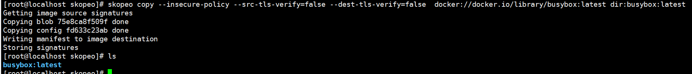
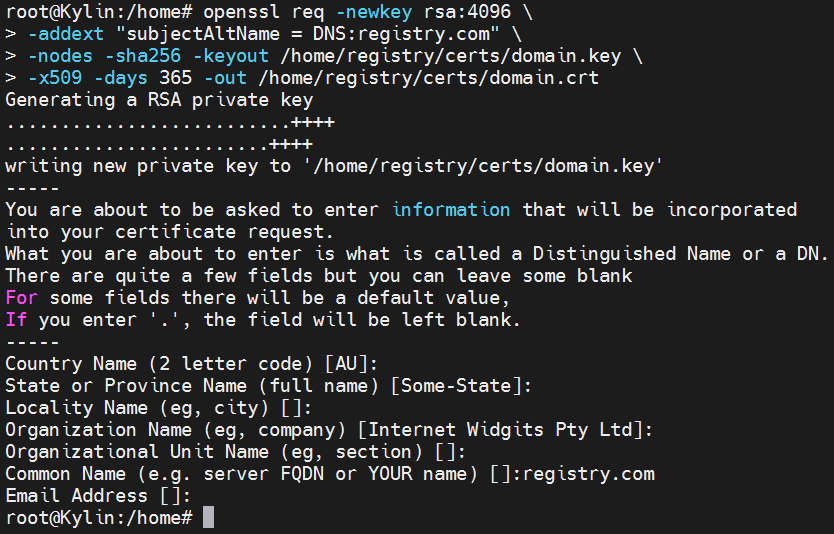
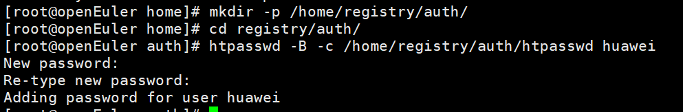
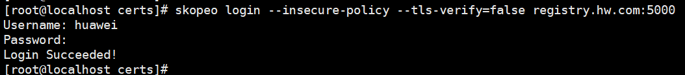
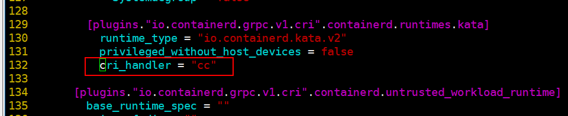
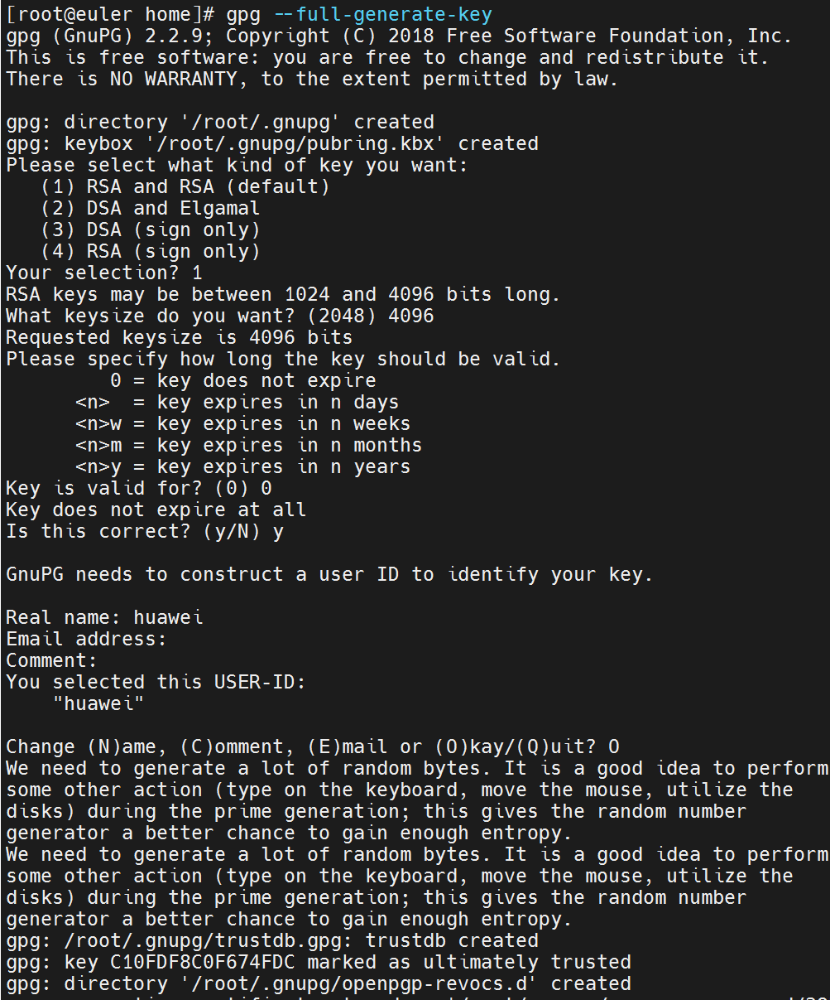
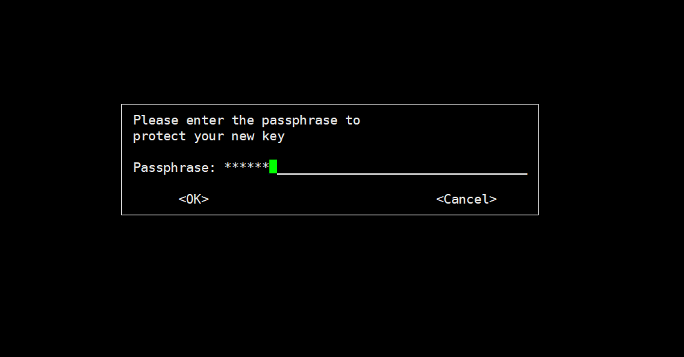
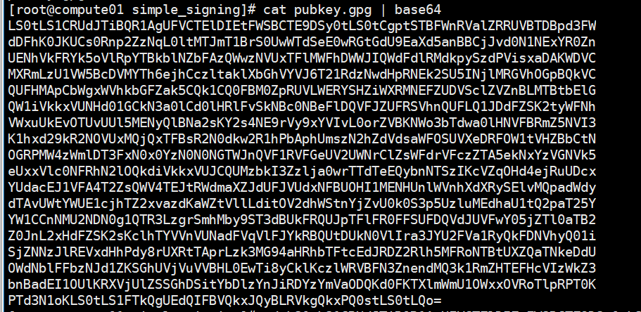

# 容器镜像签名验签<a name="ZH-CN_TOPIC_0000002044282114"></a>

## skopeo编译安装<a name="section1967520191014"></a>

1.  下载skopeo。

    ```
    git clone -b v1.9.1 https://github.com/containers/skopeo.git $GOPATH/src/github.com/containers/skopeo
    ```

2.  下载编译依赖。

    ```
    yum install -y gpgme-devel device-mapper-devel
    ```

3.  编译安装。

    ```
    cd $GOPATH/src/github.com/containers/skopeo && make bin/skopeo
    cp bin/skopeo /usr/local/bin
    ```

4.  <a name="li98111624578"></a>测试拉取镜像到本地，可以看到镜像被成功拉取。

    ```
    mkdir -p /home/work/images && cd /home/work/images
    skopeo copy --insecure-policy   
    docker://docker.io/library/busybox:latest dir:busybox:latest
    ```

    

    > **说明：** 
    >skopeo默认读取$HOME/.config/containers/policy.json或/etc/containers/policy.json的策略文件，根据文件中定制的镜像签名验证策略来验证镜像的合法性。策略格式和要求与[指定镜像仓的验证策略](#li395515366199)相同，部署验证阶段可通过--insecure-policy参数忽略验证策略。生产环境下请根据实际需求进行配置，并取消--insecure-policy参数。

## docker本地仓搭建<a name="section1936114544214"></a>

> **说明：** 
>docker依赖会和containerd依赖冲突，建议基于另一台服务器搭建docker本地仓。

1.  安装docker。

    ```
    yum install -y docker httpd-tools
    ```

2.  启动docker服务，并设置开机自启。

    ```
    systemctl start docker
    systemctl enable docker
    ```

3.  配置docker镜像源。

    ```
    vim /etc/docker/daemon.json
    
    {
      "registry-mirrors": [
            "https://registry.docker-cn.com",
            "http://hub-mirror.c.163.com"
      ],
     
      "dns": [
        "114.114.114.114",
        "110.110.110.110",
        "8.8.8.8"
      ]
    }
    ```

4.  配置docker代理。

    ```
    mkdir -p /etc/systemd/system/docker.service.d
    vim /etc/systemd/system/docker.service.d/http-proxy.conf
    ```

5.  配置代理IP。

    ```
    [Service]
    Environment="HTTP_PROXY=http://proxy.example.com:port/"
    Environment="HTTPS_PROXY=https://proxy.example.com:port/"
    Environment="NO_PROXY=registry.com,localhost"
    ```

    > **说明：** 
    >若HTTPS\_PROXY字段没有可用的https代理，可自行采用http作为替代。
    >NO_PROXY字段可根据实际部署情况填入内网镜像仓地址。

6.  重启docker。

    ```
    systemctl daemon-reload
    systemctl restart docker
    ```

7.  拉取registry镜像。

    ```
    docker pull registry:2
    ```

8.  配置https证书，设置镜像仓域名。

    ```
    mkdir -p /home/registry/certs
    openssl req -newkey rsa:4096 \
    -addext "subjectAltName = DNS:registry.com" \
    -nodes -sha256 -keyout /home/registry/certs/domain.key \
    -x509 -days 365 -out /home/registry/certs/domain.crt
    ```

    设置域名registry.com，其他可直接回车跳过。

    

    设置docker本地仓所在服务器的域名IP。

    ```
    vim /etc/hosts
    127.0.0.1 registry.com
    ```

    > **说明：** 
    >外部服务器访问私有仓请配置私有仓所在服务器IP，内网部署请及时取消代理。

9.  将镜像仓证书写入docker本地仓所在服务器根证书。

    ```
    cat /home/registry/certs/domain.crt >>/etc/pki/ca-trust/extracted/pem/tls-ca-bundle.pem
    cat /home/registry/certs/domain.crt >>/etc/pki/ca-trust/extracted/openssl/ca-bundle.trust.crt
    ```

    > **说明：** 
    >拷贝domain.crt到机密容器执行服务器，执行下方命令将domain.crt追加到tls-ca-bundle.pem和ca-bundle.trust.crt。
    >```
    >cat /home/registry/certs/domain.crt >>/etc/pki/ca-trust/extracted/pem/tls-ca-bundle.pem
    >cat /home/registry/certs/domain.crt >>/etc/pki/ca-trust/extracted/openssl/ca-bundle.trust.crt
    >```

10. 返回到机密容器执行服务器，将本地仓证书写入guest，并修改guest的域名IP。
    1.  挂载rootfs镜像。

        ```
        cd /home/work/kata-containers/tools/osbuilder/rootfs-builder/
        mount rootfs.img rootfs
        ```

    2.  将本地仓证书追加到rootfs根证书。

        ```
        cat domain.crt >> rootfs/etc/pki/ca-trust/extracted/pem/tls-ca-bundle.pem
        cat domain.crt >> rootfs/etc/pki/ca-trust/extracted/openssl/ca-bundle.trust.crt
        ```

    3.  修改guest的域名配置文件，保证guest能解析docker本地镜像仓ip。

        ```
        vim rootfs/etc/hosts
        docker本地仓所在服务器IP registry.com
        ```

    4.  取消挂载。

        ```
        umount rootfs
        ```

    5.  回到docker本地仓所在服务器，执行后续步骤。

11. 执行以下命令生成registry登录密码。

    ```
    mkdir -p /home/registry/auth/
    htpasswd -B -c /home/registry/auth/htpasswd <用户名>
    ```

    

12. 运行registry容器。

    ```
    docker run -d -p 5000:5000 \
    --restart=always \
    --name registry.com \
    -v /home/registry/auth:/auth \
    -v /home/registry/certs:/certs \
    -e REGISTRY_HTTP_TLS_CERTIFICATE=/certs/domain.crt \
    -e REGISTRY_HTTP_TLS_KEY=/certs/domain.key \
    -v /home/registry/data:/var/lib/registry \
    -e "REGISTRY_AUTH=htpasswd" \
    -e "REGISTRY_AUTH_HTPASSWD_REALM=Registry Realm" \
    -e REGISTRY_AUTH_HTPASSWD_PATH=/auth/htpasswd \
    registry:2
    ```

    执行下方命令可查看正在运行的registry容器。

    ```
    docker ps
    ```

    

13. 测试镜像仓运行情况。
    1.  设置镜像仓域名加入no_proxy。
        ```
        echo "export no_proxy=registry.com,${no_proxy}" >> /etc/profile
        source /etc/profile
        ```

    1.  使用skopeo登录本地仓，执行以下命令后输入用户名和密码。

        ```
        skopeo login  --insecure-policy registry.com:5000
        ```

        

    2.  使用skopeo上传之前下载的本地镜像测试。

        ```
        cd /home/work/images
        skopeo copy --insecure-policy  dir:busybox:latest docker://registry.com:5000/busybox:latest
        ```

        > **说明：** 
        >该步骤需使用[skopeo编译安装](#section1967520191014)章节[步骤4](#li98111624578)下载的本地镜像进行测试。

    3.  执行以下命令，按照提示输入镜像仓密码，检查镜像上库情况。

        ```
        curl -u 用户名 https://registry.com:5000/v2/_catalog
        ```

## kata镜像拉取设置<a name="section584474810210"></a>

1.  修改kata配置。

    修改service\_offload和image\_request\_timeout值。

    ```
    vim /etc/kata-containers/configuration.toml
    service_offload = true
    image_request_timeout = 600
    :wq
    ```

    

    > **说明：** 
    >image\_request\_timeout的值视镜像大小和网络情况自行调整。

2.  修改containerd配置。

    ```
    vim /etc/containerd/config.toml
    :/[plugins."io.containerd.grpc.v1.cri".containerd.runtimes.kata]
    ```

    在图示位置添加**cri\_handler = "cc"**。

    

    ```
    :wq
    systemctl daemon-reload
    systemctl restart containerd
    ```

## 镜像签名<a name="section2086319468917"></a>

1.  使用gpg生成签名密钥。

    ```
    gpg --full-generate-key
    ```

    1.  根据指引选择密钥类型、密钥长度和密钥有效期等参数。（换图）

        

    2.  输入密钥密码。

        

    3.  查看签名密钥指纹。

        ```
        gpg --list-keys --fingerprint
        ```

        

    4.  根据密钥指纹导出签名密钥的公钥。

        ```
        mkdir -p /home/work/keys/
        gpg -a -o /home/work/keys/pubkey.gpg --export CB310609B165C5E6CDCADA73E16822488ED1B8E1 
        ```

    5.  获取pubkey.gpg的base64编码内容。

        ```
        cat pubkey.gpg | base64
        ```

        

2.  镜像签名。
    1.  使用skopeo指定密钥指纹对镜像签名并推送到本地镜像仓。

        ```
        skopeo copy --insecure-policy  \
        --sign-by CB310609B165C5E6CDCADA73E16822488ED1B8E1 \
        docker://registry.com:5000/busybox:latest \
        docker://registry.com:5000/busybox_sign:latest
        ```

    2.  输入之前设置的密钥密码。

        

        镜像签名默认保存在本地目录“/var/lib/containers/sigstore/“下。

        

3.  配置KBS。
    1.  进入KBS所在服务器，创建security-policy目录，配置镜像验签策略。

        ```
        mkdir -p /opt/confidential-containers/kbs/repository/default/security-policy/
        cd /opt/confidential-containers/kbs/repository/default/security-policy/
        vim test
        ```

    2.  <a name="li395515366199"></a>指定镜像仓的验证策略和公钥位置。

        ```
        {
            "default": [
                {
                    "type": "reject"
                }
            ],
            "transports": {
                "docker": {
                    "registry.com:5000": [
                        {
                            "type": "signedBy",
                            "keyType": "GPGKeys",
                            "keyData": "LS0tLS1CRUdJTiBQR1AgUFVCTElDIEtFWSBCTE9DSy0tLS0tCgptSTBFWnRValZRRUVBTDBpd3FWdDFhK0JKUCs0Rnp2ZzNqL0ltMTJmT1BrS0UwWTdSeE0wRGtGdU9EaXd5anBBCjJvd0N1NExYR0ZnUENhVkFRYk5oVlRpYTBkblNZbFAzQWwzNVUxTFlMWFhDWWJIQWdFdlRMdkpySzdPVisxaDAKWDVCMXRmLzU1VW5BcDVMYTh6ejhCczltaklXbGhVYVJ6T21RdzNwdHpRNEk2SU5INjlMRGVhOGpBQkVCQUFHMApCbWgxWVhkbGFZak5CQk1CQ0FBM0ZpRUVLWERYSHZiWXRMNEFZUDVSclZVZnBLMTBtbElGQW1iVkkxVUNHd01GCkN3a0lCd0lHRlFvSkNBc0NBeFlDQVFJZUFRSVhnQUFLQ1JDdFZSK2tyWFNhVWxuUkEvOTUvUUl5MENyQlBNa2sKY2s4NE9rVy9xYVIvL0orZVBKNWo3bTdwa0lHNVFBRmZ5NVI3K1hxd29kR2NOVUxMQjQxTFBsR2N0dkw2R1hPbAphUmszN2hZdVdsaWFOSUVXeDRFOW1tVHZBbCtNOGRPMW4zWmlDT3FxN0x0YzN0N0NGTWJnQVF1RVFGeUV2UWNrClZsWFdrVFczZTA5ekNxYzVGNVk5eUxxVlc0NFRhN2lOQkdiVkkxVUJCQUMzbkI3Zzlja0wrTTdTeEQybnNTSzIKcVZqOHd4ejRuUDcxYUdacEJ1VFA4T2ZsQWV4TEJtRWdmaXZJdUFJVUdxNFBUOHI1MENHUnlWVnhXdXRySElvMQpadWdydTAvUWtYWUE1cjhTZ2xvazdKaWZtVllLditOV2dhWStnYjZvU0k0S3p5UzluMEdhaU1tQ2paT25YYW1CCnNMU2NDN0g1QTR3LzgrSmhMby9ST3dBUkFRQUJpTFlFR0FFSUFDQVdJUVFwY05jZTl0aTB2Z0JnL2xHdFZSK2sKclhTYVVnVUNadFVqVlFJYkRBQUtDUkN0VlIra3JYU2FVa1RyQkFDNVhyQ01iSjZNNzJlREVxdHhPdy8rUXRtTAprLzk3MG94aHRhbTFtcEdJRDZ2Rlh5MFRoNTBtUXZQaTNkeDdUOWdNblFFbzNJd1ZKSGhUVjVuVVBHL0EwTi8yCklKczlWRVBFN3ZnendMQ3k1RmZHTEFHcVIzWkZ3bnBadEI1OUlKRXVjUlZSSGhDSitYbDlzYnJiRDYzYmVaODQKd0FKTXlmWmU1OWxxOVRoTlpRPT0KPTd3N1oKLS0tLS1FTkQgUEdQIFBVQkxJQyBLRVkgQkxPQ0stLS0tLQo="
                        }
                    ]
                }
            }
        }
        ```
        > **说明：** 
        >设置type字段指定具体验证要求，"reject"为拒绝任何镜像，"signedBy"为要求验证签名，"insecureAcceptAnything"为不进行任何验证。

    3.  创建sigstore-config目录，配置签名部署文件。

        ```
        mkdir -p /opt/confidential-containers/kbs/repository/default/sigstore-config/
        vim /opt/confidential-containers/kbs/repository/default/sigstore-config/test
        ```

    4.  设置签名存放位置。

        ```
        docker:
            registry.com:5000:
                sigstore: file:///var/lib/containers/sigstore
                sigstore-staging: file:///var/lib/containers/sigstore
        ```

    5.  <a name="li155371958201211"></a>将镜像仓用户名和密码设置为以下形式，并将其使用base64进行编码。

        ```
        <用户名>:<密码>
        ```

    6.  配置镜像仓登录密钥，将[5](#li155371958201211)编码内容写入配置文件。

        ```
        mkdir -p /opt/confidential-containers/kbs/repository/default/credential/
        ```

        ```
        vim /opt/confidential-containers/kbs/repository/default/credential/test
        
        {
            "auths": {
                "registry.com:5000": {
                    "auth": "<base64编码>"
                }
            }
        }
        ```

        > **说明：** 
        >当前仅支持从“/opt/confidential-containers/kbs/repository/default/credential/test“文件中读取镜像仓用户和密码数据，存在安全风险，请根据需要设置该文件的读写权限。

4.  部署签名和公钥。
    1.  挂载guest镜像。

        ```
        cd /home/work/kata-containers/tools/osbuilder/rootfs-builder/kata-overlay/
        mount rootfs.img rootfs
        ```

    2.  根据前述sigstore-config和security-policy配置的路径将签名和公钥放到guest的指定目录。

        ```
        mkdir -p rootfs/var/lib/containers/sigstore/
        cp -r /var/lib/containers/sigstore/* rootfs/var/lib/containers/sigstore/
        mkdir -p rootfs/run/image-security/simple_signing/
        cp /home/work/keys/pubkey.gpg rootfs/run/image-security/simple_signing/pubkey.gpg
        ```

    3.  解除挂载。

        ```
        umount rootfs
        ```

5.  签名镜像验证。
    1.  部署签名镜像，编写pod配置。

        ```
        cd /home/work/
        vim sign-test.yaml
        ```

    2.  写入如下信息。

        ```
        apiVersion: v1
        kind: Pod
        metadata:
          name: sign-test
        spec:
          runtimeClassName: kata
          containers:
          - name: box
            image: registry.com:5000/busybox_sign:latest
        ```

    3.  执行以下命令部署pod。

        ```
        kubectl apply -f sign-test.yaml
        ```

    4.  通过执行以下命令可以看到镜像验证通过，容器正常运行。

        ```
        kubectl get pods
        ```

