# 机密容器部署运行<a name="ZH-CN_TOPIC_0000002044282130"></a>

kata容器又称安全容器，容器运行在轻量级虚拟机中，而不是直接在宿主机内核上，这种方式提供了类似传统虚拟机的强隔离，防止不同容器之间的安全问题。若需要基于TEE套件使用机密容器特性，需合入kata-shim和kata-agent适配TEE套件的patch修改。

机密容器是在kata容器的基础上，将该轻量级虚拟机替换为virtcca的机密虚拟机，进一步提升了kata容器的安全性。

## 约束与限制<a name="section142772153388"></a>

-   机密容器当前暂不支持绑核使用。
-   机密容器安全内存最小规格与机密虚机保持一致，大小为1GB。

> **说明：** 
>在/etc/kata-containers/configuration.toml中，若default\_memory设置的过小，该配置可能失效，机密容器内存会被设置为默认的2GB。

-   若待启动容器配置的总内存大小超过host非安全内存大小，K8s会将对应的pod状态置为**pending**，容器启动失败。故当前建议在BIOS中设置安全内存和非安全内存大小对半分以规避该问题。

## 软件架构<a name="section937105610374"></a>

机密容器软件架构[如下图](#fig051793514444)。

**图 1**  机密容器软件架构图<a name="fig051793514444"></a>  
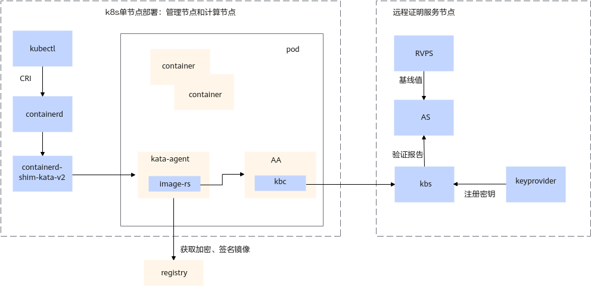

**K8s节点所在的host上包括以下组件**：

-   kubectl：kubectl是Kubernetes的命令行工具，用于与Kubernetes集群进行交互和管理。
-   containerd：containerd是一个开源的容器运行时，提供了容器生命周期管理、镜像管理和运行时接口。
-   containerd-shim-kata-v2：containerd-shim-kata是containerd的一个扩展，是containerd和kata-container之间的桥梁。

**pod上包括以下组件**：

-   kata-agent：与host上的containerd-shim-kata-v2通讯，负责kata容器的生命周期管理。
-   AA：Attestation Agent，从TMM获取远程证明报告，并通过kbc与kbs交互实现远程证明报告验证和秘钥资源获取。

**远程证明服务节点包括**：

-   kbs：Key Broker Service，KBS实现了基于远程验证的身份认证和授权、秘密资源存储和访问控制。在kbs的配置文件中需要指定它暴露给其他组件访问的IP+PORT，PORT默认为**8080**。
-   AS：Attestation Service，AS主要作用是验证远程报告并将结果返回给kbs，AS的默认侦听端口为**3000**。
-   RVPS：Reference Value Provider Service，RVPS提供了度量基线值的注册和查询功能，RVPS的默认侦听端口为**50003**。
-   Keyprovider：Keyprovider负责镜像加密秘钥的管理，自动将加密密钥注册到kbs中，默认侦听端口为**50000**。

**registry本地镜像仓**：

registry本地镜像仓负责存储容器镜像，响应kata-agent的镜像请求。

## 编译Guest Kernel和rootfs

### rootfs编译步骤<a name="section144719383010"></a>

1.  <a name="li1676464217152"></a>创建rpm数据库。

    建议在“/tmp“目录下创建“rootfs“。

    ```
    mkdir -p /tmp/rootfs/var/lib/rpm
    rpm --root /tmp/rootfs/ --initdb
    ```

2.  下载openEuler发布包。

    手动下载openEuler发布包，指定在“rootfs“目录中安装，安装完成后，在“rootfs“下会生成etc、usr、var子目录。

    ```
    rpm -ivh --nodeps --root /tmp/rootfs/ https://repo.openeuler.org/openEuler-24.09/everything/aarch64/Packages/openEuler-release-24.09-55.oe2409.aarch64.rpm
    cd /tmp/rootfs
    ll
    ```

    安装成功如下（error报错忽略）。

    **图 1**  安装成功（1）<a name="fig14566143412288"></a>  
    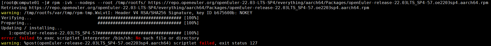

    **图 2**  安装成功（2）<a name="fig1939616449287"></a>  
    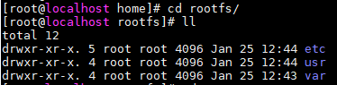

3.  安装yum，dnf包管理程序。
    1.  创建包管理源。

        ```
        mkdir /tmp/rootfs/etc/yum.repos.d
        curl -o /tmp/rootfs/etc/yum.repos.d/openEuler-24.09.repo https://gitee.com/src-openeuler/openEuler-repos/raw/openEuler-24.09/generic.repo
        ```

        > **说明：** 
        >通过添加-k命令选项可以在进行HTTPS请求时不验证服务器的SSL证书，此操作可以规避自签名证书问题，但存在安全绕过风险，建议默认不使用-k命令选项。

    2.  下载dnf、yum等安装包。

        ```
        dnf --installroot=/tmp/rootfs/ install -y dnf yum vim net-tools iproute iputils NetworkManager openssh-server passwd hostname ntp
        ```

        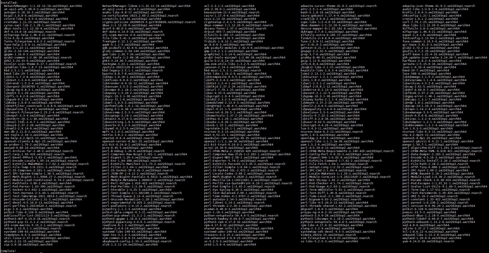

4.  添加配置文件，设置DNS。
    1.  编辑文件。

        ```
        vi /tmp/rootfs/etc/resolv.conf
        ```

    2.  添加内容。

        ```
        nameserver 8.8.8.8
        nameserver 114.114.114.114
        ```

    3.  保存并退出文件。

        ```
        :wq
        ```

        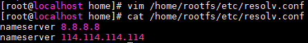

5.  配置网络。
    1.  编辑文件。

        ```
        vi /tmp/rootfs/etc/sysconfig/network-scripts/ifup-eth0
        ```

    2.  添加内容。

        ```
        TYPE=Ethernet
        PROXY_METHOD=none
        BROWSER_ONLY=no
        BOOTPROTO=dhcp
        DEFROUTE=yes
        IPV4_FAILURE_FATAL=no
        IPV6INIT=yes
        IPV6_AUTOCONF=yes
        IPV6_DEFROUTE=yes
        IPV6_FAILURE_FATAL=no
        IPV6_ADDR_GEN_MODE=stable-privacy
        NAME=eth0
        UUID=851a6f36-e65c-3a43-8f4a-78fd0fc09dc9
        ONBOOT=yes
        AUTOCONNECT_PRIORITY=-999
        DEVICE=eth0
        ```

    3.  保存并退出。

        ```
        :wq
        ```

6.  设置rootfs。
    1.  挂载必要的路径。

        ```
        mount --bind /dev /tmp/rootfs/dev
        mount -t proc /proc /tmp/rootfs/proc
        mount -t sysfs /sys /tmp/rootfs/sys
        ```

        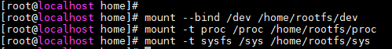

    2.  进入文件系统。

        ```
        chroot /tmp/rootfs/ /bin/bash
        ```

    3.  设置root密码。

        ```
        passwd root
        ```

        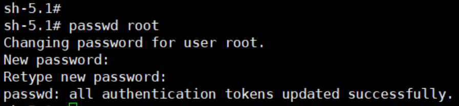

    4.  （可选）添加mirror用户并自定义IMA策略（使能ima容器镜像度量时配置）。

        ```
        useradd mirror
        ```

        1.  编辑IMA策略文件。

            ```
            /etc/ima/ima-policy
            ```

        2.  添加以下内容。

            ```
            measure func=FILE_CHECK mask=MAY_READ fowner=1000
            ```

        3.  保存并退出。

            ```
            :wq
            ```

            > **说明：** 
            >-   fowner的值为mirror用户的uid，可通过**cat /etc/passwd**命令查看UID的值。
            >-   若配置了/etc/ima/ima-policy文件，系统启动时会默认加载此文件的IMA配置，IMA策略只能修改一次，虚拟机启动后无法再修改IMA策略。

    5.  设置主机名。

        ```
        echo openEuler > /etc/hostname
        exit
        ```

        > **说明：** 
        >主机名openEuler用户可自定义。

    6.  取消临时挂载目录。

        ```
        umount -l /tmp/rootfs/dev
        umount -l /tmp/rootfs/proc
        umount -l /tmp/rootfs/sys
        ```

7.  <a name="li156681238103311"></a>编译内核模块。
    1.  准备内核代码。

        请参见[编译Guest Kernel](#section573574019719)准备内核代码并生成配置。

        > **说明：** 
        >-   编译rootfs内核模块的内核配置需要和编译guest image时的内核配置保持一致。
        >-   使能机密容器特性时，务必完成guest kernel编译后再完成rootfs的make modules等操作，否则机密容器无法启动。

    2.  编译内核代码。其中**LOCALVERSION**指定了内核版本后缀，影响驱动安装的目录“/lib/modules/$\{LOCALVERSION\}/“，内核版本需与[编译Guest Kernel](#section573574019719)里指定的版本保持一致。

        ```
        export LOCALVERSION=
        make include/config/kernel.release
        make modules -j32
        ```

        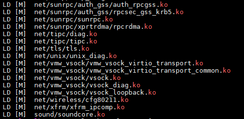

    3.  安装内核模块到“rootfs“。

        ```
        make modules_install INSTALL_MOD_PATH=/tmp/rootfs
        ```

        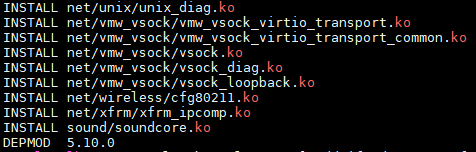

8.  执行以下命令创建rootfs镜像。

    1.  创建空白镜像文件。

        ```
        dd if=/dev/zero of=/tmp/rootfs.img bs=1M count=5000
        ```

        > **说明：** 
        >其中bs表示块大小，对应的rootfs.img大小为bs \* count，即5000M，用户可根据实际情况自定义容量大小。

        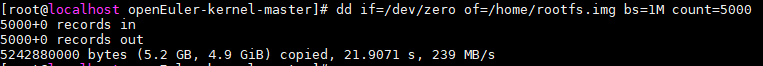

    2.  创建EXT4类型的文件系统。

        ```
        cd /tmp
        mkfs.ext4 rootfs.img
        ```

        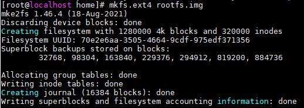

    3.  将[步骤1](#li1676464217152)到[步骤7](#li156681238103311)准备好的文件系统内容拷贝到文件系统镜像中。

        ```
        mkdir -p rootfs1
        mount rootfs.img rootfs1
        cp -rfp /tmp/rootfs/* rootfs1/
        umount rootfs1
        ```

        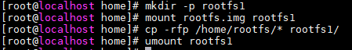

    4.  对文件系统映像文件rootfs.img进行自动化的文件系统完整性检查和修复操作。

        ```
        e2fsck -p -f rootfs.img
        ```

        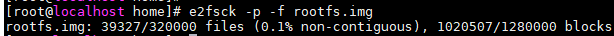

    5.  最小化文件系统大小。

        ```
        resize2fs -M rootfs.img
        ```

        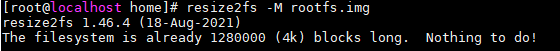

    > **说明：** 
    >可以通过执行以下命令扩展一个已有的rootfs.img的容量。
    >```
    >qemu-img resize rootfs.img +50G
    >e2fsck -f rootfs.img
    >resize2fs rootfs.img
    >```

### 编译Guest Kernel<a name="section573574019719"></a>

1.  安装编译依赖。

    ```
    yum install ncurses-devel openssl-devel
    yum groupinstall "Development Tools"
    ```

2.  下载openEuler 24.09 kernel源码。

    ```
    yum install kernel-source -y
    ```

    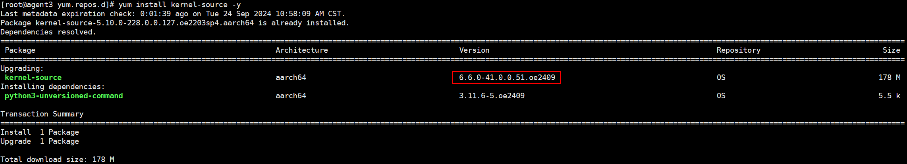

    目标版本Kernel源码位于“/usr/src“。

    

    > **说明：** 
    >完成安装openEuler 24.09镜像包后，OS默认为openEuler 24.09的yum源。
    >可执行以下命令查看源码安装位置。
    >```
    >rpm -ql kernel-source
    >```

3.  生成默认配置。
    1.  进入kernel目录并修改deconfig。

        ```
        cd /usr/src/linux-6.6.0-41.0.0.51.oe2409.aarch64
        vim arch/arm64/configs/openeuler_defconfig
        ```

        > **说明：** 
        >内核版本号取决于用户kernel-source的安装版本，因此这里的kernel目录应参考用户实际安装的版本所在目录。

    2.  确保编译选项修改为如下形式。

        ```
        CONFIG_NET_9P=y
        CONFIG_NET_9P_VIRTIO=y
        CONFIG_VIRTIO_BLK=y
        CONFIG_SCSI_VIRTIO=y
        CONFIG_VIRTIO_NET=y
        CONFIG_VIRTIO=y
        CONFIG_VIRTIO_PCI_LIB=y
        CONFIG_VIRTIO_PCI=y
        CONFIG_EXT4_FS=y
        # CONFIG_DEBUG_INFO_BTF is not set
        ```

    3.  修改Kconfig。
        1.  修改tristate“Virtio block driver”为如下。

            ```
            vim drivers/block/Kconfig
            ```

            ```
            bool "Virtio block driver"
            ```

            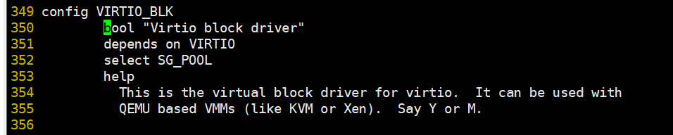

        2.  修改tristate“Virtio network driver”为如下。

            ```
            vim drivers/net/Kconfig
            ```

            ```
            bool "Virtio network driver"
            ```

            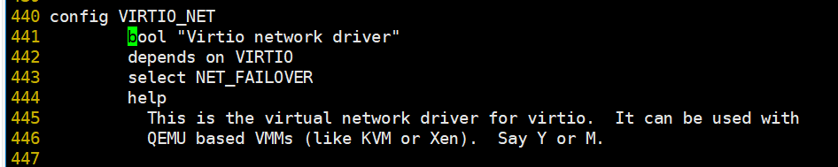

        3.  修改VIRTIO\_PCI\_LIB和VIRTIO\_PCI。

            ```
            vim drivers/virtio/Kconfig
            ```

            1.  将config VIRTIO\_PCI\_LIB下的tristate改为bool。

                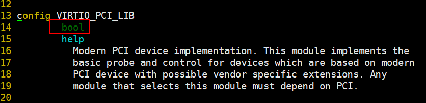

            2.  修改tristate“PCI driver for virtio devices”为如下。

                ```
                bool "PCI driver for virtio devices"
                ```

                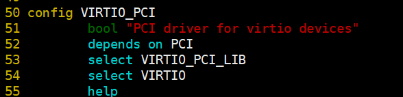

    4.  生成.config配置文件。

        ```
        make openeuler_defconfig
        ```

4.  编译Guest Kernel。其中LOCALVERSION指定了内核版本后缀，影响虚拟机内执行“uname -r“显示的值，需与[rootfs编译步骤](#section144719383010)里指定的版本保持一致。

    ```
    export LOCALVERSION=
    make include/config/kernel.release
    make -j32
    ```

    编译完成生成的Guest Kernel镜像位于“arch/arm64/boot/Image“路径下。Image文件即机密虚机启动时所需镜像文件。


## kata-shim编译和部署<a name="section425812386177"></a>

1.  安装golang。

    ```
    wget https://golang.google.cn/dl/go1.22.4.linux-arm64.tar.gz
    tar -zxvf go1.22.4.linux-arm64.tar.gz -C /usr/local
    echo "export GO_HOME=/usr/local/go" >> /etc/profile
    echo "export GOPATH=/home/work/go" >> /etc/profile
    source /etc/profile
    echo "export PATH=${GO_HOME}/bin:${PATH}" >> /etc/profile
    source /etc/profile
    ```

2.  安装cargo和rust。
    1.  安装cargo和rust，选择选项1进行默认安装即可。

        ```
        curl https://sh.rustup.rs -sSf | sh
        ```

        

    2.  更新环境变量。

        ```
        echo "export $HOME/.cargo/env" >> /etc/profile
        source /etc/profile
        ```

    3.  切换rust版本到1.77.1。

        ```
        rustup install 1.77.1
        rustup default 1.77.1
        ```

    4.  添加tag。

        ```
        rustup target add aarch64-unknown-linux-musl
        ```

    5.  安装musl-gcc。

        ```
        yum install -y musl-gcc
        ```

3.  <a name="li187686137192"></a>下载kata-container相关代码
    1.  创建并进入工作目录，要求所有代码仓均位于同一目录下。所示路径仅供参考，用户可自行选择。

        ```
        mkdir -p /home/work && cd /home/work
        ```

    2.  下载kata-container相关组件代码。

        ```
        git clone https://github.com/kata-containers/kata-containers.git -b CC-0.8.0
        git clone https://github.com/confidential-containers/guest-components.git -b v0.8.0
        git clone https://github.com/virtee/kbs-types.git
        git clone https://github.com/confidential-containers/attestation-service.git -b v0.8.0
        git clone https://github.com/confidential-containers/trustee.git -b v0.8.0
        ```

4.  获取kata-container的修改patch。

    ```
    git clone https://gitee.com/openeuler/virtCCA_sdk.git
    ```

5.  应用对kata-container各组件的修改patch。
    1.  应用kata-containers代码patch。

        ```
        cd /home/work/kata-containers
        git apply ../virtCCA_sdk/confidential_container/kata-container.patch
        ```

    2.  应用guest-components代码patch。

        ```
        cd /home/work/guest-components
        git apply ../virtCCA_sdk/confidential_container/guest-components.patch
        ```

        > **说明：** 
        >（可选）仅在需要使用[容器镜像度量](容器镜像度量.md)时执行下述步骤：
        >1.  image-ima-measurement代码patch。
        >    ```
        >    git apply ../virtCCA_sdk/confidential_container/image-ima-measurement.patch
        >    ```
        >2.  重新编译kata-agent并部署到rootfs。

    3.  应用kbs-types代码patch。

        ```
        cd /home/work/kbs-types
        git checkout c90df0
        git apply ../virtCCA_sdk/confidential_container/kbs-types.patch
        ```

    4.  应用attestation-service代码patch。

        ```
        cd /home/work/attestation-service
        git apply ../virtCCA_sdk/confidential_container/attestation-service.patch
        ```

    5.  应用trustee代码patch。

        ```
        cd /home/work/trustee
        git apply ../virtCCA_sdk/confidential_container/trustee.patch
        ```

6.  编译containerd-shim-kata-v2。

    ```
    cd /home/work/kata-containers
    make -C src/runtime
    ```

    

    > **说明：** 
    >编译生成的目标文件位于“src/runtime/containerd-shim-kata-v2“下。

7.  部署containerd-shim-kata-v2和kata-runtime。

    ```
    cp /home/work/kata-containers/src/runtime/kata-runtime /usr/bin/kata-runtime
    ln -snf /home/work/kata-containers/src/runtime/containerd-shim-kata-v2 /usr/bin/containerd-shim-kata-v2
    ```

8.  部署kata配置。

    ```
    mkdir -p /etc/kata-containers
    cp /home/work/kata-containers/src/runtime/config/configuration-qemu.toml /etc/kata-containers/configuration.toml
    ```

9.  修改kata配置。

    > **说明：** 
    >配置文件位于“/etc/kata-containers/configuration.toml“下。

    1.  将**kernel**、**image**和**path**设置为下列机密虚机组件实际路径。
        -   kernel为guest OS内核镜像，请参照[编译Guest Kernel](#section573574019719)  编译生成。
        -   image为guest OS的rootfs，请参照[rootfs编译步骤](#section144719383010)  编译生成。
        -   path为qemu可执行文件路径，当前编译方式如下，生成的路径为： /home/work/qemu/build/qemu-system-aarch64。

            从前述virtCCA\_sdk仓库获取qemu.patch并将该文件存放于/home/work路径下。

            ```
            yum install sphinx python3-sphinx_rtd_theme
            cd /home/work
            git clone https://gitee.com/openeuler/qemu.git -b qemu-8.2.0 --depth=1
            cd qemu
            git apply ../virtCCA_sdk/confidential_container/qemu.patch
            mkdir build && cd build
            ../configure --target-list=aarch64-softmmu
            make -j64
            ```

            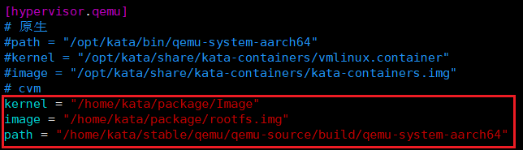

    1.  使能virtio-fs类型共享文件系统步骤如下。

        1. 拉取virtiofsd安装包。

        ```
        curl  -o virtiofsd-1.10.1-2.oe2403.aarch64.rpm https://repo.openeuler.org/openEuler-24.03-LTS/EPOL/main/aarch64/Packages/virtiofsd-1.10.1-2.oe2403.aarch64.rpm
        ```

        > **说明：** 
        >通过添加-k命令选项可以在进行HTTPS请求时不验证服务器的SSL证书，此操作可以规避自签名证书问题，但存在安全绕过风险，建议默认不使用-k命令选项。

        2. 安装virtiofsd rpm包。

        ```
        rpm -ivh virtiofsd-1.10.1-2.oe2403.aarch64.rpm --force
        ```

        3. 查看可执行文件路径。

        ```
        ll /usr/libexec/virtiofsd
        ```

        4. 在“vim /etc/kata-containers/configuration.toml “修改kata配置，确保如下配置：

        -   **virtio\_fs\_daemon = "/usr/libexec/virtiofsd"**
        -   **virtio\_fs\_extra\_args = \["--thread-pool-size=1"\]**  （去掉默认的****--announce-submounts参数）

    2.  将**sandbox\_cgroup\_only**和**static\_sandbox\_resource\_mgmt**设置为**true**。

        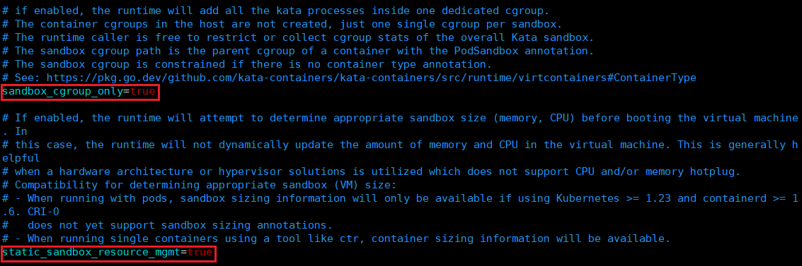

## rootfs配置kata-agent默认启动<a name="section12153172619284"></a>

1.  参考[rootfs编译步骤](#section144719383010)构建出基础rootfs。
    1.  拷贝rootfs镜像文件到目标路径。

        ```
        cd /home/work/kata-containers/tools/osbuilder/rootfs-builder
        cp /tmp/rootfs.img ./
        ```

    2.  将rootfs.img挂载临时目录。

        ```
        mkdir rootfs
        mount rootfs.img rootfs
        ```

2.  使用[下载kata-container](#li187686137192)下载的源码，构建出kata-agent systemd默认启动配置。

    ```
    yum install -y lvm2-devel clang clang-devel device-mapper-devel --allowerasing
    mkdir $PWD/kata-overlay
    SECCOMP=no CFLAGS=-mno-outline-atomics ./rootfs.sh -r "$PWD/kata-overlay"
    ```

    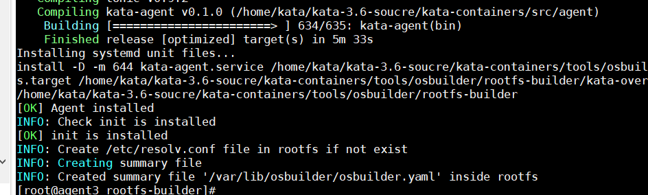

    > **说明：** 
    >编译过程中，若编译失败，报错显示  **“Too many open files \(os error 24\)”**。
    >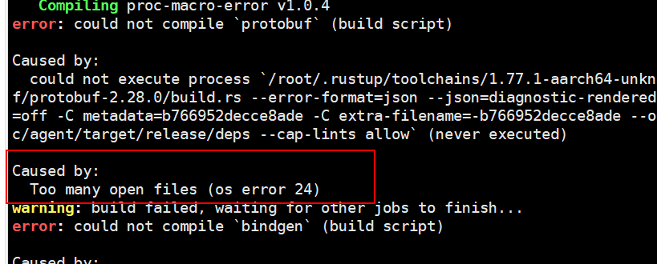
    >可执行以下命令解决。
    >```
    >ulimit -n 65536
    >```

3.  将kata-overlay下的文件拷贝到rootfs目录下。

    ```
    cp -rf kata-overlay/etc/systemd/system/basic.target.wants/  rootfs/etc/systemd/system/
    cp -rf kata-overlay/etc/systemd/system/kata-containers.target.wants  rootfs/etc/systemd/system/
    cp -rf kata-overlay/usr/lib/systemd/system/*  rootfs/usr/lib/systemd/system/
    cp -rf kata-overlay/usr/bin/kata-agent  rootfs/usr/bin
    ```

    保证rootfs中如下红框中的文件存在。

    

4.  取消挂载的目录。

    ```
    umount rootfs
    ```

## 部署containerd<a name="section1118305916393"></a>

1.  下载CoCo社区提供的containerd 1.6.8.2版本。

    ```
    wget https://github.com/confidential-containers/containerd/releases/download/v1.6.8.2/containerd-1.6.8.2-linux-arm64.tar.gz
    ```

2.  解压获取可执行文件。

    ```
    tar -xvf containerd-1.6.8.2-linux-arm64.tar.gz
    ```

    解压产物如下：

    

3.  拷贝可执行文件到“/usr/local/bin“目录下。

    ```
    cp bin/*  /usr/local/bin
    ```

4.  安装runc。

    ```
    yum install runc -y
    ```

5.  生成containerd配置文件。

    ```
    mkdir /etc/containerd/
    containerd config default > /etc/containerd/config.toml
    ```

6.  在配置文件中新增如下字段。

    ```
    [plugins."io.containerd.grpc.v1.cri".containerd.runtimes.kata]
              runtime_type = "io.containerd.kata.v2"
              privileged_without_host_devices = false
    ```

    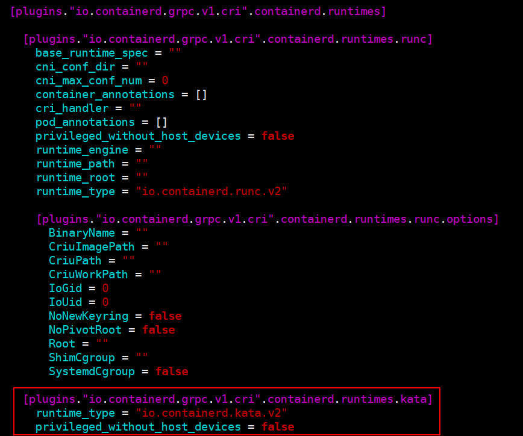

7.  安装containerd.service。

    ```
    wget raw.githubusercontent.com/confidential-containers/containerd/v1.6.8.2/containerd.service
    cp ./containerd.service  /usr/lib/systemd/system/
    ```

8.  Containerd代理配置。

    > **说明：** 
    >若部署环境直通公网，则可跳过当前步骤。

    1.  创建目录。

        ```
        mkdir -p /etc/systemd/system/containerd.service.d/
        ```

    2.  打开配置文件。

        ```
        vim /etc/systemd/system/containerd.service.d/http-proxy.conf
        ```

    3.  按“i”进入编辑模式，增加如下内容。

        ```
        [Service]
        Environment="HTTP_PROXY=代理服务器"
        Environment="HTTPS_PROXY=代理服务器"
        Environment="NO_PROXY=localhost"
        ```

9.  启动containerd。

    ```
    systemctl daemon-reload
    systemctl start containerd
    systemctl enable containerd
    ```

    查看containerd服务是否正常启动。

    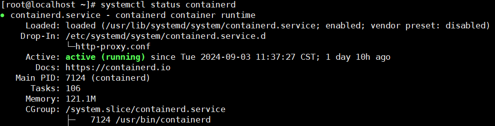

10. 通过containerd命令行工具ctr启动容器。
    1.  拉取镜像。

        ```
        ctr image pull docker.io/library/busybox:latest
        ```

    2.  运行容器。
        -   运行一个容器，未指定runtime，默认为runc。

            ```
            ctr run --rm -t docker.io/library/busybox:latest test-kata /bin/sh
            ```

            

        -   运行一个容器，指定runtime为kata。

            ```
            ctr run --runtime "io.containerd.kata.v2" --rm -t docker.io/library/busybox:latest test-kata /bin/sh
            ```

            

## 部署K8s部署（单节点）<a name="section112772026183416"></a>

1.  新增yum源。
    1.  新建K8s.repo文件。

        ```
        vim /etc/yum.repos.d/k8s.repo
        ```

    2.  按“i”进入编辑模式，增加如下内容。

        ```
        [k8s]
        name=Kubernetes
        baseurl=https://mirrors.aliyun.com/kubernetes/yum/repos/kubernetes-el7-aarch64/
        enabled=1
        gpgcheck=0
        repo_gpgcheck=0
        ```

    3.  更新yum源。

        ```
        yum clean all
        yum makecache
        ```

2.  安装K8s组件。

    ```
    yum install -y kubelet-1.18.20 kubeadm-1.18.20 kubectl-1.18.20 kubernetes-cni --nobest
    ```

3.  添加系统配置。
    1.  关闭防火墙。

        ```
        systemctl stop firewalld && systemctl disable firewalld
        ```

        > **说明：** 
        >通过关闭防火墙来确保k8s组件之间能正常通讯，仅建议调试环境使用这种方式，生产环境建议配置防火墙规则来确保通讯正常。

    2.  加载内核模块。

        ```
        modprobe br_netfilter
        ```

    3.  设置net选项。

        ```
        sysctl -w net.bridge.bridge-nf-call-iptables=1
        sysctl -w net.ipv4.ip_forward=1
        ```

    4.  禁用交换分区。

        ```
        swapoff -a
        cp -p /etc/fstab /etc/fstab.bak$(date '+%Y%m%d%H%M%S')
        sed -i "s/\/dev\/mapper\/openeuler-swap/\#\/dev\/mapper\/openeuler-swap/g" /etc/fstab
        ```

        > **说明：** 
        >当前openEuler系统重启后会自动恢复交换分区功能，导致当服务器重启后k8s服务无法开机启动，需手动执行禁用交换分区命令。

    5.  设置kubelet服务开机自启动。

        ```
        systemctl enable kubelet
        ```

4.  初始化K8s集群。
    1.  设置代理规则，将本机IP和hostname放入no_proxy。

        ```
        vim /etc/profile

        export no_proxy=127.0.0.1,localhost,$(hostname -I | awk '{print $1}'),{本机IP}
        ```
        > **说明：** 
        >当前部署默认处于内网环境，请根据具体部署情况自行设置代理规则。

    2.  创建/etc/resolv.conf。

        ```
        touch /etc/resolv.conf
        ```

    3.  生成初始化配置。

        ```
        kubeadm config print init-defaults > kubeadm-init.yaml
        ```

    4.  在kubeadm-init.yaml同级目录生成配置脚本。

        ```
        vim update_kubeadm_init.sh
        ```

        ```
        #!/bin/bash
        
        IP_ADDRESS=$(hostname -I | awk '{print $1}')
        CONFIG_FILE="kubeadm-init.yaml"
        
        sed -i "s/^  advertiseAddress: .*/  advertiseAddress: ${IP_ADDRESS}/" "$CONFIG_FILE"
        sed -i "s|criSocket: /var/run/dockershim.sock|criSocket: /run/containerd/containerd.sock|" "$CONFIG_FILE"
        sed -i "s/^imageRepository: .*/imageRepository: k8smx/" "$CONFIG_FILE"
        sed -i "s/^kubernetesVersion: .*/kubernetesVersion: v1.18.20/" "$CONFIG_FILE"
        sed -i '/serviceSubnet: 10.96.0.0\/12/a\  podSubnet: 10.244.0.0/16' "$CONFIG_FILE"
        ```

    5.  在kubeadm-init.yaml同级目录执行如下命令。

        ```
        chmod 755 update_kubeadm_init.sh
        ./update_kubeadm_init.sh
        ```

        

    6.  执行以下命令将K8s节点进行复位，在交互栏输入**y**完成复位程。

        ```
        kubeadm reset
        ```

        

        > **说明：** 
        >1.  K8s二次部署过程中，若执行** kubeadm reset**  命令报错 etcdserver: re-configuration failed due to not enough started members，可执行以下命令进行解决。
        >    ```
        >    rm -rf /etc/kubernetes/*
        >    rm -rf /root/.kube/
        >    ```
        >    之后重新执行**kubeadm reset**命令
        >2.  K8s调度策略会检查结点运行状态，当节点根目录磁盘占用超过85%时将节点驱逐，导致节点不可用，请在正式部署前检查机器根目录存储状况，预留足够空间。
        >    
        >    为保证节点可用性，可配置containerd容器运行空间，根据实际情况修改root选项对应的路径。
        >    ```
        >    vim /etc/containerd/config.toml
        >    root = "/home/kata/var/lib/containerd"
        >    :wq
        >    ```
        >    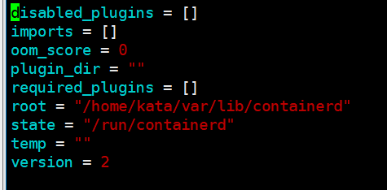

    7.  初始化K8s节点。

        ```
        kubeadm init --config kubeadm-init.yaml
        ```

        

        > **说明：** 
        >K8s节点初始化过程中，若出现报错：\[kubelet-check\] Initial timeout of 40s passed。
        >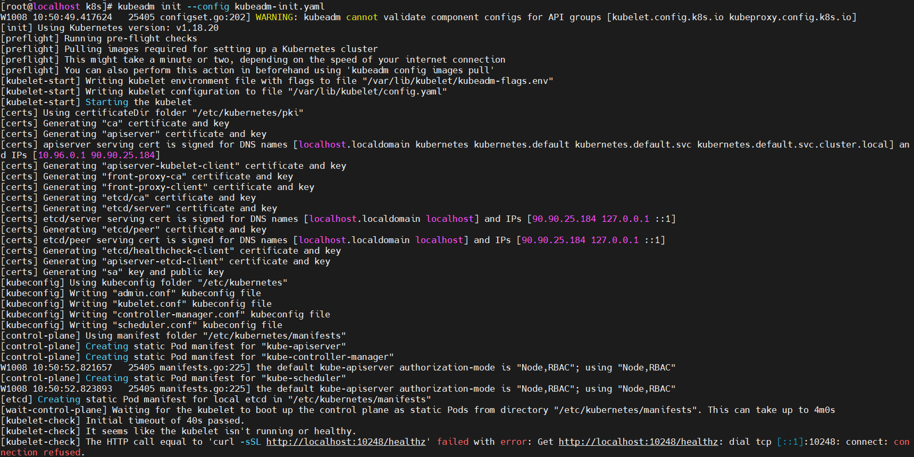
        >可通过执行以下命令解决：
        >```
        >kubeadm reset
        >rm -rf /var/lib/etcd
        >iptables -F && iptables -t nat -F && iptables -t mangle -F
        >```
        >之后重新执行指令：
        >```
        >kubeadm init --config kubeadm-init.yaml
        >```

    8.  创建配置，导出环境变量。

        ```
        mkdir -p $HOME/.kube
        cp -i /etc/kubernetes/admin.conf $HOME/.kube/config
        chown $(id -u):$(id -g) $HOME/.kube/config
        export KUBECONFIG=/etc/kubernetes/admin.conf
        ```

    9.  写入K8s配置路径到文件。

        ```
        vim /etc/profile
        export KUBECONFIG=/etc/kubernetes/admin.conf
        ```

5.  修改pod cidr支持CNI组件。
    1.  修改ConfigMap。

        ```
        kubectl edit cm kubeadm-config -n kube-system
        ```

    2.  增加如下内容。

        ```
        podSubnet: 10.244.0.0/16
        ```

        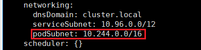

    3.  新建kube-controller-manager.yaml文件。

        ```
        vim /etc/kubernetes/manifests/kube-controller-manager.yaml
        ```

    4.  按“i”进入编辑模式，增加如下内容。

        ```
        - --allocate-node-cidrs=true
        - --cluster-cidr=10.244.0.0/16
        ```

        

    5.  按“Esc”键，输入**:wq!**，按“Enter”保存并退出编辑。

6.  安装flannel插件。
    1.  下载并安装cni相关插件。

        ```
        wget https://github.com/containernetworking/plugins/releases/download/v1.5.1/cni-plugins-linux-arm64-v1.5.1.tgz
        tar -C /opt/cni/bin -zxvf cni-plugins-linux-arm64-v1.5.1.tgz
        ```

    2.  新建kube-flannel.yaml文件。

        ```
        vim kube-flannel.yaml
        ```

    3.  按“i”进入编辑模式，增加如下内容。

        ```
        ---
        kind: Namespace
        apiVersion: v1
        metadata:
          name: kube-flannel
          labels:
            k8s-app: flannel
            pod-security.kubernetes.io/enforce: privileged
        ---
        kind: ClusterRole
        apiVersion: rbac.authorization.k8s.io/v1
        metadata:
          labels:
            k8s-app: flannel
          name: flannel
        rules:
        - apiGroups:
          - ""
          resources:
          - pods
          verbs:
          - get
        - apiGroups:
          - ""
          resources:
          - nodes
          verbs:
          - get
          - list
          - watch
        - apiGroups:
          - ""
          resources:
          - nodes/status
          verbs:
          - patch
        - apiGroups:
          - networking.k8s.io
          resources:
          - clustercidrs
          verbs:
          - list
          - watch
        ---
        kind: ClusterRoleBinding
        apiVersion: rbac.authorization.k8s.io/v1
        metadata:
          labels:
            k8s-app: flannel
          name: flannel
        roleRef:
          apiGroup: rbac.authorization.k8s.io
          kind: ClusterRole
          name: flannel
        subjects:
        - kind: ServiceAccount
          name: flannel
          namespace: kube-flannel
        ---
        apiVersion: v1
        kind: ServiceAccount
        metadata:
          labels:
            k8s-app: flannel
          name: flannel
          namespace: kube-flannel
        ---
        kind: ConfigMap
        apiVersion: v1
        metadata:
          name: kube-flannel-cfg
          namespace: kube-flannel
          labels:
            tier: node
            k8s-app: flannel
            app: flannel
        data:
          cni-conf.json: |
            {
              "name": "cbr0",
              "cniVersion": "0.3.1",
              "plugins": [
                {
                  "type": "flannel",
                  "delegate": {
                    "hairpinMode": true,
                    "isDefaultGateway": true
                  }
                },
                {
                  "type": "portmap",
                  "capabilities": {
                    "portMappings": true
                  }
                }
              ]
            }
          net-conf.json: |
            {
              "Network": "10.244.0.0/16",
              "Backend": {
                "Type": "vxlan"
              }
            }
        ---
        apiVersion: apps/v1
        kind: DaemonSet
        metadata:
          name: kube-flannel-ds
          namespace: kube-flannel
          labels:
            tier: node
            app: flannel
            k8s-app: flannel
        spec:
          selector:
            matchLabels:
              app: flannel
          template:
            metadata:
              labels:
                tier: node
                app: flannel
            spec:
              affinity:
                nodeAffinity:
                  requiredDuringSchedulingIgnoredDuringExecution:
                    nodeSelectorTerms:
                    - matchExpressions:
                      - key: kubernetes.io/os
                        operator: In
                        values:
                        - linux
              hostNetwork: true
              priorityClassName: system-node-critical
              tolerations:
              - operator: Exists
                effect: NoSchedule
              serviceAccountName: flannel
              initContainers:
              - name: install-cni-plugin
                image: docker.io/flannel/flannel-cni-plugin:v1.2.0
                command:
                - cp
                args:
                - -f
                - /flannel
                - /opt/cni/bin/flannel
                volumeMounts:
                - name: cni-plugin
                  mountPath: /opt/cni/bin
              - name: install-cni
                image: docker.io/flannel/flannel:v0.22.3
                command:
                - cp
                args:
                - -f
                - /etc/kube-flannel/cni-conf.json
                - /etc/cni/net.d/10-flannel.conflist
                volumeMounts:
                - name: cni
                  mountPath: /etc/cni/net.d
                - name: flannel-cfg
                  mountPath: /etc/kube-flannel/
              containers:
              - name: kube-flannel
                image: docker.io/flannel/flannel:v0.22.3
                command:
                - /opt/bin/flanneld
                args:
                - --ip-masq
                - --kube-subnet-mgr
                resources:
                  requests:
                    cpu: "200m"
                    memory: "100Mi"
                securityContext:
                  privileged: false
                  capabilities:
                    add: ["NET_ADMIN", "NET_RAW"]
                env:
                - name: POD_NAME
                  valueFrom:
                    fieldRef:
                      fieldPath: metadata.name
                - name: POD_NAMESPACE
                  valueFrom:
                    fieldRef:
                      fieldPath: metadata.namespace
                - name: EVENT_QUEUE_DEPTH
                  value: "5000"
                volumeMounts:
                - name: run
                  mountPath: /run/flannel
                - name: flannel-cfg
                  mountPath: /etc/kube-flannel/
                - name: xtables-lock
                  mountPath: /run/xtables.lock
              volumes:
              - name: run
                hostPath:
                  path: /run/flannel
              - name: cni-plugin
                hostPath:
                  path: /opt/cni/bin
              - name: cni
                hostPath:
                  path: /etc/cni/net.d
              - name: flannel-cfg
                configMap:
                  name: kube-flannel-cfg
              - name: xtables-lock
                hostPath:
                  path: /run/xtables.lock
                  type: FileOrCreate
        ```

    4.  按“Esc”键，输入**:wq!**，按“Enter”保存并退出编辑。
    5.  启动flannel。

        ```
        kubectl apply -f kube-flannel.yaml
        ```

7.  检查集群状态。
    1.  短暂等待flannel部署完毕后，检查master节点状态为**Ready**。

        ```
        kubectl get nodes
        ```

        

    2.  pod状态均为**Running**。

        ```
        kubectl get pods -A
        ```

        

8.  将K8s master设置成node工作节点。

    ```
    kubectl taint nodes --all node-role.kubernetes.io/master-
    ```

9.  K8s中创建kata runtime。
    1.  新建runtime.yaml。

        ```
        vim runtime.yaml
        ```

    2.  按“i”进入编辑模式，增加如下内容。

        ```
        kind: RuntimeClass
        apiVersion: node.k8s.io/v1beta1
        metadata:
          name: kata
        handler: kata
        ```

    3.  按“Esc”键，输入**:wq!**，按“Enter”保存并退出编辑。
    4.  创建kata runtime。

        ```
        kubectl apply -f runtime.yaml
        ```

10. <a name="li0343125545419"></a>创建示例容器，验证是否部署成功。
    1.  新建kata-test.yaml文件。

        ```
        vim kata-test.yaml
        ```

    2.  按“i”进入编辑模式，增加如下内容。

        ```
        apiVersion: v1
        kind: Pod
        metadata:
          name: box-kata
          annotations:
            io.katacontainers.config_path: "docker.io/library/busybox:latest"
        spec:
          runtimeClassName: kata
          containers:
          - name: box
            image: docker.io/library/busybox:latest
        ```

    3.  按“Esc”键，输入**:wq!**，按“Enter”保存并退出编辑。
    4.  启动并查看pod状态。

        ```
        kubectl apply -f kata-test.yaml
        kubectl get pods -A
        ```

        box-kata的状态为**Running**。

        

        > **说明：** 
        >由于kubectl run命令启动容器并不支持指定容器运行时的类型，而/etc/containerd/config.toml中配置的默认容器运行时是**runc**，故kubectl run启动的是普通容器。建议用户通过[步骤10](#li0343125545419)启动kata机密容器。强制修改/etc/containerd/config.toml中的默认容器运行时为**kata**将可能会导致安全内存占满，请谨慎操作。

